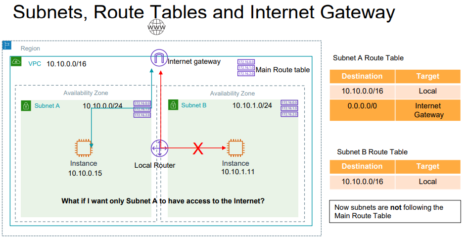
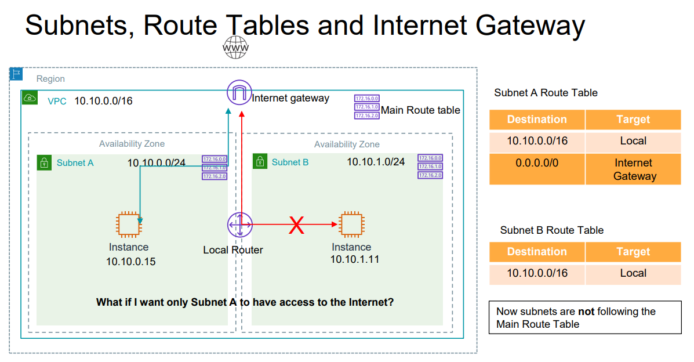
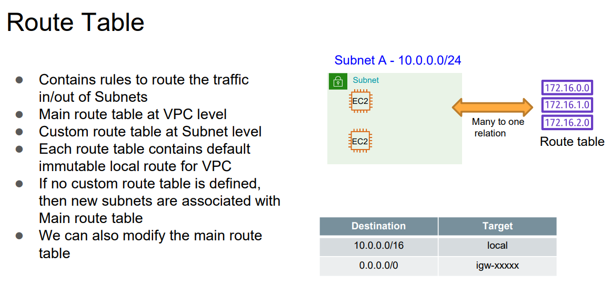
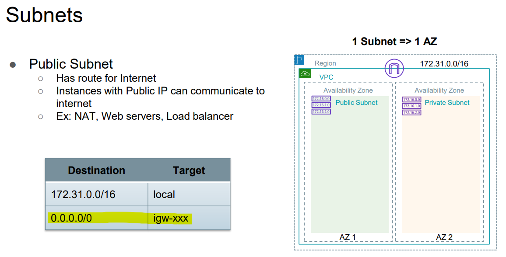
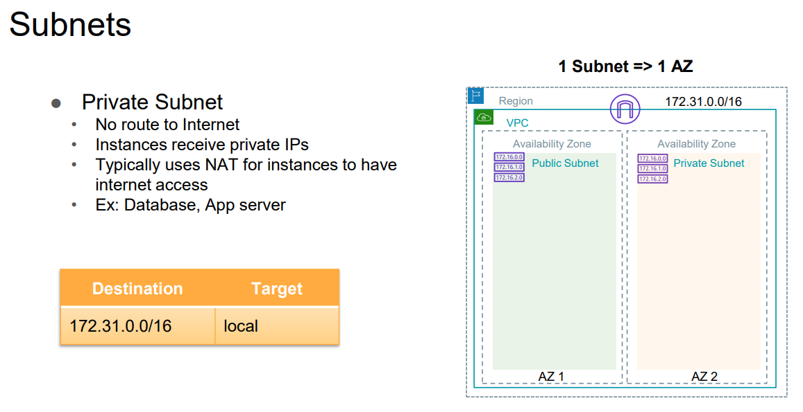
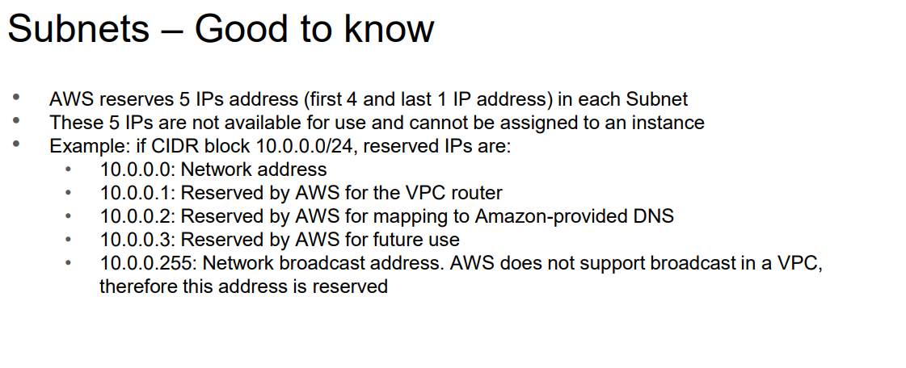

By default subnet follow the main route table
till you create custom route table -\> then subnet follow the coustom route table

Internet Gateway -\> to route traffic to internet

Requirement of Ec2 instance to route public traffic?
\> There should be internet gateway
\> Route table must have entry
| Dest: 0.0.0.0/0 | target: Internet Gateway |
|-----------------|--------------------------|
\> Instance should have public Ip

