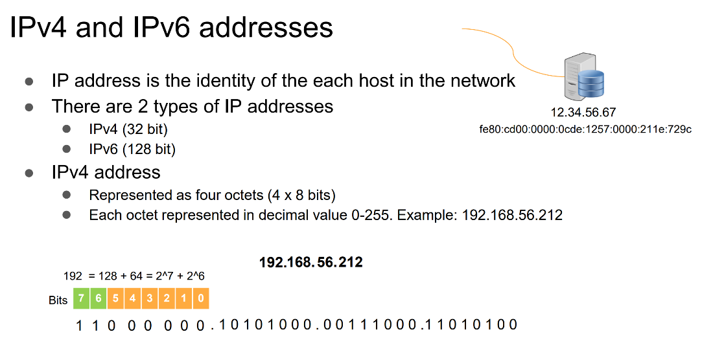
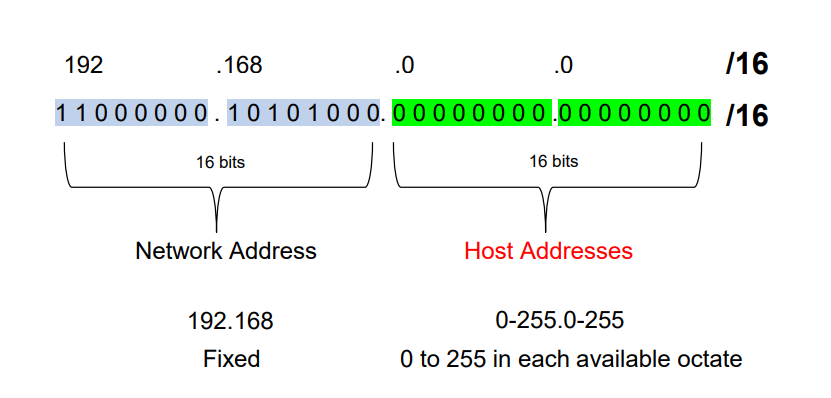

Always try to use RFC 1918 private IPs unless you're 100% sure you won't face integration or internet-routing needs.

RFC 1918 ranges standard:
🔹 10.0.0.0/8
🔹 172.16.0.0/12
🔹 192.168.0.0/16

IpV4 and IpV6 address - can be assigned to machine

IpV4 -\> Ocate ( 4x8 bits )

16 bits - network bits - Fixed

<https://visualsubnetcalc.com/>

