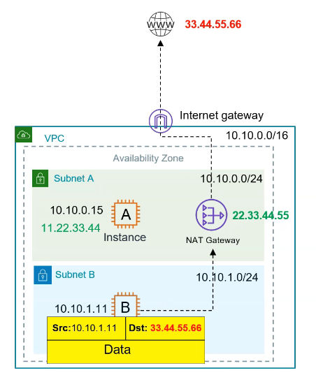
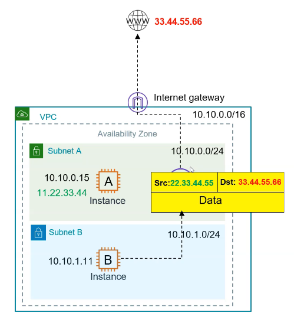
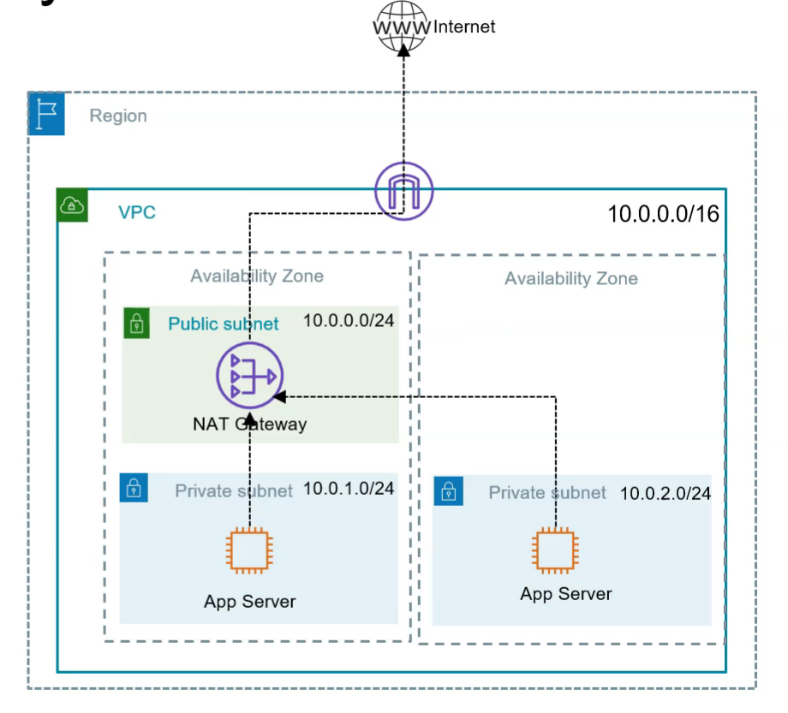
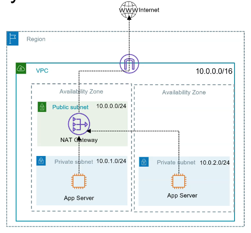

🌐 NAT Gateway
  • Allows private subnets to access the internet or AWS services
  • Use cases:
    ○ 📥 Download software updates from internet
    ○ 🔗 Connect to AWS services (e.g., S3, DynamoDB)
  • Provides one-way (outbound-only) internet access from private subnet
  • Requires an Elastic IP (EIP) for outbound traffic

⚙️ Key Points
  • NAT Gateway must be in a public subnet
  • Public subnet must have a route to the internet (via Internet Gateway)
  • Private subnet’s route table must point to the NAT Gateway for internet-bound traffic
  • 🔒 Network ACLs (NACLs) still apply to NAT Gateway traffic
  • 📌 Elastic IP ensures consistent public IP for outbound traffic

🔁 How Does NAT Work?
  1️⃣ Private EC2 instance initiates a request (e.g., yum update)
  2️⃣ Request is forwarded to the NAT Gateway (in public subnet)
  3️⃣ NAT Gateway translates private IP → public IP, sends the request out
  4️⃣ Internet response returns to NAT Gateway, which forwards it to the EC2 instance

<table>
<colgroup>
<col style="width: 48%" />
<col style="width: 51%" />
</colgroup>
<thead>
<tr class="header">
<th>

</th>
<th>

</th>
</tr>
</thead>
<tbody>
<tr class="odd">
<td>
If AZs goes downs then NAT goes down 
 
 

</td>
<td>
Recommended for Production workloads

Launch multiple NAT per Azs 
 

</td>
</tr>
<tr class="even">
<td>

</td>
<td>

</td>
</tr>
</tbody>
</table>

🧠 What is a NAT Instance?

A NAT Instance is just a regular EC2 instance that is manually configured to forward traffic from private instances to the internet — just like a NAT Gateway, but cheaper and more DIY.

🔁 How it works:
\- You launch an EC2 instance in a public subnet
\- You enable IP forwarding on it
\- You update the route table of your private subnet to route internet traffic (0.0.0.0/0) through the private IP of the NAT instance
\- The NAT instance then forwards that traffic to the internet using its Elastic IP

💸 Why use a NAT Instance?
• Cheaper than NAT Gateway
○ You pay EC2 pricing (which can be as low as a few dollars/month if using t3.micro)

○ No per-GB processing charges like with NAT Gateway
