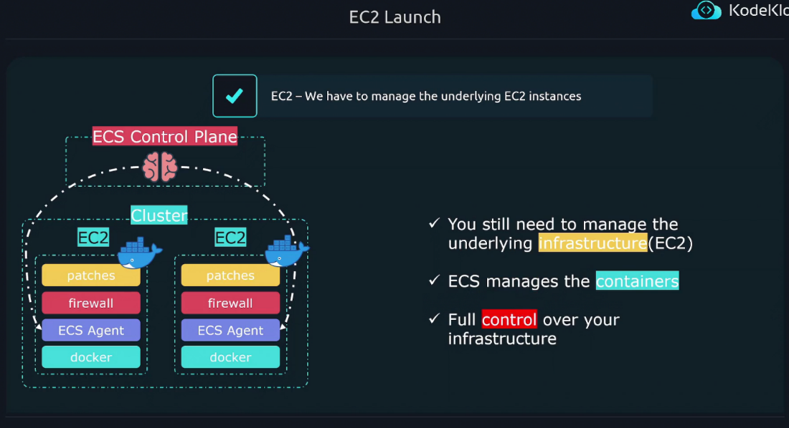
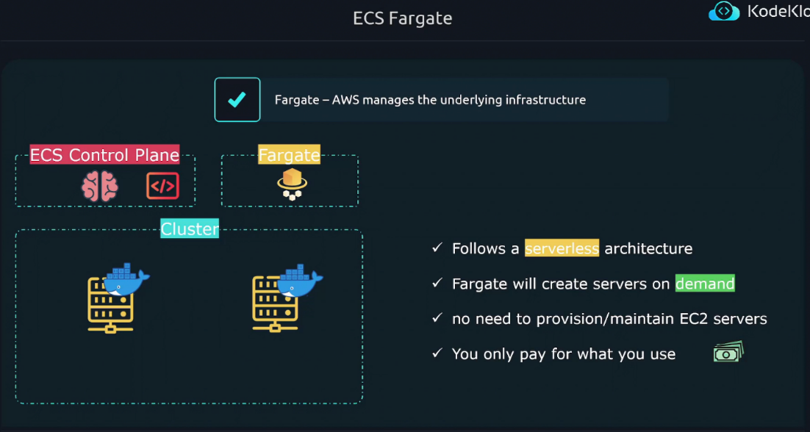

In Ec2 launch type
you own the underline ec2
instances you manage them
you configure them
you install docker ecs agent firewall patches

you get full control of the infrastructure

only thing ecs does is it manages the container with ecs agent

ECS Fargate
on demand

