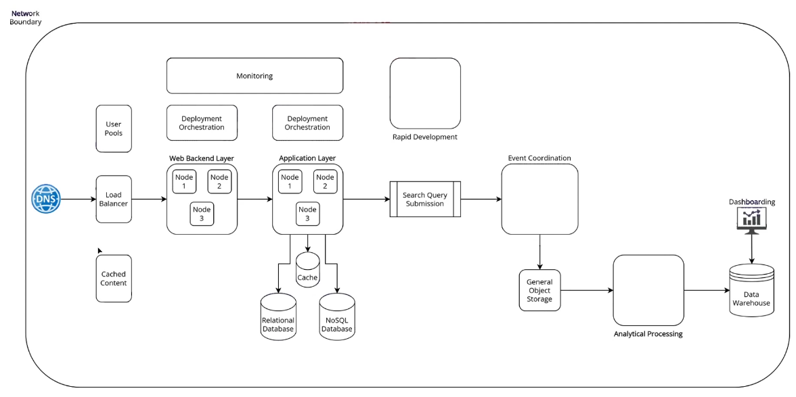

<table>
<colgroup>
<col style="width: 20%" />
<col style="width: 79%" />
</colgroup>
<thead>
<tr class="header">
<th>
DNS = RouteS3

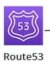

</th>
<th>
- where the traffic come from the internet

- health check
</th>
</tr>
</thead>
<tbody>
<tr class="odd">
<td>
Load Balencer

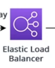
</td>
<td>
- ELB = Elastic load balencer

has 2 veriation

- ALB = application load balencer ( L7 level) 
- NLB = network load balencer ( L4 level) 

</td>
</tr>
<tr class="even">
<td></td>
<td>3 choice for Web Backend layer</td>
</tr>
<tr class="odd">
<td>
EC2 

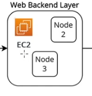
</td>
<td>- you can run vertual machine</td>
</tr>
<tr class="even">
<td>
Lambda 

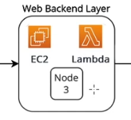

</td>
<td>
- serverless 
- no need to worry about infra

- pay per invocation
</td>
</tr>
<tr class="odd">
<td>
ECS 

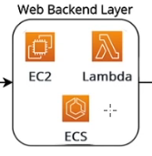

</td>
<td>
- middle between EC2 and lambda

-
</td>
</tr>
<tr class="even">
<td>
Api Gateway 

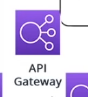

</td>
<td>
- Api Gateway 
- Help to host apis

- Feature - Api throttling

- authorization on an api

Better than ELB
</td>
</tr>
<tr class="odd">
<td>
Elastic Cache 

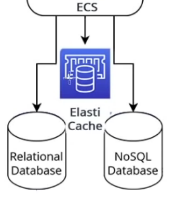
</td>
<td>
- 2 flaver

- Memcached based or Redis
</td>
</tr>
<tr class="even">
<td>
Aurora

RDS DB
</td>
<td></td>
</tr>
<tr class="odd">
<td>
DynamoDB 

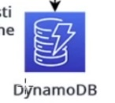

</td>
<td>
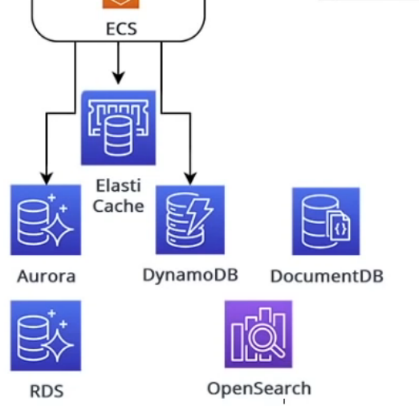

</td>
</tr>
<tr class="even">
<td></td>
<td></td>
</tr>
<tr class="odd">
<td></td>
<td>

</td>
</tr>
<tr class="even">
<td>Cloud watch</td>
<td>- it has many services 
- view diff matrics on ec2 machine what is cpu or memery uutilization 
- lambda How many invokation it has 
- logging</td>
</tr>
<tr class="odd">
<td>Cloud Trail 
 
</td>
<td>- Cloud watch help to monitor sate of app 
Where as Cloud Trail help to monitor infra 
 
- who is deleting 
- who is accessing what services and what are they doing to the services 
</td>
</tr>
<tr class="even">
<td>
IAM 

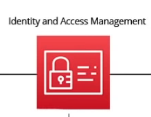

</td>
<td>Security management service 
 
We create User or Role 
User has policy by default user don't have permission to do anything with aws unless you attach IAM policy to that user</td>
</tr>
<tr class="odd">
<td>

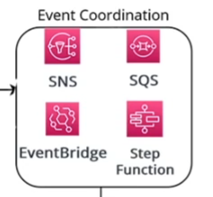

</td>
<td>
Event Co-ordination 
 
Notification service 
SNS = is pub sub service 
it publish notification to topic then many application (lambda) subscribe it 

SQS queue = hold message 
 
EventBridge = 
similar to SNS + more

Action - Whenever ES2 terminated

- Whenever Lambda fun get updated

- Whenever conf in dynamodb change

Step Fun = 
help to define work flow

</td>
</tr>
</tbody>
</table>
