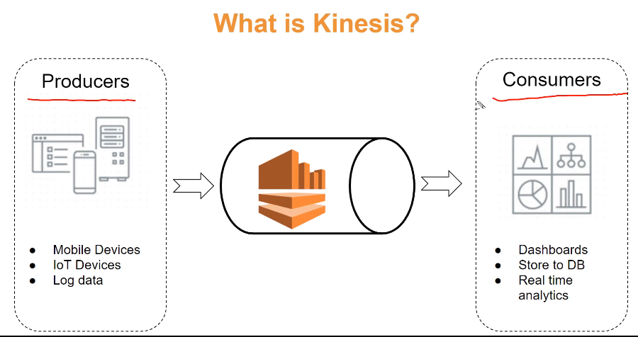

Kinesis Data Stream: [video](https://youtu.be/RR0hhZUyjjc)

\|- To make stream processing application
\|- Producers write data --\> Consumers reads data
\|- data is immutable after it is added
\|- concepts of shards
\|- determine the capacity of receive data

\|- soft limit of 500 shards \[ can inc quota \]

\|- 1 shard -\> made from 1 2 3... n records

\|- Records made up from 3 things

\|- Partation Key

\|- same Pk -\> data will go in same shard

\|- when application put data in stream it must specify the PK

\|- Sequence Number

\|- unique number per record,

\|- added automatically by the kinesis

\|- data blob (max 1 mb)

\|- actual data like json, csv video

\|- Retention period:
\|- default: 24 hr

\|- Increased upto 7 days ( cost inc )

\|- Data Limitation
\|- Producers write max 1mb/s of data per shard

\|- Consumer read max 2mb/s of data per shard

\|- if 5 consumers 400kb per consumer from 1 shard

\|- you can inc it in Enhance fan-out option in KCL 2.x

\|- Producers of data
\|- SDK \| kinesis producers Lib \| kinesis agent

\|- Consumers of data
\|- SDK \| ==kinesis client Lib== \| firehose \| Lambda

