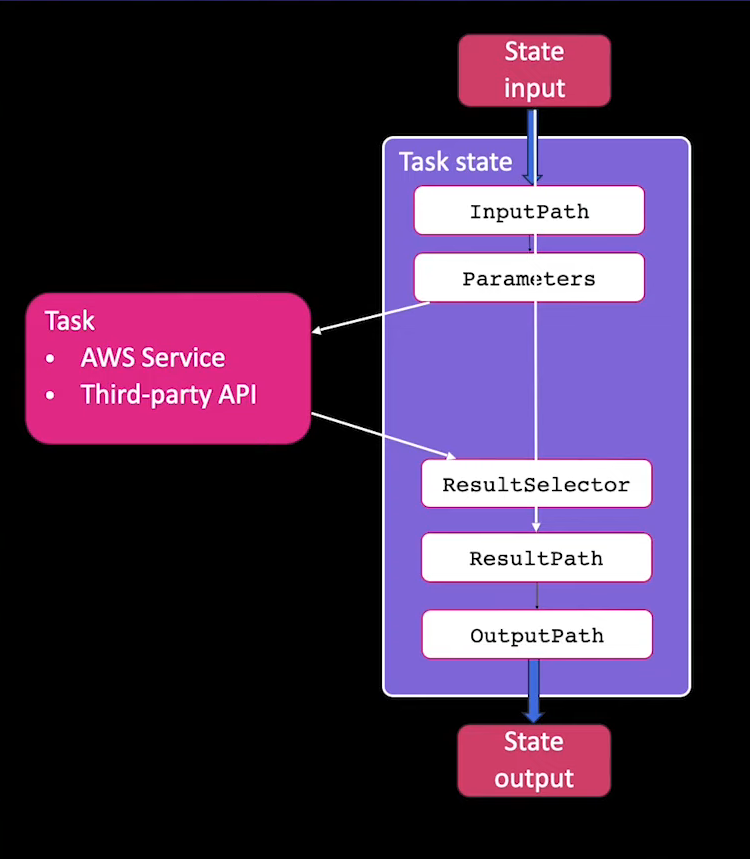

State:

Task = to create lambda fun like thing
choise
Success
Failed
Parallel = make parallel processing =\> use pass state in end
Wait = will wait
Pass = just pass

Error Handing = states.ALL task.Failed
