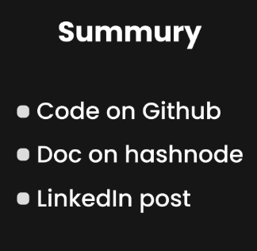
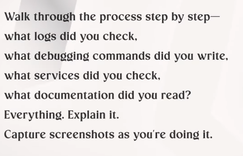

You don't find the Remote job Remote job finds you

1.  Learn In Public for 2/3 Years
2.  Build Your network on X and Linkedin
3.  Write On internet: Showcase your work Publically
4.  Contribute: Write WhitePapers Publish Conferences

Learn In Public:

[Learn in Public = High Paying Job? \| The Best Way and Real Truth](https://youtu.be/AYBMhpw7W3s)

1 in every week

Learn in Public :) Linkedin & Twitter

hashnode

dev.to

-\> Makes you searchable

-\> Unlock opportunity

-\> faced pod crashing issue today -- here is how i solved it

-\> post about the struggle -- like failed in hackation

-\> Use SEO Friendly Post..

-\> It takes 1 Year

-\> dealing with Imposter Synderome

-\> don't warry about it -- just share

-\> even if one person find it useful

-\>

Share the porblem you encounter

Here is how i debug it

Here is how

docker day 1

docker day 2

