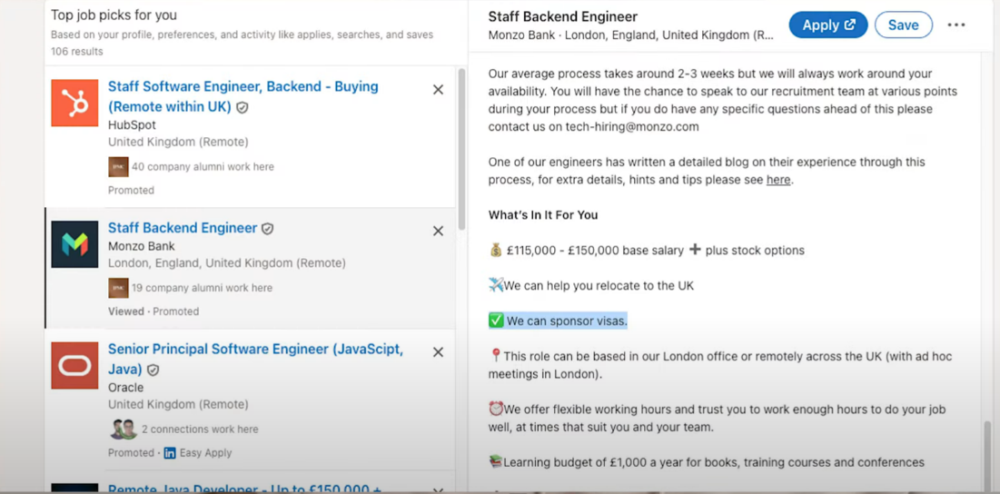

Skilled worker Visa

Leave there for 5 Year with SWV -- you get PR

Language -
Skill -

<table>
<colgroup>
<col style="width: 51%" />
<col style="width: 48%" />
</colgroup>
<thead>
<tr class="header">
<th>Apply on:</th>
<th>
Linkedin

Indeed

Glassdoor

Reed.co.uk
</th>
</tr>
</thead>
<tbody>
<tr class="odd">
<td>Company</td>
<td>
EY

KPMG 
Jp morgen
</td>
</tr>
</tbody>
</table>

Ultimate Uk Visa sponsor chekcer Extension

Resume good
Linkedin Optimize
Apply Every Job -- just to get interview
Behavioural question Perperation -- VVIMP in Uk

one way is to google search for the organisation and check if they sponsor. Other way is to check job description to see if they sponsor.
