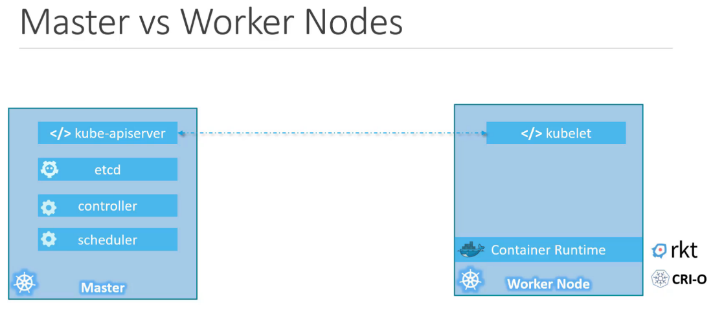

Nodes (minions)
\- kubernetis installed

Clusters - set of nodes group together

Master Nodes -
\- master node with kubernets installed in it

components
Api server
etcd
scheduler
kubelet
controller
container runtime

