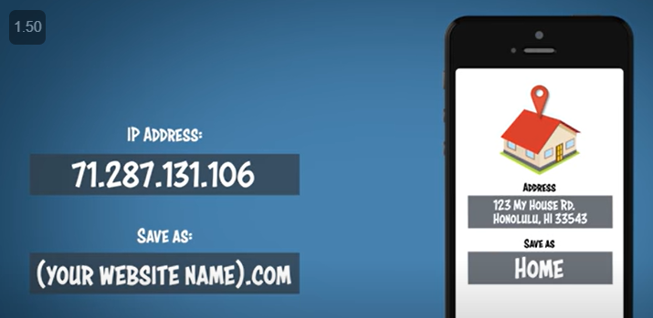
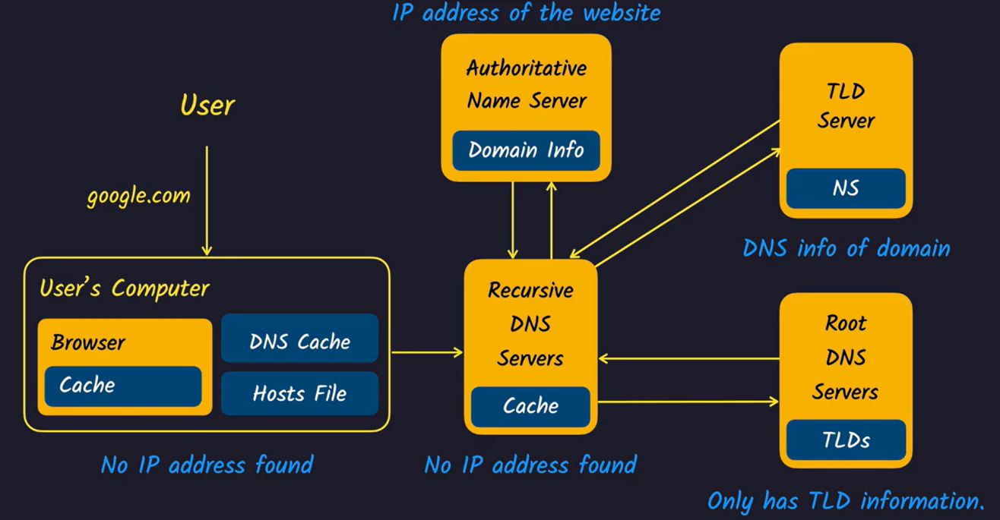

**Domain =\>**
**It gives Ip address simple easy to remember name**

**<u>How it works \></u>**
**<u>Brower send domain name to DNS system and it returns ip address</u>**

**Web Hosting**
**Rent space on internet Where your website can be stored**

**How Ip address get searched**

**Our Comp ISP internet service provider**

[DNS and How doxxxxes it work?](https://youtu.be/Wj0od2ag5sk)

Tld gives info of
auth name server

Root domain name
has info of top level
domain like
.com
.in
prev user cache  

