✅ VPC Setup with Public & Private Subnets, NAT Gateway, and IGW

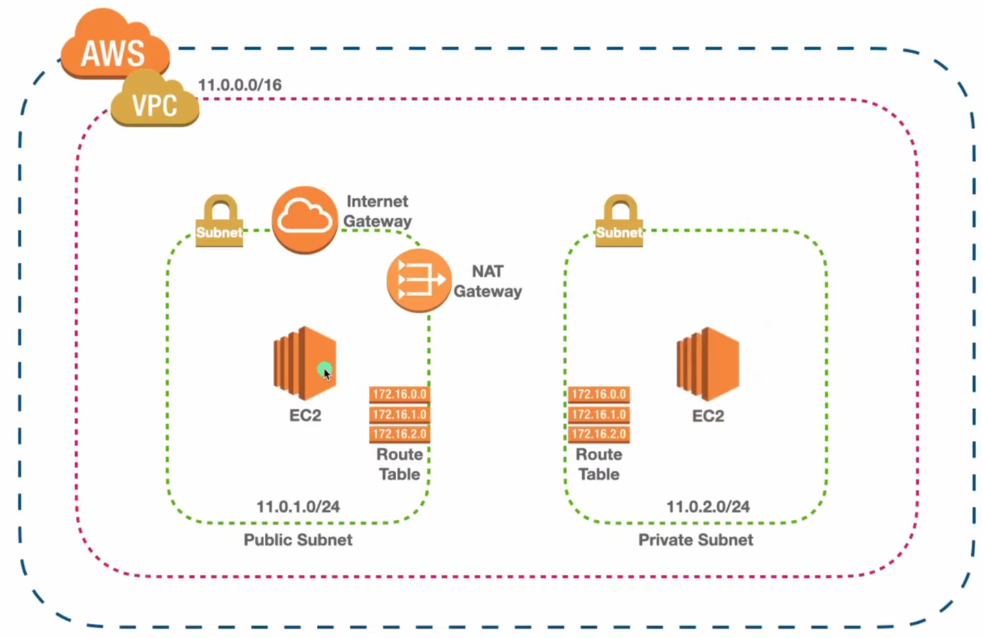

🔧 VPC & Subnet Creation
• Create a VPC
  ○ CIDR block: 11.0.0.0/16
• Create Subnets
  ○ Public Subnet: 11.0.1.0/24
  ○ Private Subnet: 11.0.2.0/24
  ○ Ensure subnets are in the same Availability Zone as the NAT Gateway
(for simplicity)

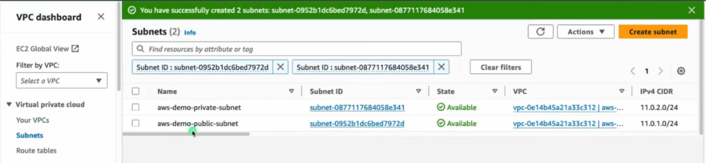

🌐 Create and Attach Internet Gateway (IGW)
• Create IGW
  ○ Attach the IGW to your VPC
  ○ Required for public resources to access the internet

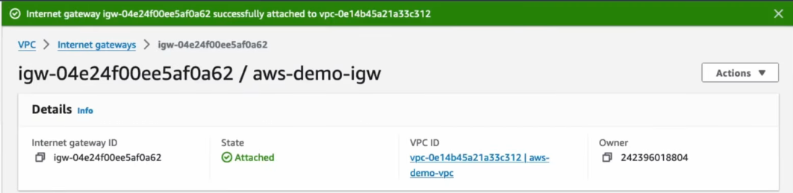

📜 Create and Associate Route Tables
• Create 2 Route Tables
  ○ One for Public Subnet
  ○ One for Private Subnet

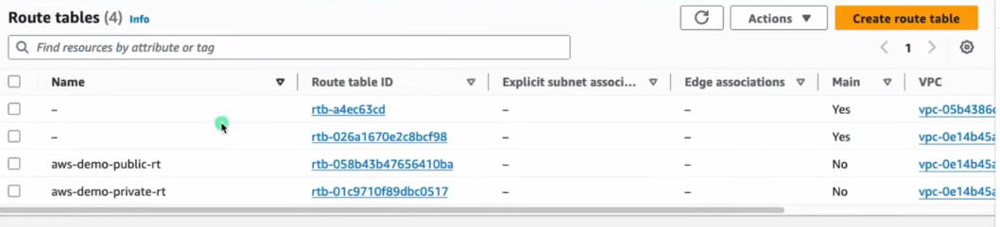

• Associate Route Tables to Subnets
  ○ Public Route Table → Public Subnet
  ○ Private Route Table → Private Subnet

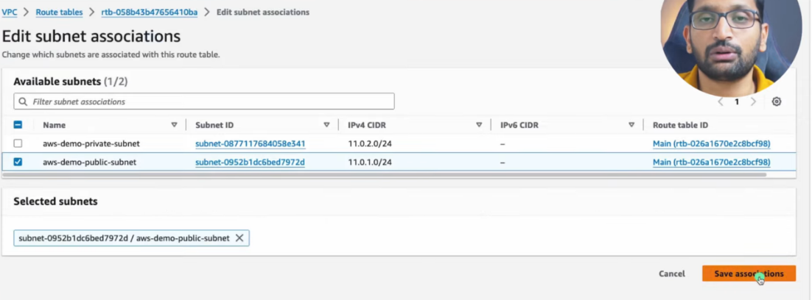

🌍 Update Public Route Table
• Add route to public route table:
  ○ Destination: 0.0.0.0/0
  ○ Target: Internet Gateway

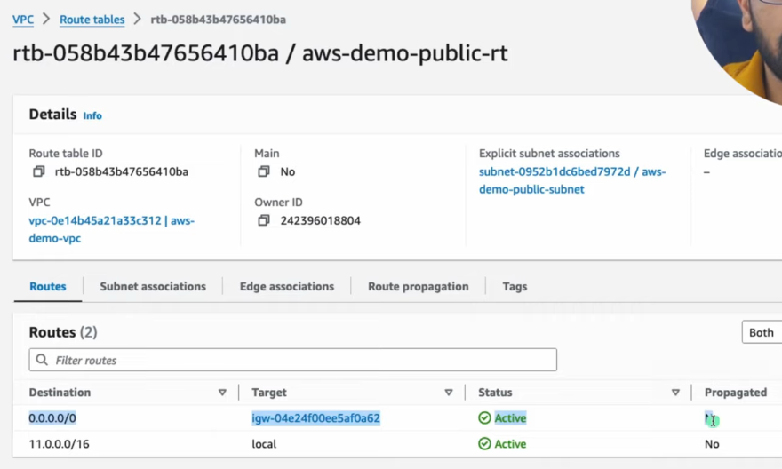

⚙️ Create and Configure NAT Gateway
• Create NAT Gateway
  ○ Must be in Public Subnet
  ○ Requires Elastic IP
  ○ NAT Gateway is used by private instances for outbound internet access

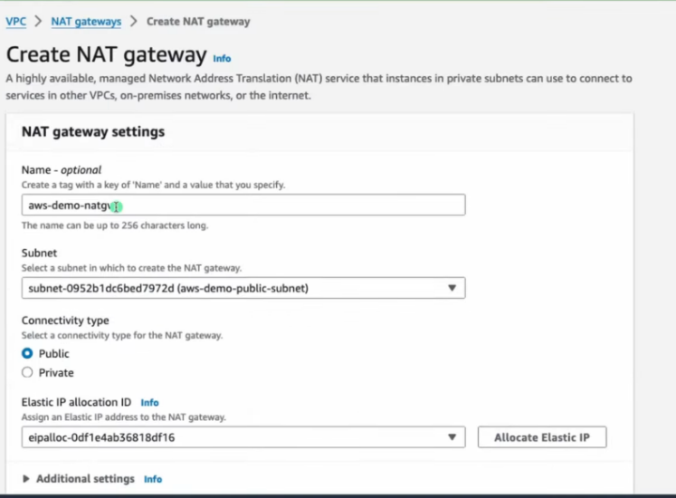

• Important Notes
  ○ NAT Gateway is not used for inbound traffic
  ○ It is expensive (hourly + data usage)
  ○ It allows private subnet to reach internet for updates, downloads, etc.
○ Acts as Proxy for Private Ec2 instance

📦 Update Private Route Table
• Add route to private route table:
  ○ Destination: 0.0.0.0/0
  ○ Target: NAT Gateway

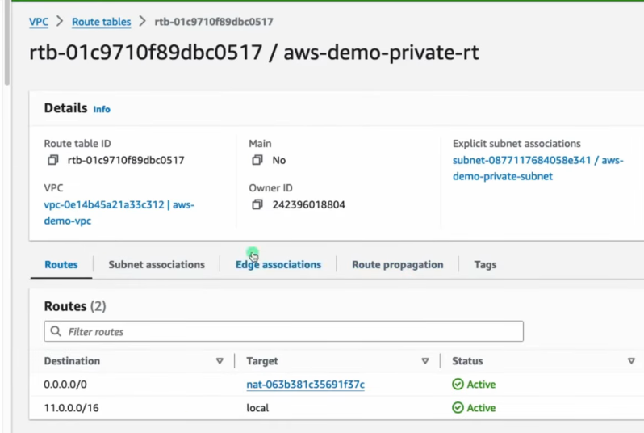

🖥️ Launch EC2 Instances
• Launch Public EC2 Instance
  ○ Subnet: Public
  ○ Auto-assign Public IP: ✅ Yes
• Launch Private EC2 Instance
  ○ Subnet: Private
  ○ Auto-assign Public IP: ❌ No

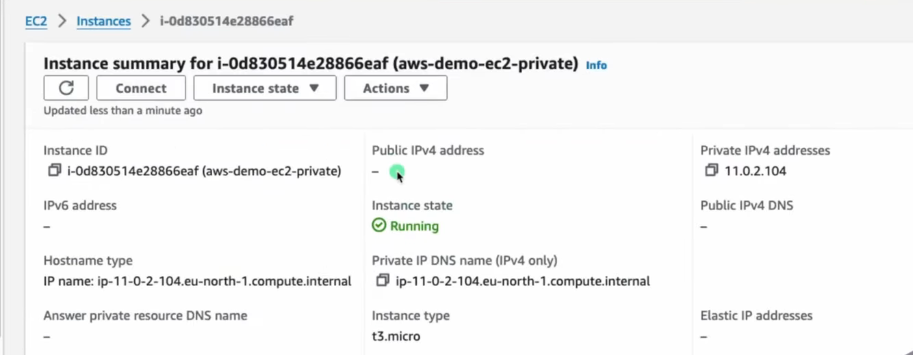

🔐 Security Groups Configuration
• Public EC2 SG
  ○ Inbound: Allow SSH (port 22) from your IP address
• Private EC2 SG
  ○ Inbound: Allow SSH from Public EC2's private IP or CIDR 11.0.1.0/24
• Tip
  ○ Follow the Principle of Least Privilege — allow only what's needed

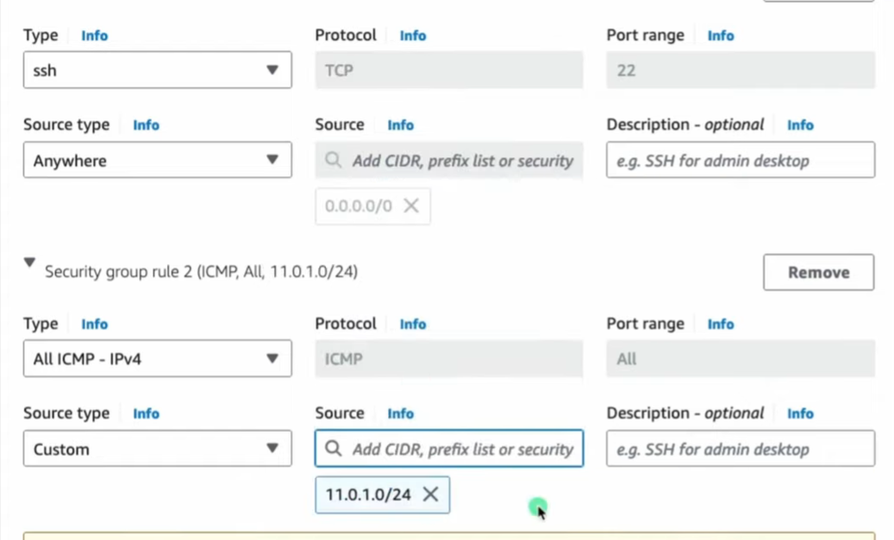

🔗 SSH into Private EC2
• SSH into Public EC2 from your local machine:
  ○ Use the public IP and .pem key

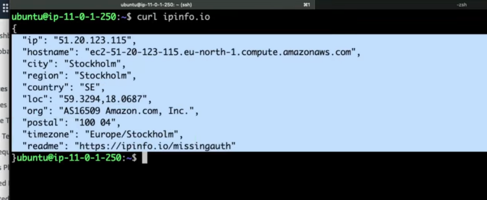

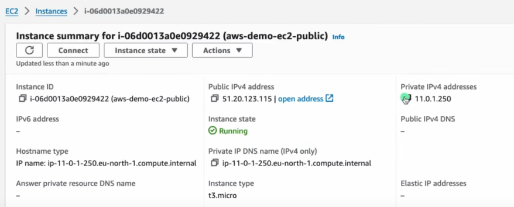

• SSH into Private EC2 from inside Public EC2:
  ○ Use private IP of the private EC2 and the same .pem key
• This is known as a Bastion Host (Jump Box) setup

• Run: curl ipinfo.io
  ○ It shows the Elastic IP of the NAT Gateway, confirming NAT works

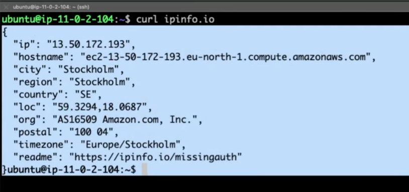

IMP: EC2 stays private (Uses NAT IP Proof)

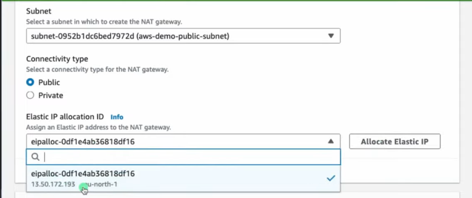

🌐 Internet Access Behavior
• Public EC2
  ○ Has both private and public IP
  ○ Uses IGW for internet access
• Private EC2
  ○ Has only private IP
  ○ Uses NAT Gateway in public subnet for outbound-only internet access
  ○ Cannot be reached from internet directly

🔁 IGW vs NAT Gateway
| Feature | Internet Gateway (IGW)  | NAT Gateway (NAT GW) |
|----|----|----|
| Used | In Public Subnets  | Private Subnets |
| Internet | Access Inbound + Outbound  | Outbound only |
| IP Needed  | No  | Yes (Elastic IP) |
| Cost   | Free   | Paid |
| Accept Incoming Conn.  | Yes | No |
| Public IP Req.  | EC2 needs Public IP | EC2 stays private (uses NAT IP) |

🧠 Must-Know Concepts
• Elastic IP
  ○ A static public IP in AWS, used with NAT Gateways or EC2
• Bastion Host ( Jump Server )
  ○ Public instance used to SSH into private instances
• Security Group vs NACL
  ○ SG is stateful (response traffic allowed automatically)
  ○ NACL is stateless (explicit rules for both inbound and outbound)

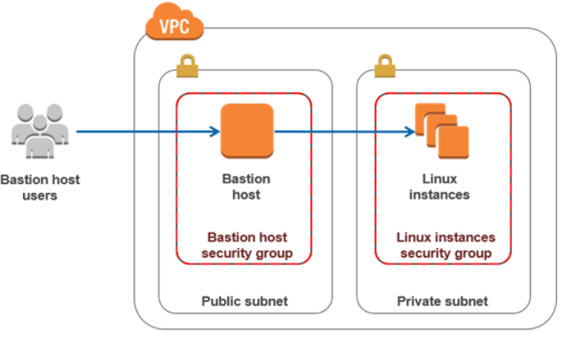

⚠️ Best Practices
• Avoid giving private EC2 a public IP
• Restrict SSH access using security groups
• Monitor NAT Gateway usage to manage costs
• Use NAT Instance (EC2-based) for cheaper alternative (but less scalable)

