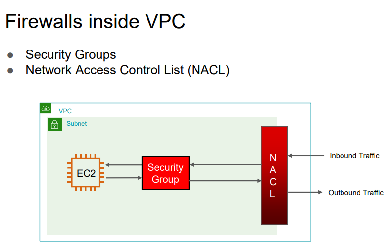

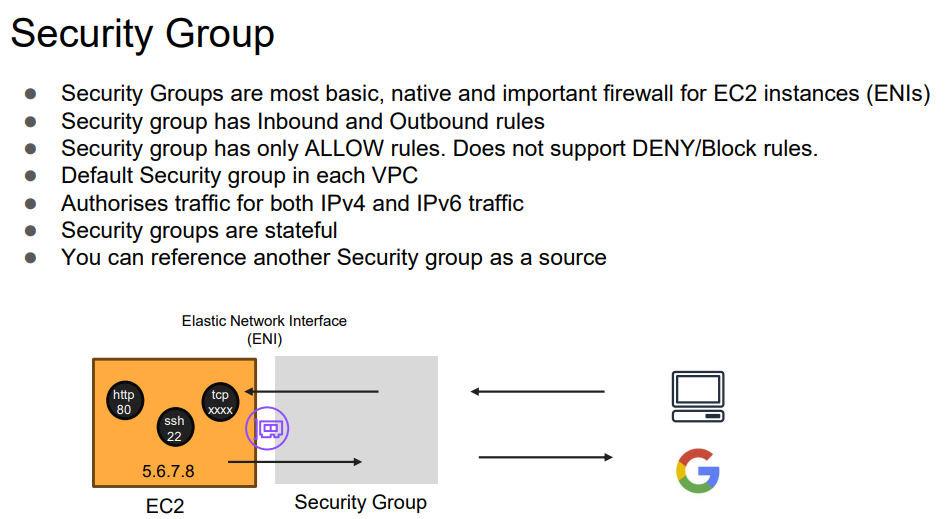

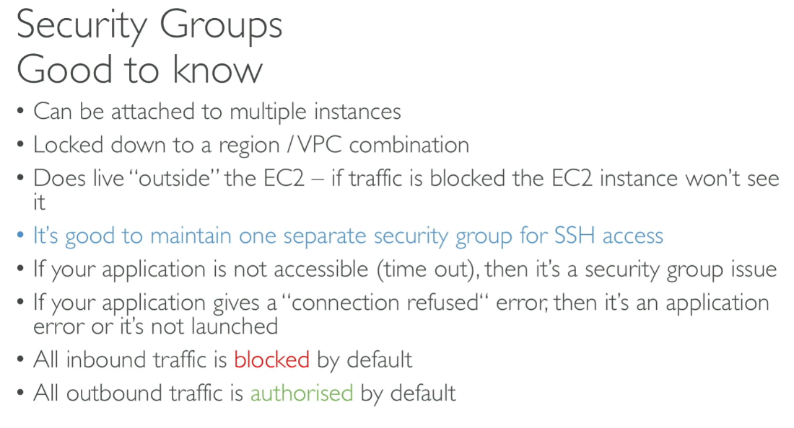

If your EC2 makes a valid outbound request, the **response is automatically allowed back in**, even if your **inbound rules are empty**.

If EC2 is in a public subnet with internet access → ✅ You’ll get a JSON response.
If EC2 is in a private subnet with no NAT → ❌ The request will hang or fail.

Inboud Rule

from 1 machine
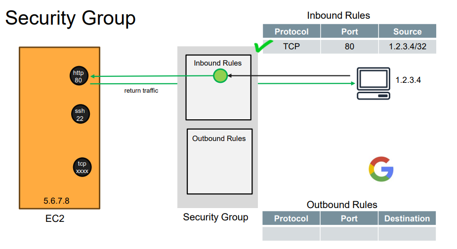

from anywhere ssh allowed
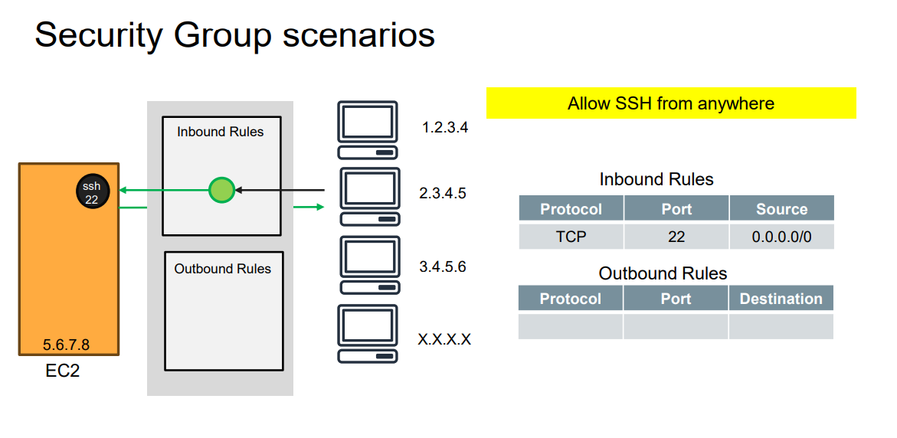

Outbound Rule:

In Amazon EC2 Security Groups (SGs), the default outbound rule for a new security group is:
Allow all outbound traffic (0.0.0.0/0 for IPv4 and ::/0 for IPv6) on all protocols and all ports.

Even if you remove default outbound:
✅ Your EC2 will still respond to incoming requests — like a browser request from your PC — because Security Groups are stateful.

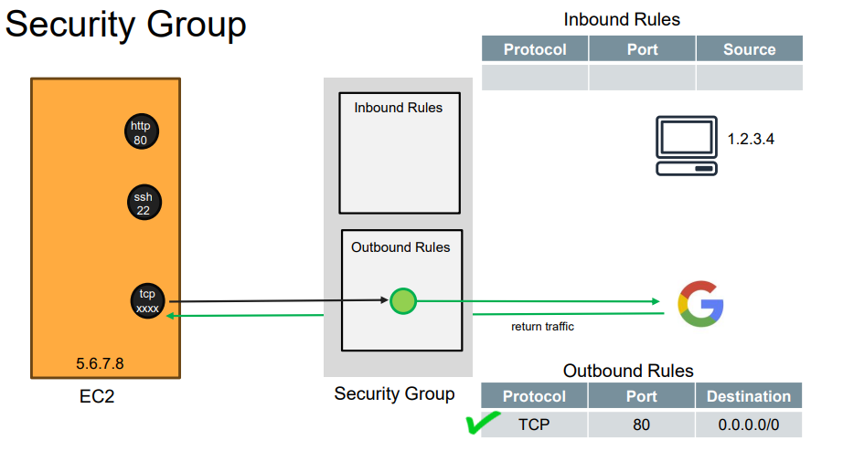

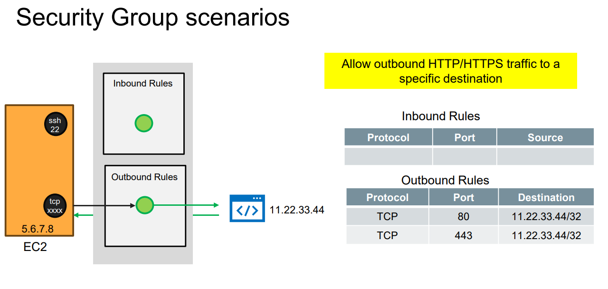

EC2 - EC2 Communication
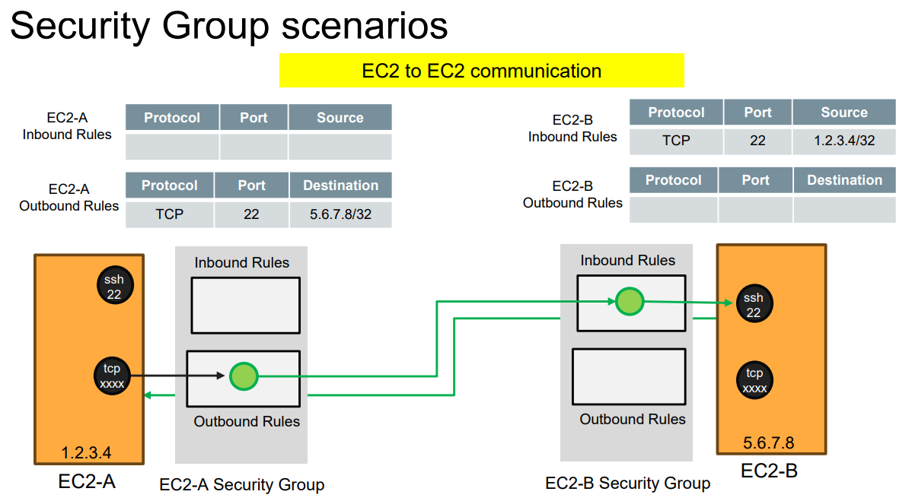

Only from the web servers :)

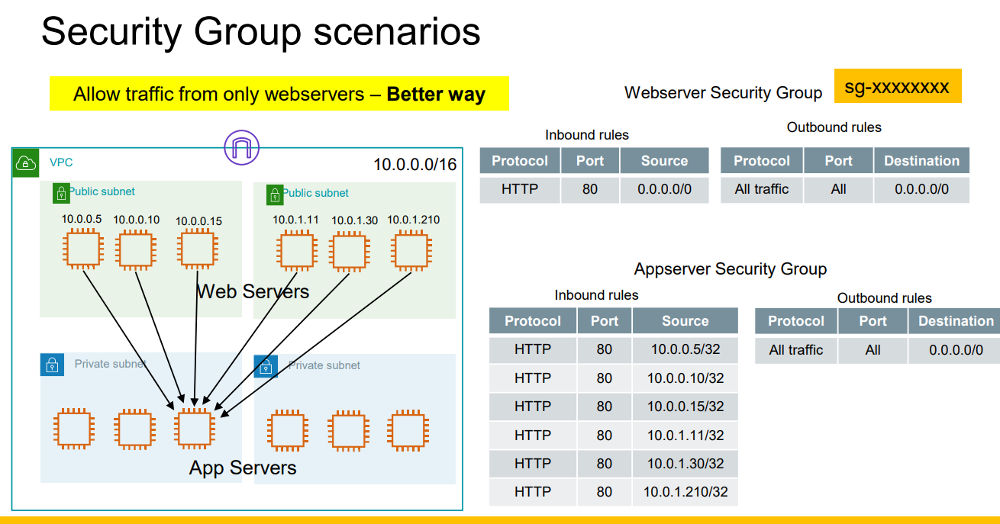

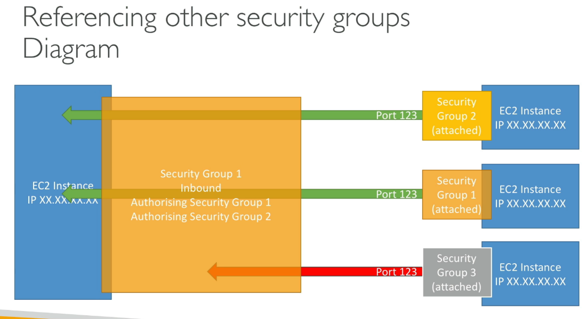

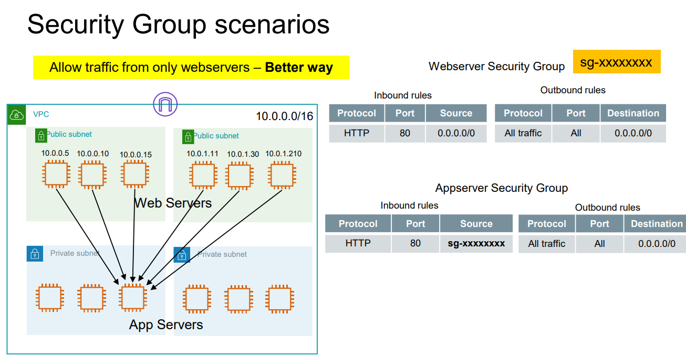

---------------------------------------------

Default security group

self reference in it's inbound rule
\- All machine that are attach to it can talk to each other

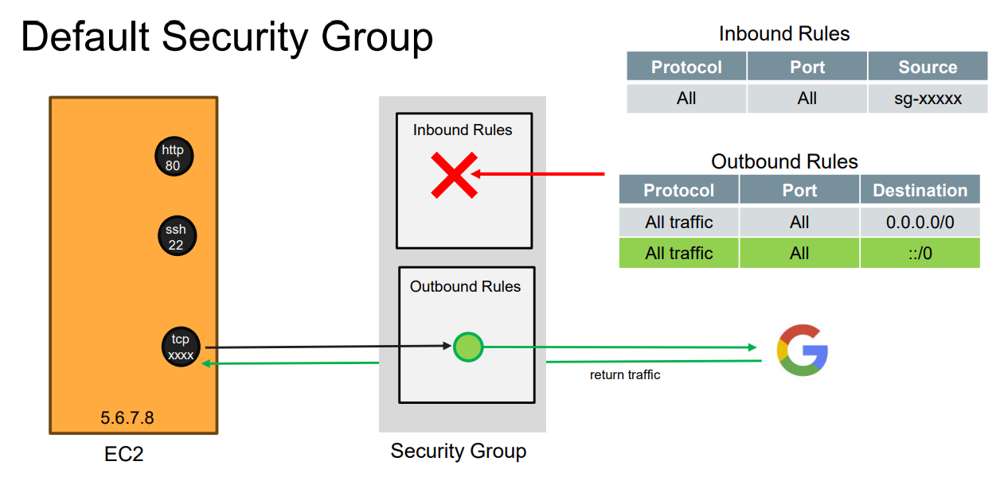

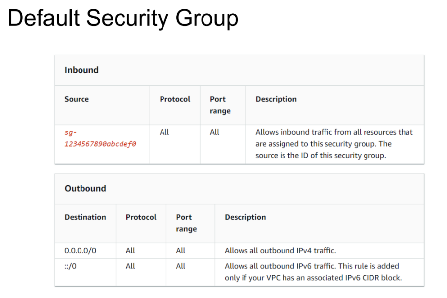

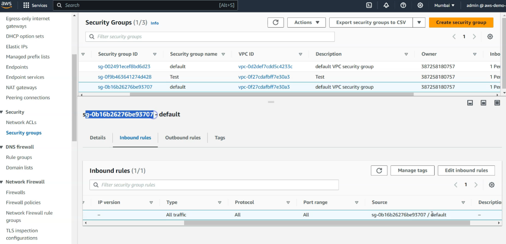

