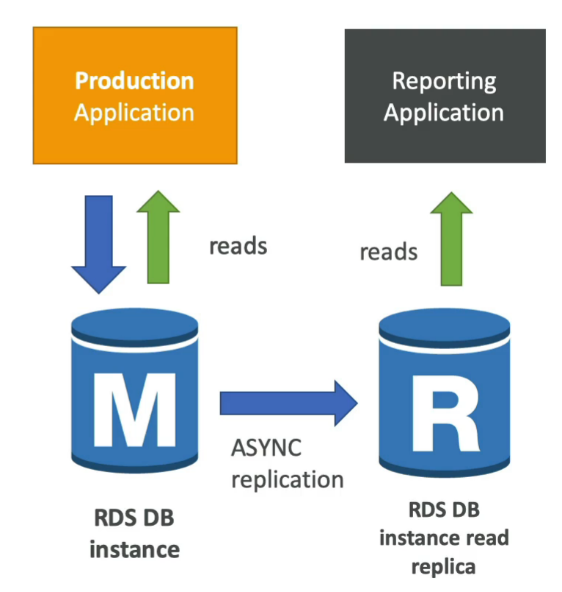
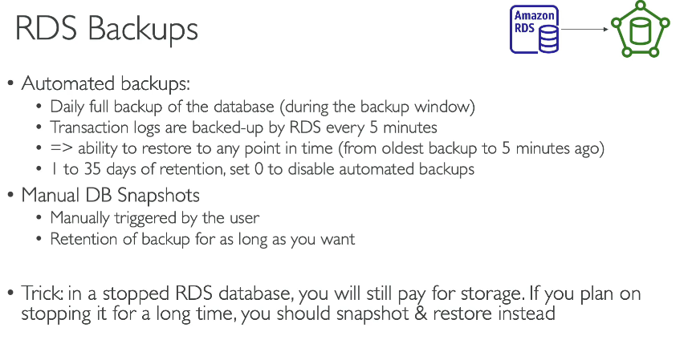
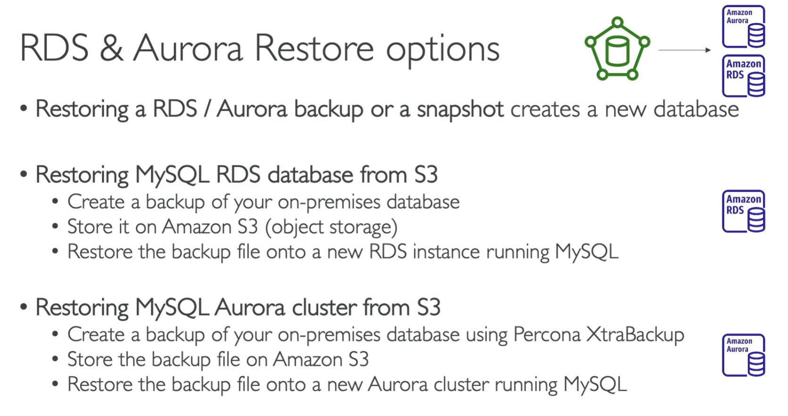
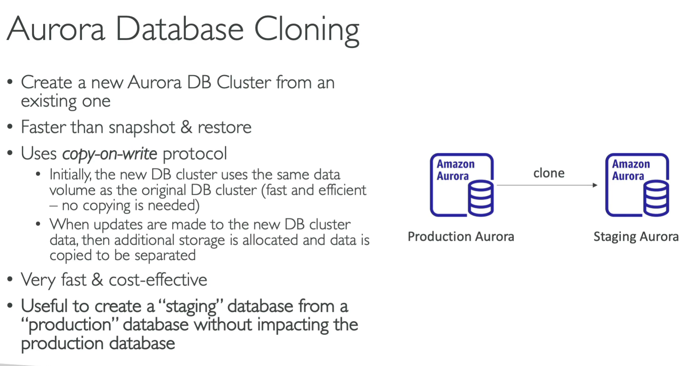
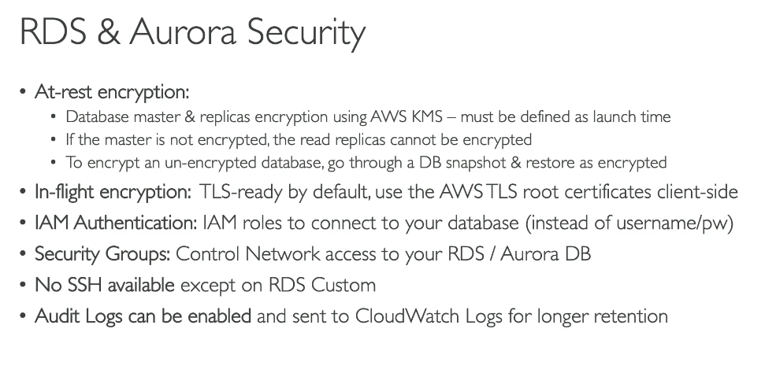

📘 Amazon RDS (Relational Database Service)

📝 Introduction
  • ✔ Amazon RDS is a managed relational database service by AWS.
  • ✔ Simplifies database setup, operation, and storage auto-scaling.
  • ✔ Supports engines: MySQL, PostgreSQL, MariaDB, Oracle, SQL Server, and Amazon Aurora.

🛠️ Key Features
  • 📌 Automated Backups – Automatically backs up DB and transaction logs.
  • 📌 Read Replicas – Enhance read performance and scalability.
  • 📌 Automated Patching – Keeps DB engine and OS secure and updated.
  • 📌 Monitoring & Metrics – Integrated with Amazon CloudWatch.

📊 Storage Options
  • ✔ gp2 / gp3 (General Purpose SSD) – Balanced performance.
  • ✔ io1 / io2 (Provisioned IOPS SSD) – High-performance for heavy workloads.
  • ✔ Magnetic (Standard) – ❌ Legacy, not recommended for new apps.

🔐 Security
  • 📌 Encryption at rest using KMS.
  • 📌 Encryption in transit using SSL/TLS.
  • 📌 Authentication via IAM or native user credentials.

📘 Amazon RDS Read Replicas – For Read Scalability

🔑 Overview
  • ✔ Create read-only copies of your RDS database.
  • ✔ Uses asynchronous replication from the primary DB. (no downtime)
  • 📌 Helps offload read traffic and improves performance.

💼 Use Cases
  • ✔ Support BI tools, reporting apps, or read-heavy workloads.
  • 📌 Replicas can be → within Az, Cross Az or Cross Region
    ○ Same region → ✅ No data transfer cost.
    ○ Cross-region → ⚠️ Network cost applies.
  • ✔ Replica can be promoted to their own DB

🧩 Key Differences: Read Replica vs Multi-AZ

| 🔍 Feature | 🧩 Read Replica | 🧩 Multi-AZ |
|----|----|----|
| 📌 Purpose | Read scalability/ improve reads | High availability/ Disastor recovery |
| 🔄 Replication Type | Asynchronous (may lag if reading from) | Synchronous |
| 🔎 Read Access | ✅ Yes (read-only) | ❌ No (standby only) |
| 🔁 Failover | Manual promotion to primery DB | ✅ Automatic (single DNS name) |

💡 Pro Tip: The Read Replicas be setupas Multi AZ for Disaster Recovery (DR)

🧑‍💻 Short Downtime (Single-AZ → Multi-AZ)
  • 🛠️ Modify the DB instance. Clik Create a standby instance
  • short downtime during the switchover. Typically a few minutes, took 7 min
  • How it Works?
    ○ Taking a snapshot of main DB
    ○ Restoring new DB from snapshot to a new AZ
○ Sync is established between two DB

same for Arora - just you can't desiable the automated snapshot

can be used for Migration

