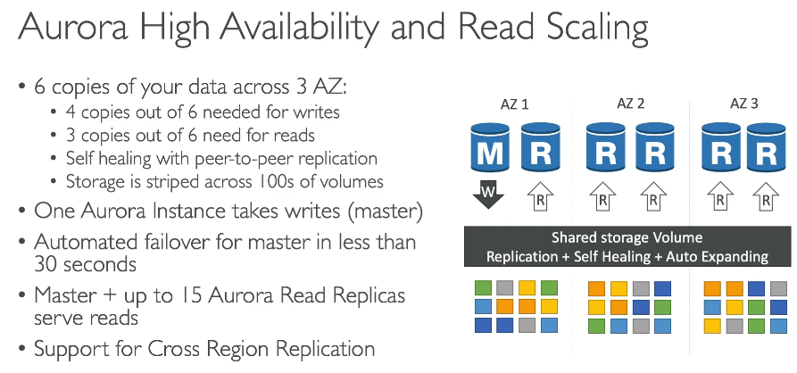
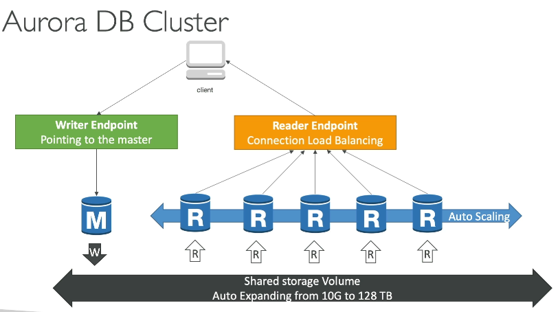
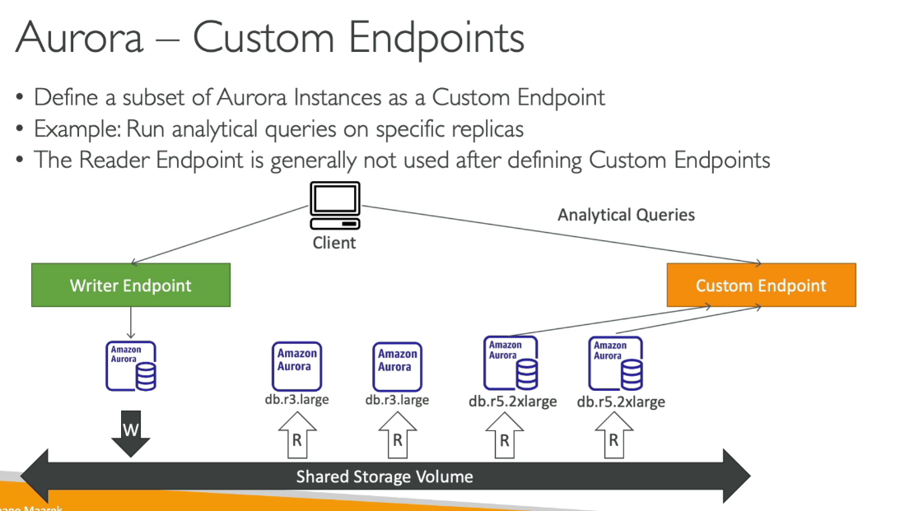
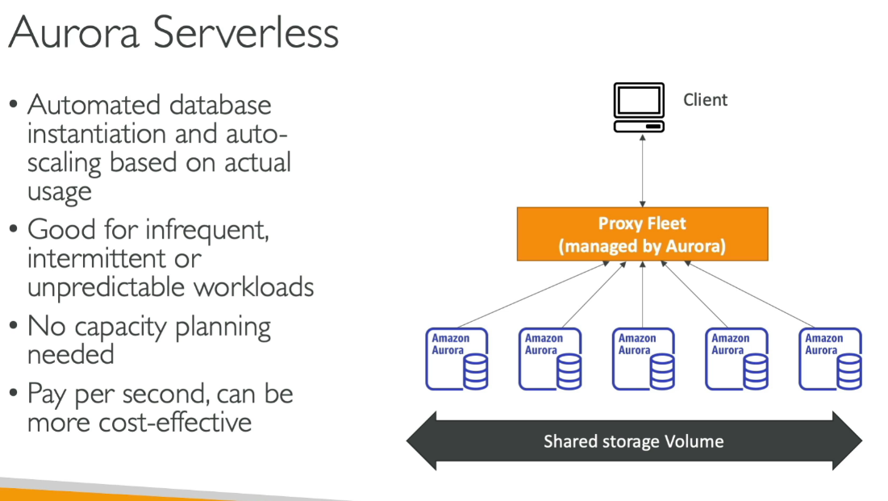
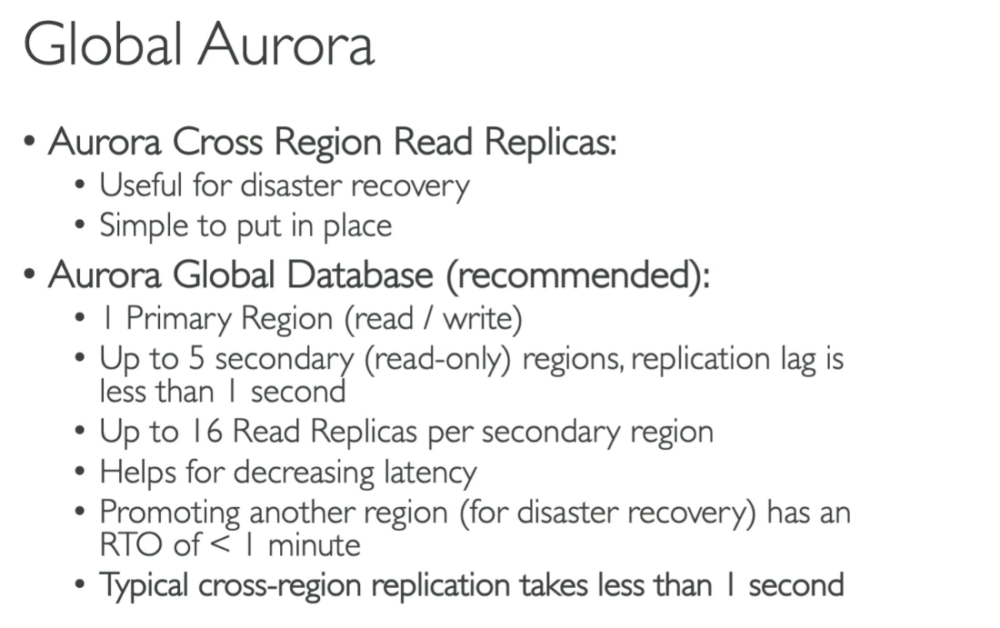
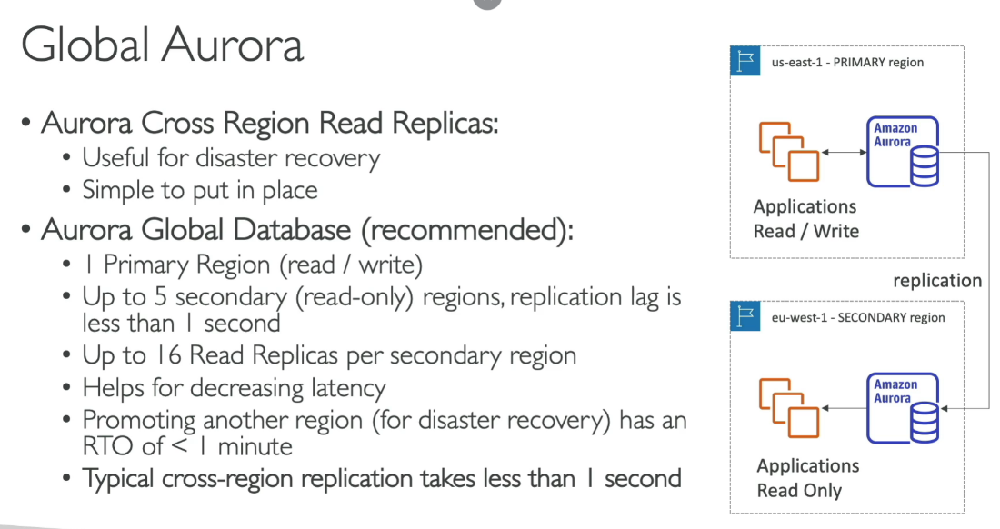
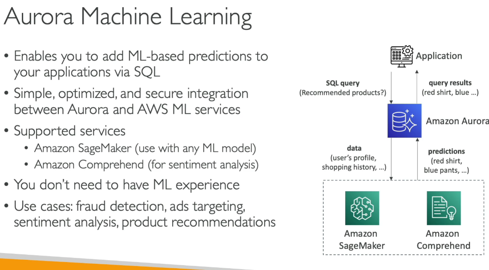
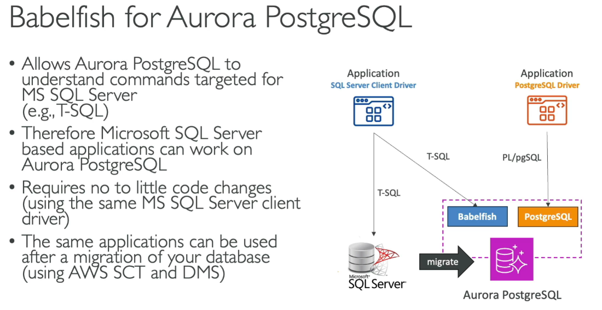
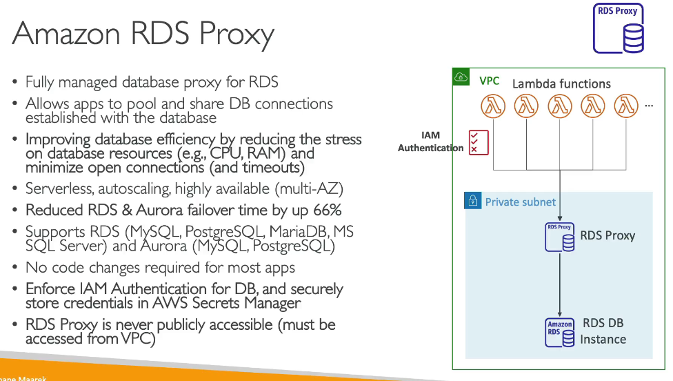

🔑 What is Amazon Aurora?
  • Fully managed, high-performance relational database by AWS
  • Compatible with MySQL and PostgreSQL
  • Built for speed, availability, and durability
  • Part of the Amazon RDS family but optimized under the hood
  📌 Performance:
    ○ Up to 5x faster than MySQL
    ○ Up to 3x faster than PostgreSQL

Aurora MySQL offers:

Up to five times the throughput of MySQL Community Edition
Up to 128 TB of autoscaling SSD storage
Six-way replication across three Availability Zones
Up to 15 read replicas with replica lag under 10-ms
Automatic monitoring with failover

🧩 Key Features

🛠️ Storage & Performance
  • SSD-backed storage that auto-scales from 10GB to 128TB
  • Uses quorum-based replication across 3 AZs (6 copies of data)
  • Automatic failover in under 30 seconds ✔

💼 Replicas
  • Supports up to 15 Aurora read Replicas
    ○ Shared storage, so no replication lag
  • Auto failover to replicas if writer fails

🗂️ Backups
  • Continuous backups to Amazon S3
    ○ No impact on performance
  • Point-in-time recovery supported ✔

🌍 Aurora Global Databases
  • Designed for low-latency global reads
    ○ Supports up to 5 secondary regions
    ○ \<1s replication lag
  • Use for disaster recovery & global apps
  📌 Use Global Aurora for multi-region, mission-critical workloads

✨ Aurora Serverless v2
  • Auto-scales compute in fine-grained increments
  • Ideal for variable or unpredictable workloads
  • Pay-per-second billing model
  • Maintains warm pools for near-instant scaling
  💡 Great for dev/test, infrequent workloads, or new applications

🔐 Security
  • Encryption at rest via AWS KMS
  • Encryption in transit via TLS
  • Supports IAM authentication

🔧 Monitoring & Integration
  • Works with:
    ○ Amazon CloudWatch (metrics/logs)
    ○ AWS CloudTrail (auditing)
    ○ RDS Performance Insights
  📌 Fully integrated with AWS ecosystem

📊 Pricing
  • Aurora (Provisioned): Pay per instance hour
  • Aurora Serverless: Pay per second for active compute
  • Backup storage & IO operations billed separately
  💡 Stop unused instances to reduce costs

⚠️ Exam Tips & Best Practices
  ✔ Aurora is proprietary, not open-source
  ✔ Use Aurora Serverless v2 for on/off workloads
  ✔ Use Aurora Global for multi-region disaster recovery
  ✔ Aurora replicas are faster and cheaper than standard RDS
  ✔ Aurora maintains high durability via multi-AZ replication

Less then 1 sec to do cross region replication

