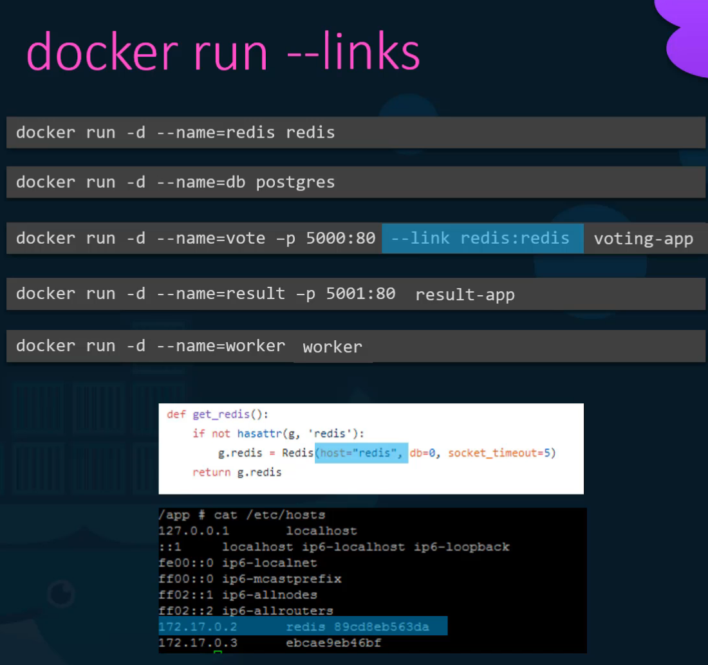
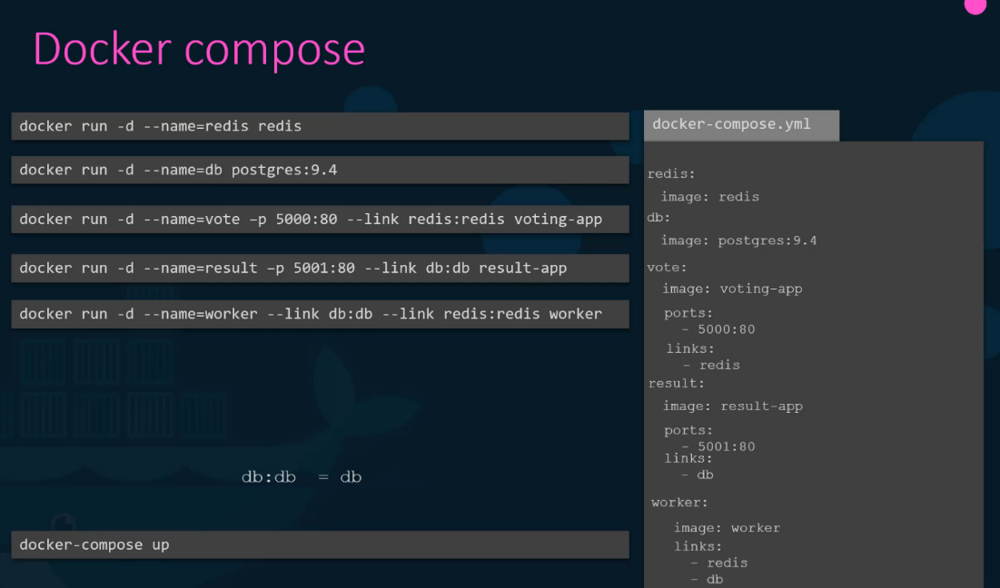
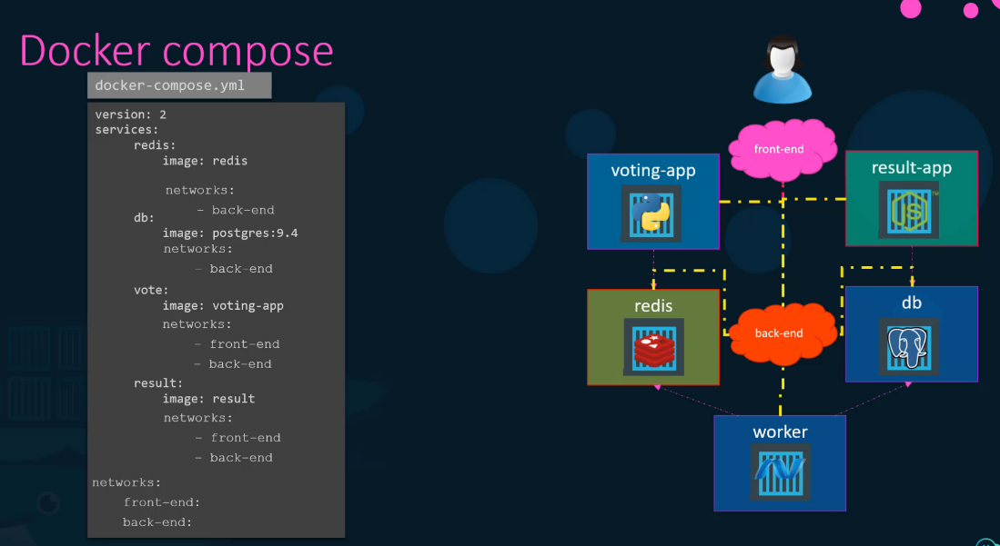

<table>
<colgroup>
<col style="width: 100%" />
</colgroup>
<thead>
<tr class="header">
<th>
🌟 What is Docker Compose?

<ul>
<li>
A tool for defining and managing multi-container Docker applications.
</li>
<li>
Allows starting multiple containers in one go using a single YAML file
</li>
</ul>
<blockquote>

(docker-compose.yml).

</blockquote>

why?

🛠️ Basic Structure of docker-compose.yml:

version: '3.8' <em># Docker Compose version</em>

services: 

 app_service: <em># Name of the service (container)</em>

  image: my_app_image <em># or ./vote # location to Dockerfile</em>

  ports:

   - "8080:80" <em># Port mapping (host:container)</em>

  links:

   - db_service <em># Deprecated: Was used to Linking to another service</em>

  networks:

   - app_network <em># Custom network</em>

  depends_on:

   - db_service <em># Ensure the database starts first</em>

  environment:

   - APP_ENV=production

 db_service:

  image: mysql:5.7

  environment:

   MYSQL_ROOT_PASSWORD: example

  volumes:

   - db_data:/var/lib/mysql

networks:

 app_network:

volumes:

 db_data:

🛠️ Key Docker Compose Components:

<table>
<colgroup>
<col style="width: 31%" />
<col style="width: 68%" />
</colgroup>
<thead>
<tr class="header">
<th>Services:</th>
<th>Defines individual containers (like app and database).</th>
</tr>
</thead>
<tbody>
<tr class="odd">
<td>Ports Mapping (ports):</td>
<td>Maps ports between host and container.</td>
</tr>
<tr class="even">
<td>
Links (links)

(Deprecated in v3+):
</td>
<td>Adds entries to the /etc/hosts file to allow container communication.</td>
</tr>
<tr class="odd">
<td>Depends On (depends_on):</td>
<td>Ensures one service starts after another.</td>
</tr>
<tr class="even">
<td>Networks (networks):</td>
<td>Creates isolated networks for secure communication.</td>
</tr>
<tr class="odd">
<td>Volumes (volumes):</td>
<td>Persistent data storage between container restarts.</td>
</tr>
<tr class="even">
<td>Build Context (build):</td>
<td>
When a Dockerfile is available, specify the build directory. 
 

build: ./app_directory 
</td>
</tr>
</tbody>
</table>

🚀 Commands to Run Docker Compose:

<table>
<colgroup>
<col style="width: 40%" />
<col style="width: 59%" />
</colgroup>
<thead>
<tr class="header">
<th>docker-compose up -d</th>
<th>Start containers in the background:</th>
</tr>
</thead>
<tbody>
<tr class="odd">
<td>docker-compose down</td>
<td>Stop running containers:</td>
</tr>
<tr class="even">
<td>docker-compose logs</td>
<td>View logs:</td>
</tr>
<tr class="odd">
<td>docker-compose up --scale app_service=3</td>
<td>Scale services:</td>
</tr>
</tbody>
</table>

link Add entry to the host file of voting-appp

--link redis:redis

containerName:NameOfHostAppLookingFor(in code i guess)

<blockquote>

</blockquote>

Network

</th>
</tr>
</thead>
<tbody>
</tbody>
</table>
