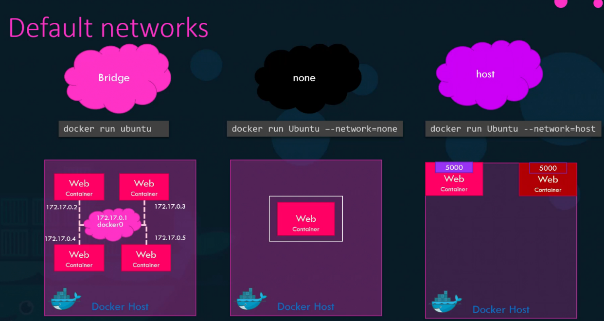
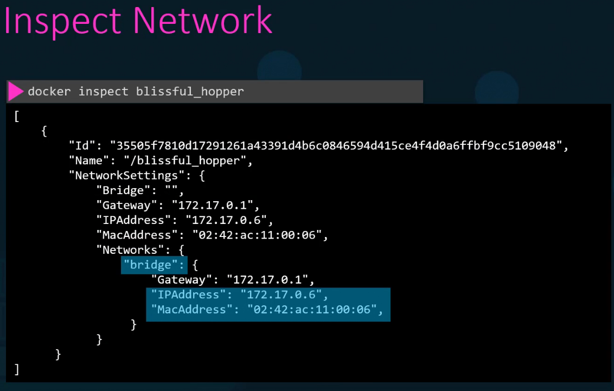

<table>
<colgroup>
<col style="width: 100%" />
</colgroup>
<thead>
<tr class="header">
<th>
4️⃣ Networking (Container Communication) 🌐

<ul>
<li>
Docker provides multiple networking options:

<ul>
<li>
Bridge (default network) → Containers on the same host can talk to each other.
</li>
<li>
Host → Uses the host network directly (no isolation).
</li>
<li>
Overlay → Enables communication across multiple hosts.
</li>
<li>
None → No network access.
</li>
</ul></li>
</ul>

Example: Running a container with port mapping for Bridge Network

docker run -p 8080:80 nginx

Maps port 80 of the container to port 8080 of the host.

Important Docker Networking commands:

🔍 Viewing Networks

<table>
<colgroup>
<col style="width: 47%" />
<col style="width: 52%" />
</colgroup>
<thead>
<tr class="header">
<th>docker network ls</th>
<th>→ List all available Docker networks.</th>
</tr>
</thead>
<tbody>
<tr class="odd">
<td>docker network inspect &lt;network_id_or_name&gt;</td>
<td>→ Get detailed information about a specific network.</td>
</tr>
</tbody>
</table>

🌐 Creating &amp; Removing Networks

<table>
<colgroup>
<col style="width: 46%" />
<col style="width: 53%" />
</colgroup>
<thead>
<tr class="header">
<th>docker network create &lt;network_id&gt;</th>
<th>→ Create a new custom network.</th>
</tr>
</thead>
<tbody>
<tr class="odd">
<td>docker network rm &lt;network_name&gt;</td>
<td>→ Remove a specific network.</td>
</tr>
</tbody>
</table>

🔗 Connecting &amp; Disconnecting Containers

<table>
<colgroup>
<col style="width: 46%" />
<col style="width: 53%" />
</colgroup>
<thead>
<tr class="header">
<th>docker network connect &lt;network_name&gt; &lt;container_name&gt;</th>
<th>→ Connect a running container to a network.</th>
</tr>
</thead>
<tbody>
<tr class="odd">
<td>docker network disconnect &lt;network_name&gt; &lt;container_name&gt;</td>
<td>→ Disconnect a container from a network.</td>
</tr>
</tbody>
</table>

🚀 Running Containers with Network Options

<table>
<colgroup>
<col style="width: 46%" />
<col style="width: 53%" />
</colgroup>
<thead>
<tr class="header">
<th>docker run --network &lt;network_name&gt; &lt;image&gt;</th>
<th>→ Start a container in a specific network.</th>
</tr>
</thead>
<tbody>
<tr class="odd">
<td>docker run --network host &lt;image&gt;</td>
<td>→ Use the host network (no isolation).</td>
</tr>
<tr class="even">
<td>docker run --network none &lt;image&gt;</td>
<td>→ Start a container with no network access.</td>
</tr>
</tbody>
</table>

🔄 Port Mapping &amp; Communication

<table>
<colgroup>
<col style="width: 52%" />
<col style="width: 47%" />
</colgroup>
<thead>
<tr class="header">
<th>docker run -p &lt;host_port&gt;:&lt;container_port&gt; &lt;image&gt;</th>
<th>→ Map container ports to host ports (default bridge network).</th>
</tr>
</thead>
<tbody>
<tr class="odd">
<td>docker exec -it &lt;container_id&gt; ping &lt;another_container&gt;</td>
<td>→ Check communication between containers in the same network.</td>
</tr>
</tbody>
</table>

bridge is default

docker has build in dns server that help container to resolve each other with the name of the container

<em># create network</em>

docker network create --driver=bridge --gateway=182.18.0.1 --subnet=182.18.0.0/24 wp-mysql-network 

<em># create mysql db in network</em>

docker run -d --name=mysql-db -e MYSQL_ROOT_PASSWORD=db_pass123 --network=wp-mysql-network mysql:5.6

<em># create application in network with link to mysql-db</em>

docker run -d --name=webapp -p 38080:8080 -e DB_Host=mysql-db -e DB_Password=db_pass123 --network=wp-mysql-network --link mysql-db:mysql-db kodekloud/simple-webapp-mysql

</th>
</tr>
</thead>
<tbody>
</tbody>
</table>
