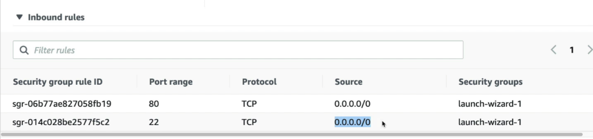

**<u>EC2 Instances</u>**
\|- actual vertual machine

\|- It has memory cpu os inside it

**<u>Elastic Ips</u>**
\|- gives you static ip ( not auto assigned )

\|- you can assign that to any EC2 instence you created

**<u>Connect with Instence</u>**
\|- SSH - Port 22 in inbout rule of SG

\|- You need .pem key

\|- ssh -i "key_path.pem" ubunto@ec2-3-4-177.ap-south-1.compute.amazonaws.com

\|- you can use your instance remotely

\|- Inbound rule for port 22 from Anywhere required

