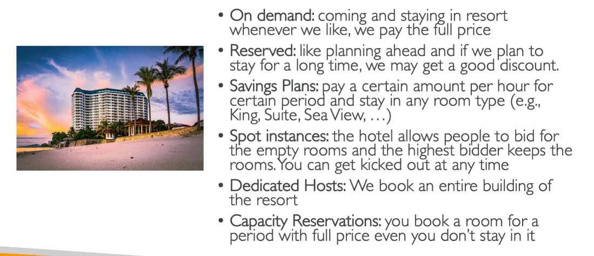
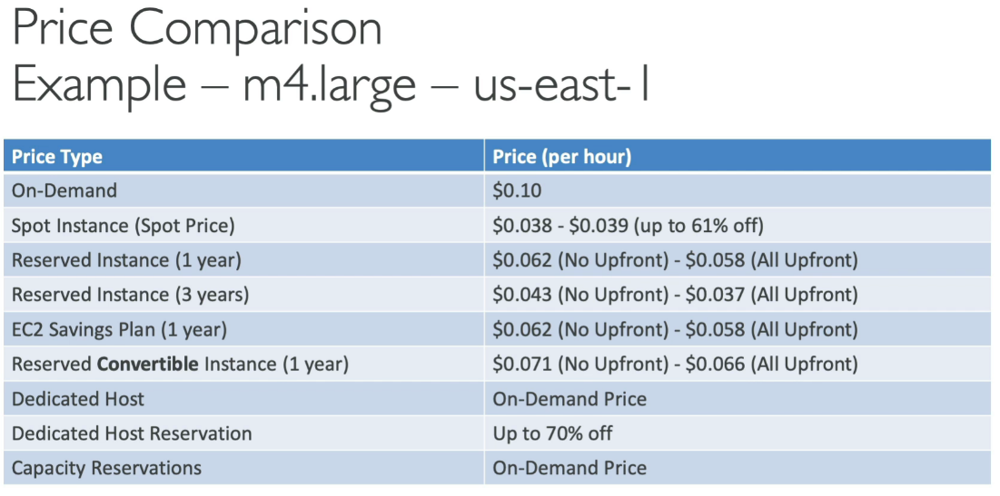

<table>
<colgroup>
<col style="width: 14%" />
<col style="width: 12%" />
<col style="width: 12%" />
<col style="width: 10%" />
<col style="width: 14%" />
<col style="width: 19%" />
<col style="width: 15%" />
</colgroup>
<thead>
<tr class="header">
<th>Option</th>
<th>What is it?</th>
<th>Commitment</th>
<th>Discount vs On-Demand</th>
<th>Interruption Risk</th>
<th>Best Use Case</th>
<th>Flexibility</th>
</tr>
</thead>
<tbody>
<tr class="odd">
<td>On-Demand</td>
<td>Pay-per-use with no long-term commitment</td>
<td>None</td>
<td>❌ No discount</td>
<td>❌ No</td>
<td>Short-term, unpredictable workloads</td>
<td>✅ High</td>
</tr>
<tr class="even">
<td>Reserved Instances</td>
<td>Reserve specific instance type in specific region/AZ for long term</td>
<td>1 or 3 years</td>
<td>✅ Up to 75% compared to on-Demand</td>
<td>❌ No</td>
<td>Steady-state or predictable workloads</td>
<td>⚠️ Limited (Convertible RIs are flexible)</td>
</tr>
<tr class="odd">
<td>Savings Plans</td>
<td>Commit to a specific amount</td>
<td>1 or 3 years specific amount ($/hr)</td>
<td>✅ Up to 72%</td>
<td>❌ No</td>
<td>Consistent usage across multiple services</td>
<td>✅ High (especially Compute SP)</td>
</tr>
<tr class="even">
<td>Spot Instances</td>
<td>Buy unused EC2 capacity at a discount, can be reclaimed by AWS anytime</td>
<td>None</td>
<td>✅ Up to 90%</td>
<td>✅ Yes (2 mins notice)</td>
<td>Batch jobs, stateless/fault-tolerant apps</td>
<td>
⚠️ Medium (based on availability)

Less reliable
</td>
</tr>
<tr class="odd">
<td>Dedicated Hosts</td>
<td>Physical server dedicated to you; lets you use your own licenses</td>
<td>1 or 3 years (optional)</td>
<td>✅ Can save (BYOL)</td>
<td>❌ No</td>
<td>License compliance, regulatory requirements</td>
<td>⚠️ Low</td>
</tr>
<tr class="even">
<td>Dedicated Instances</td>
<td>no other customers will share your hardware</td>
<td>None</td>
<td>⚠️ Slightly higher cost</td>
<td>❌ No</td>
<td>Workloads needing physical isolation</td>
<td>⚠️ Medium</td>
</tr>
<tr class="odd">
<td>Capacity Reservations</td>
<td>Reserve EC2 capacity in a specific AZ without launching the instance</td>
<td>Optional (by hour or duration)</td>
<td>❌ No discount</td>
<td>❌ No</td>
<td>Ensure capacity in specific AZ for DR, HA</td>
<td>✅ High (can combine with RIs)</td>
</tr>
</tbody>
</table>

💸 Cost-effective and ✅ Highly Available!
🧩 Spot Instances for most of the load + On-Demand fallback via Auto Scaling + Multi-AZ deployment =

**☁️ EC2 Instance Purchasing Options**
**1️⃣ On-Demand Instances**
📌 Pay-as-you-go pricing (per second/minute/hour)
📌 Best for short-term, unpredictable workloads
📌 No upfront commitment
✔ Ideal for testing, dev environments, or first-time cloud users

**2️⃣ Reserved Instances (RI)**
📌 Commitment of 1 or 3 years
📌 Significant savings (up to 75%) compared to On-Demand
📌 Two types:
Standard RI – Can’t change much after purchase

Convertible RI – Flexible but slightly more expensive  
✔ Great for steady-state or predictable usage

**3️⃣ Savings Plans**
📌 Flexible alternative to RIs
📌 Commit to a specific amount (\$/hr) for 1 or 3 years
📌 Covers multiple services (not just EC2)
📌 Two types:
Compute Savings Plan – Most flexible

EC2 Instance Savings Plan – More specific  
✔ Better flexibility with cost savings

**4️⃣ Spot Instances**
📌 Up to 90% cheaper than On-Demand
📌 Use unused EC2 capacity
📌 Can be lose with short notice (2 minutes warning)
✔ Best for stateless, fault-tolerant, batch, or big data jobs

**5️⃣ Dedicated Hosts**
📌 Physical servers dedicated to your use
📌 Helps with licensing compliance (e.g., Windows/Oracle)
📌 Visibility into sockets, cores, host-level metrics
✔ Ideal for BYOL (Bring Your Own License) scenarios

**6️⃣ Dedicated Instances**
📌 EC2 instances running on hardware dedicated to a single customer
📌 Not as isolated as Dedicated Hosts (you don’t control the host)
✔ Suitable when compliance requires physical isolation

**7️⃣ Capacity Reservations**
📌 Reserve capacity in a specific AZ
📌 Useful for disaster recovery or high availability setups
📌 Charged regardless of instance usage (if not combined with RIs)
✔ Combine with RIs for cost-efficient reservations
