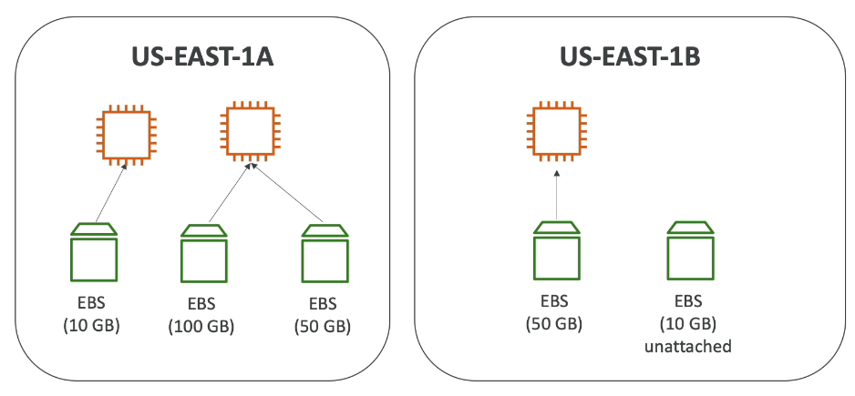
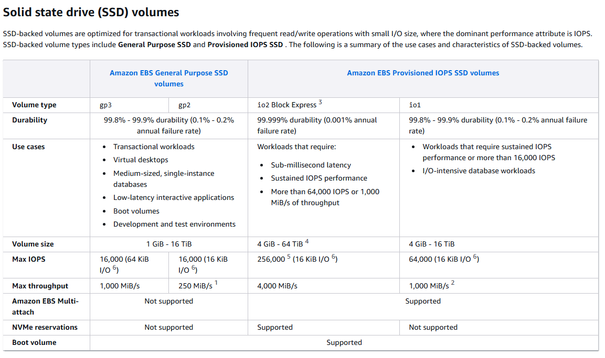
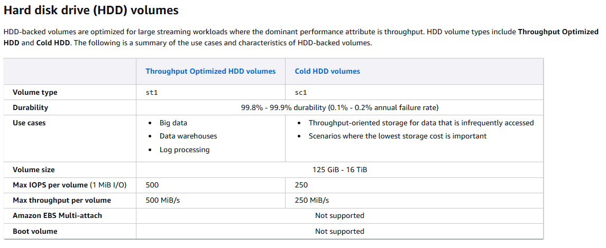
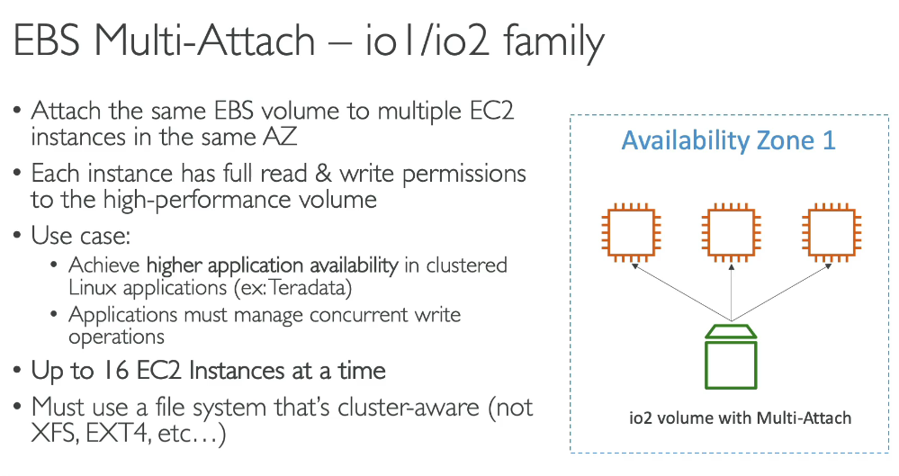
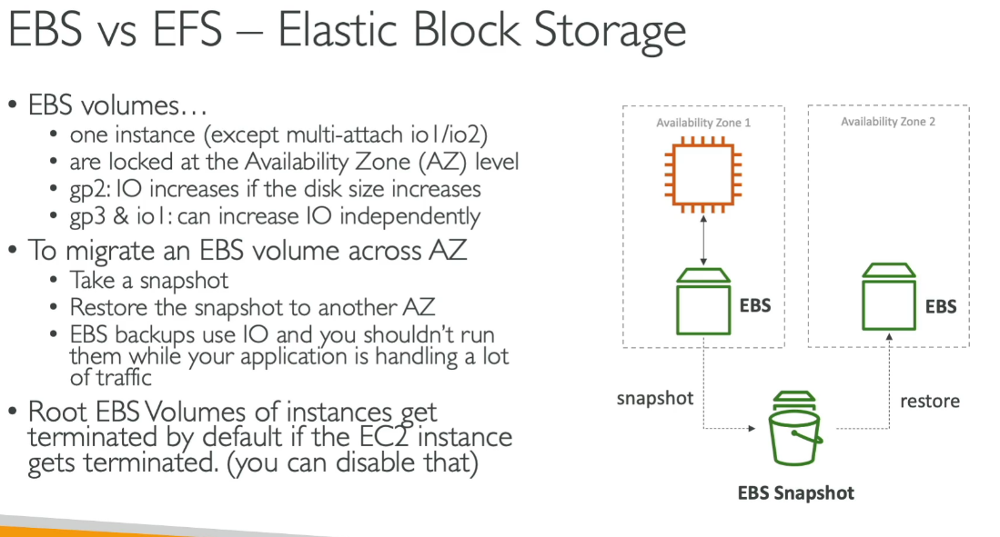
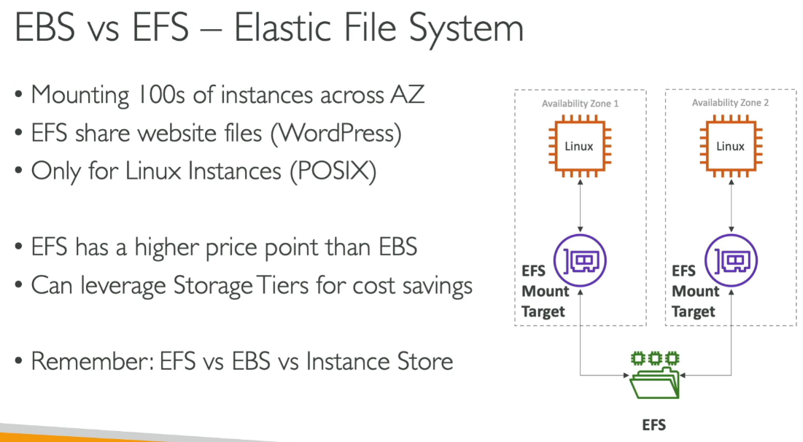

🛠️ AWS EBS (Elastic Block Store)
🛠️ AWS EFS (Elastic File System)

🔍 EBS Basics
  • Block-level storage service used with AWS EC2 instances
  • EBS volumes are bound to a specific Availability Zone (AZ)
    ○ Just like EC2, you can't attach across AZs
  • 📌 Root volume (/dev/xvda) is deleted on instance termination by default
    ○ Other attached EBS volumes are not deleted unless specified

🧩 Snapshots
  • EBS Snapshots are point-in-time backups of EBS volumes
  • 📌 Recycle Bin:
    ○ Protects EBS Snapshots and AMIs from accidental deletion
    ○ You can set retention policies

🔐 Encryption
  • You can encrypt an EBS volume using AWS-managed KMS key (aws/ebs)
  • 💡 Use copy snapshot to: ○ Create an encrypted snapshot from an unencrypted one

💻 EBS Volume Types for Root Device
  • 📌 Allowed types for boot volume:
○ gp2 / gp3 – General Purpose SSD
    ○ io1 / io2 – Provisioned IOPS SSD

🧑‍💻 Using lsblk to View Block Devices
  \[ec2-user@ip-10-0-0-180 ~\]\$ lsblk
  NAME   MAJ:MIN RM SIZE RO TYPE MOUNTPOINT
  xvda   202:0  0  8G 0 disk
  └─xvda1  202:1  0  8G 0 part /
  xvdb   202:16  0  5G 0 disk
  xvdf   202:80  0 100G 0 disk
  • xvda: Root disk
    ○ Mounted at /
  • xvdb and xvdf: Additional attached volumes
    ○ Not mounted by default - but you can mount it

🛠️ Mounting xvdf (Quick Steps)
\# 1. Check if it has a filesystem
sudo file -s /dev/xvdf
\# 2. Format as ext4 (⚠️ Only if needed!)
sudo mkfs -t ext4 /dev/xvdf
\# 3. Create a mount point
sudo mkdir /mnt/xvdf
\# 4. Mount the volume
sudo mount /dev/xvdf /mnt/xvdf
\# 5. (Optional) Add to /etc/fstab To auto-mount it after every reboot,
echo "/dev/xvdf /mnt/xvdf ext4 defaults,nofail 0 2" \| sudo tee -a /etc/fstab

<table>
<colgroup>
<col style="width: 16%" />
<col style="width: 15%" />
<col style="width: 9%" />
<col style="width: 10%" />
<col style="width: 15%" />
<col style="width: 15%" />
<col style="width: 17%" />
</colgroup>
<thead>
<tr class="header">
<th>Volume Type</th>
<th>Cost</th>
<th>Volume Size Range</th>
<th>Max IOPS</th>
<th>Max Throughput</th>
<th>Durability</th>
<th>Use Cases</th>
</tr>
</thead>
<tbody>
<tr class="odd">
<td>General Purpose SSD (gp3)</td>
<td>$$</td>
<td>1 GiB – 16 TiB</td>
<td>16,000</td>
<td>1,000 MiB/s</td>
<td>99.8%–99.9%</td>
<td>
Boot volumes,

small to medium databases,

development and test environments
</td>
</tr>
<tr class="even">
<td>Provisioned IOPS SSD (io2)</td>
<td>$$$$$</td>
<td>4 GiB – 64 TiB</td>
<td>256,000</td>
<td>4,000 MiB/s</td>
<td>99.999%</td>
<td>
High-performance databases,

mission-critical applications requiring low latency
</td>
</tr>
<tr class="odd">
<td>Throughput Optimized HDD (st1)</td>
<td>$</td>
<td>500 GiB – 16 TiB</td>
<td>500</td>
<td>500 MiB/s</td>
<td>99.8%–99.9%</td>
<td>
Big data, data warehouses,

log processing,

streaming workloads
</td>
</tr>
<tr class="even">
<td>Cold HDD (sc1)</td>
<td>$ (cheapest)</td>
<td>500 GiB – 16 TiB</td>
<td>250</td>
<td>250 MiB/s</td>
<td>99.8%–99.9%</td>
<td>
Infrequently accessed data,

archival storage,

backups
</td>
</tr>
</tbody>
</table>

<table>
<colgroup>
<col style="width: 36%" />
<col style="width: 21%" />
<col style="width: 42%" />
</colgroup>
<thead>
<tr class="header">
<th>Scenario</th>
<th>Recommended 
EBS Type</th>
<th>Reason</th>
</tr>
</thead>
<tbody>
<tr class="odd">
<td>Boot volume for EC2</td>
<td>gp3</td>
<td>Balanced performance and cost.</td>
</tr>
<tr class="even">
<td>High-performance DBs (Oracle, SQL Server) - for database workloads</td>
<td>io2/io1</td>
<td>Low latency, high IOPS support.</td>
</tr>
<tr class="odd">
<td>Log processing or streaming</td>
<td>st1</td>
<td>High throughput required for large datasets.</td>
</tr>
<tr class="even">
<td>Long-term data archiving</td>
<td>sc1</td>
<td>Cost-effective for rarely accessed data.</td>
</tr>
</tbody>
</table>

EFS

