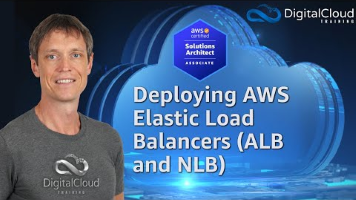

❗ What if you need a static IP?
If you need static IPs, consider:

NLB (Network Load Balancer): Supports Elastic IPs, which are static.
You can put ALB behind NLB using AWS Global Accelerator for static IPs + HTTP/HTTPS support.

<table>
<colgroup>
<col style="width: 28%" />
<col style="width: 35%" />
<col style="width: 36%" />
</colgroup>
<thead>
<tr class="header">
<th>Feature / Use Case</th>
<th>NLB (Network Load Balancer)</th>
<th>ALB (Application Load Balancer)</th>
</tr>
</thead>
<tbody>
<tr class="odd">
<td>OSI Layer</td>
<td>
Layer 4 (TCP, UDP, TLS)

Transport
</td>
<td>
Layer 7 (HTTP, HTTPS, WebSocket)

Application
</td>
</tr>
<tr class="even">
<td>Protocol Support</td>
<td>TCP, UDP, TLS</td>
<td>HTTP, HTTPS, WebSocket</td>
</tr>
<tr class="odd">
<td>Performance</td>
<td>Ultra-high performance; millions of requests/sec</td>
<td>High performance, but slightly lower than NLB</td>
</tr>
<tr class="even">
<td>Latency</td>
<td>Ultra-low (suitable for real-time systems)</td>
<td>Slightly higher due to Layer 7 processing</td>
</tr>
<tr class="odd">
<td>Static IP Support</td>
<td>✅ (Elastic IPs)</td>
<td>❌ (uses dynamic IPs)</td>
</tr>
<tr class="even">
<td>Preserve Client IP</td>
<td>✅</td>
<td>Only vi a X-Forwarded-For header</td>
</tr>
<tr class="odd">
<td>TLS Termination</td>
<td>✅</td>
<td>✅</td>
</tr>
<tr class="even">
<td>Advanced Routing (URL path, host-based, headers, etc.)</td>
<td>❌</td>
<td>✅</td>
</tr>
<tr class="odd">
<td>WebSocket Support</td>
<td>✅ (via TCP)</td>
<td>✅</td>
</tr>
<tr class="even">
<td>Target Types</td>
<td>EC2 , IP , ALBs</td>
<td>EC2, IP, Lambda</td>
</tr>
<tr class="odd">
<td>Use with PrivateLink</td>
<td>✅ (required)</td>
<td>❌</td>
</tr>
<tr class="even">
<td>AWS WAF Integration</td>
<td>❌</td>
<td>✅</td>
</tr>
<tr class="odd">
<td>Best For</td>
<td>Real-time apps, gaming, messaging, low-latency needs, private services</td>
<td>Web apps, microservices, API Gateway, advanced routing needs</td>
</tr>
</tbody>
</table>

\$ nslookup WebServer-nlb-5de2d39359116356.elb.us-east-1.amazonaws.com

[Deploying AWS Elastic Load Balancers \| ALB and NLB](https://youtu.be/4RfWO07ZY0M)

