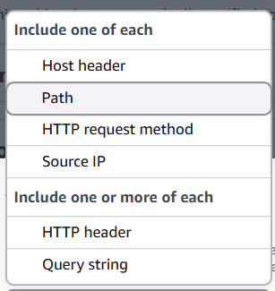

🧠 AWS ALB (Application Load Balancer)

<table>
<colgroup>
<col style="width: 100%" />
</colgroup>
<thead>
<tr class="header">
<th>

🔍 What is ALB?

• Application-layer (Layer 7) load balancer in ELB family

• Handles HTTP/HTTPS traffic

• Supports content-based routing, SSL termination, and WebSocket 
 
While Creating:

Launch it in Public AZ for internet facing

AllowHTTP Port 80 in SG of ALB 
 

</th>
</tr>
</thead>
<tbody>
<tr class="odd">
<td>
🔧 Core Components

1) 📡Listener

• Defines protocol and port (e.g., HTTP:80, HTTPS:443)

• that the ALB uses to listen for incoming traffic.

• For HTTPS, must define SSL/TLS certificate

  ○ ALB can decrypt SSL → reduces backend load

  ○ Works with AWS ACM (free certs)

  ✔ Best Practices

    ○ Terminate SSL at ALB for centralized cert management

    ○ Boosts performance by offloading resource-intensive SSL task

2) 🎯 Target Groups (<a href="onenote:#🎯%20Target%20Group&amp;section-id={2A2C6C0B-4FB4-4574-B5DF-19755D1A951A}&amp;page-id={8E314693-AD62-41F5-894E-5AD7453608DC}&amp;end&amp;base-path=https://d.docs.live.net/488D82FE7A9FEF0F/Documents/AWS/🖥️%20EC2.one">Target Groups</a>)

• Collections of targets (e.g., EC2, Lambda, IP)

• That Receive traffic based on listener rules

• Health checks defined at TG level

3) 🛣 Listener Rules

• Rules are Used to Route traffic to TG based on the if condition on each request of listner

 ○ If Conditions:

    ✔ Path-based → /api → API service

    ✔ Host-based → admin.site.com → Admin service

    ✔ Header-based → based on HTTP headers

    ✔ Use Weighted Target Routing when multiple TGs are used

  ○ then: Action FW 30% trffic to TG | Redirect to URL | Return Fixed Response

<blockquote>

</blockquote>

• 📌 Rule Types:

  ○ Default Rule → used when no custom rule matches

  ○ Custom Rules → evaluated top to bottom

✔ALB rules have unique priorities (1–50,000); lower runs first, default runs last.

✔Use gaps (e.g., 100, 200) for easy future rule additions.

• 💡 Weighted Routing on TG

  ○ weight value is proportional, Use to split traffic across multiple TG.

<table>
<colgroup>
<col style="width: 45%" />
<col style="width: 30%" />
<col style="width: 23%" />
</colgroup>
<thead>
<tr class="header">
<th>Target Group  </th>
<th>If Weight</th>
<th>Traffic</th>
</tr>
</thead>
<tbody>
<tr class="odd">
<td>tg-blue  </td>
<td>80</td>
<td>80%</td>
</tr>
<tr class="even">
<td>tg-green  </td>
<td>20</td>
<td>20%</td>
</tr>
</tbody>
</table>
<blockquote>

</blockquote>

• 🧷 Turn on target group stickiness

  ○ Enable on a rule to bind user sessions to the same target

  ○ Why: Useful when your app stores session data locally on the instance

(i.e., not in a shared DB or Redis).

  ○ How: Only works if client supports cookie.

</td>
</tr>
<tr class="even">
<td>
🛠️ Key Features:

🌐 WebSocket &amp; HTTP/2

  • ALB Supports real-time comms &amp; modern protocols

    ○ Great for chat apps, live updates, etc.

🛡️ AWS WAF Support

  • Add extra security with AWS WAF

    ○ Protects against DDoS, SQLi, XSS

💸 Pricing

  • Charged based on:

    ○ ALB uptime (per hour)

    ○ LCU (Load Balancer Capacity Units) 
 
 
Problem:

  • ALBs don't support static IPs (only a static DNS name), which is problematic for external DNS providers. solve it with NLB -&gt; ALB -&gt; Instance

</td>
</tr>
</tbody>
</table>
