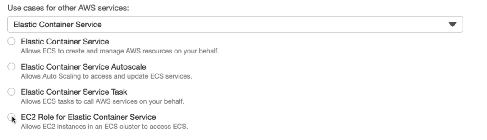

Task Execuation Role: what the ecs agent need to do on my behalf
- pull an container images
- log to cloudwatch log
- do the AWS API call
Provide access to other aws resourses that require to run the ECS task

Task role: It's for your code
- app need do some AWS api call -\> pull s3 object

