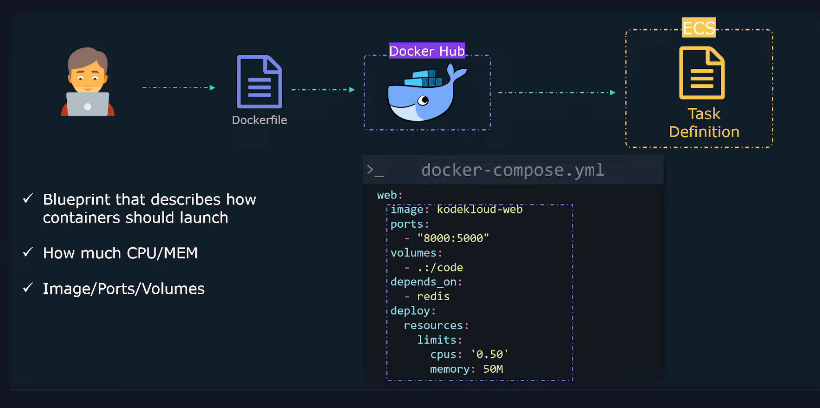
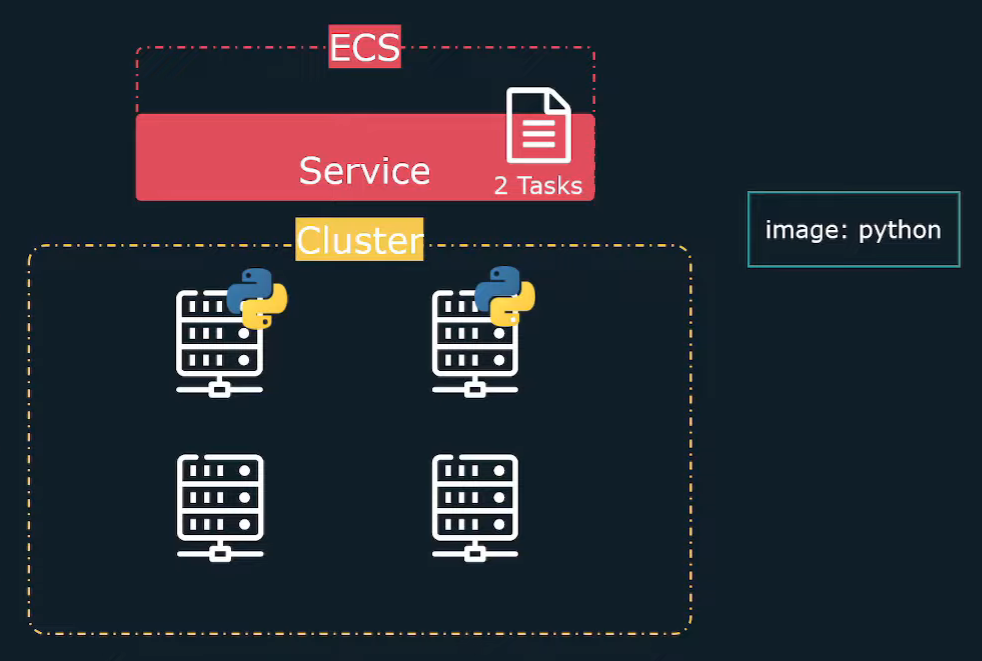
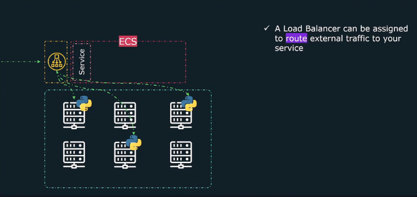

🚢 AWS ECS (Elastic Container Service)
A fully managed container orchestration service for running and scaling Docker containers on AWS. It eliminates the need to manage infrastructure while providing flexibility with different launch types.

🚀 ECS Launch Types
ECS provides two launch types for running containers:
  • EC2 Mode 🖥️
    ○ Runs tasks on self-managed EC2 instances.
    ○ You control instance types, networking, auto-scaling, and OS updates.
    ○ Best suited when you want more customization and control over the infrastructure.
  • Fargate Mode ☁️ (Serverless)
    ○ No need to manage EC2 instances, OS updates, or security patches.
    ○ AWS automatically provisions compute resources.
    ○ Best for serverless deployments and when you want less operational overhead.

🏗️ ECS Cluster
  • A logical grouping of EC2 instances (in EC2 mode) or Fargate resources.
  • Treats a pool of compute resources as an abstract unit.
  • You don’t need to manage individual EC2 instances (IP addresses, hardware specs, etc.).
  • Acts as a resource pool for running tasks and services.

📜 Task Definition (Container Blueprint)
A JSON-based template that defines how containers should run in ECS.
It includes:
  • Container Image 📦 (from ECR/Docker Hub)
  • CPU & Memory ⚙️ (resource limits)
  • Port Mapping 🔌 (exposing container ports)
  • Environment Variables 🌍 (configurable runtime settings)
  • Volumes 🗂️ (persistent storage for containers)
💡 Think of it as the Docker Compose equivalent for ECS.

🏃 Tasks (Running Containers)
  • A task is a running instance of a Task Definition.
  • Tasks run inside a cluster on EC2 instances or Fargate.
  • Multiple tasks can run from the same task definition.
  • Task Scheduling ⏳
    ○ Manual: Run tasks when needed.
    ○ Service: ECS maintains the task count automatically.
    ○ Event-Driven: Run tasks in response to CloudWatch events (e.g., scheduled jobs).
💡 Think of a task as a containerized microservice instance.

🔄 Services (Ensuring Availability & Scaling)
  • Ensures that a specified number of tasks are always running.
  • Self-healing:
    ○ If a container crashes, ECS automatically restarts the task.
    ○ If an EC2 instance fails, the task is rescheduled on another healthy instance.
  • Auto-Scaling:
    ○ Can increase or decrease the number of running tasks based on demand.
    ○ Works with CloudWatch metrics (CPU, memory, request rate, etc.).
💡 Services make ECS ideal for long-running applications (e.g., web apps, APIs).

🌐 Load Balancers (Traffic Distribution)
  • Distributes traffic across multiple running tasks.
  • ECS supports:
    ○ Application Load Balancer (ALB) 🌍 → Routes HTTP(S) requests based on rules (e.g., URLs, headers).
    ○ Network Load Balancer (NLB) ⚡ → Routes TCP/UDP traffic with ultra-low latency.
  • Automatically updates target groups when tasks scale up or down.
  • Ensures high availability and even traffic distribution.
💡 Load balancers make ECS services highly available and scalable.

🔐 ECS Security & Networking
  • IAM Roles & Policies 🔑 → Control access to AWS resources (S3, DynamoDB, etc.).
  • Security Groups & NACLs 🛡️ → Restrict inbound/outbound traffic.
  • VPC & Subnets 🌐 → Define networking rules for ECS tasks.
  • ECS Task Role 🎭 → Grants permissions to running containers for accessing AWS services.

🔄 ECS vs. Kubernetes (EKS) - When to Choose What?
| Feature      | ECS 🚢                      | EKS 🎡 (Kubernetes)              |
|--------------|------------------------------|----------------------------------|
| Ease of Use  | Easier to set up ✅          | More complex setup ❌            |
| Management  | Fully managed AWS service✅  | You manage Kubernetes cluster ❌ |
| Flexibility  | AWS-native, limited to AWS  | Works across clouds ✅           |
| Scaling      | Simple Auto-Scaling ✅      | Advanced Auto-Scaling ✅         |
| Networking  | AWS-native integrations ✅  | More complex networking setup ❌ |

💡 Choose ECS if you want simplicity and AWS-native integration. Use EKS if you need multi-cloud flexibility or Kubernetes-specific features.

Steps to create your first cluster:
  \|- Create A cluster
    \|- Name/Launch type
    \|- VPC/Subnet
    \|- Cluster created

  \|- Create a Task Defination
    \|- Lanuch type
    \|- Task Def Name: taskDef1
\|- Task Role (ecsTaskExecutionRole)
\|- Make API call to aws service
\|- Pull container image from ECR
\|- push log to cloudwatch
    \|- Oprating system
    \|- Task memeory/CPU
    \|- Add Container
      \|- Container name - node-app
      \|- Image Url
      \|- Port mapping
    \|- task Def created

  \|- Create a service
    \|- Launch type
\|- Operating system family
    \|- select Task defination: taskDef1 (Revision 1 latest)
    \|- service name
    \|- No of tasks ( **desired tasks 2** )
    \|- select same VPC/Subnets
    \|- select security group ( what traffic allowed to service )
    \|- set Auto Scaling of the tasks 
    \|- service created

  Problem both 2 task has 2 diff public ip
  Always one task crash then new created to keep desired count public ip changes

  \|- Load Balancer
    \|- one public ip common which will balance load across all tasks

Steps to delete your first cluster:
  \|- Make desired task 0 by updating service
  \|- Delete service
  \|- Delete cluster

