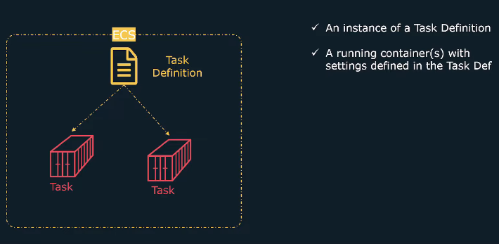
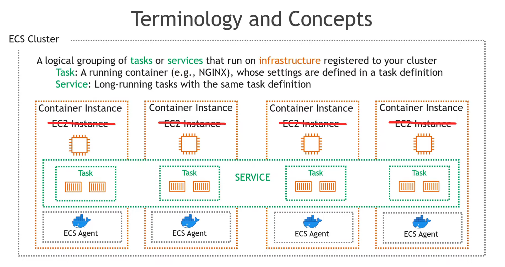

[**ECS:**](https://youtu.be/esISkPlnxL0)
\|- Managed service to Run Docker Containers

\|- Launch Type in ECS

\|- EC2 Hosted

\|- Fargate

\|- you don't need to manage EC2 or software update or security varniablity

**<u>Cluster:</u>**
\|- Set of EC2 Machine

\|- Treat a pool of EC2 Instance as abstract reource

\|- you don't necessarily need to worry about the specific details of each EC2 instance

(such as IP addresses, hardware specifications, etc.)

**<u>TaskDefination:</u>**
\|- BluePrint how your container should launch

\|- Use to define CPU/Memory Ports/Image/Volume/Env variable

\|- Spec for your docker container

\|- Task definition has same setting like docker-compose file like port or memory

**<u>Tasks</u>**
\|- We deploy our docker images on Tasks

\|- We deploy tasks on the cluster

\|- Task is an abstraction on top of docker container

\|- Simple Def = A running Containers with setting defined in the Task Def

**<u>Services:</u>**
\|- Ensure that Certain number of Tasks are running at all time

\|- We tell service that i need 2 instance of this task running all time

\|- IF any container exited/crashed then it will restart task on same EC2

\|- IF any EC2 instance fails, then Service will restart task on a working EC2 instance

**<u>Load Balancers:</u>**
\|- External traffic to the services

\|- It is assiged to the service which then evenly distribute the traffic on running task or instanses

\|- If service scale up tasks then It intelligently pick that up and forward the traffic to that task to

