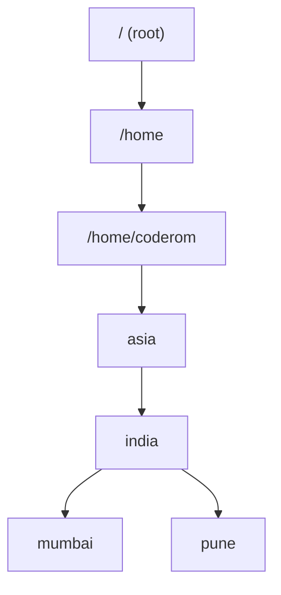

---

#### 1️⃣ Command Categories

- **Internal (shell built-in)**
    - `cd`, `pwd`, `echo`
- **External (binary in PATH)**
    - `cp`, `mv`, `rm`, `uptime`
- Check type:
    - `type cd`
    - `which cp`

---

#### 2️⃣ Your City Style Directory View

---

#### 3️⃣ Core Commands 

- Where am I? → `pwd`
- Create city folder
    - `mkdir mumbai`
    - `mkdir -p india/mumbai` ⚠️ creates parents if missing
- Travel (navigate)
    - `cd /home/coderom/asia/india/mumbai` (absolute path)
    - `cd mumbai` (relative path)
- Copy city files/folders
    - `cp city.txt pune/`
    - `cp -r mumbai/ pune/` ⚠️ `-r` is required for folders
- Move/Rename city
    - `mv mumbai/ pune/` (move)
    - `mv mumbai pune` (rename)
- Remove
    - `rm city.txt`
    - `rm -r pune/` [⚠️ `-r` needed for folders]
- View file
    - `cat city.txt`
    - `less city.txt` 💡 scroll friendly
    - `more city.txt` 💡 page by page

---

#### 4️⃣ LS Flags, simple view

| Command   | Meaning      |
| --------- | ------------ |
| `ls -l`   | details      |
| `ls -a`   | hidden files |
| `ls -lt`  | newest first |
| `ls -ltr` | oldest first |

---
