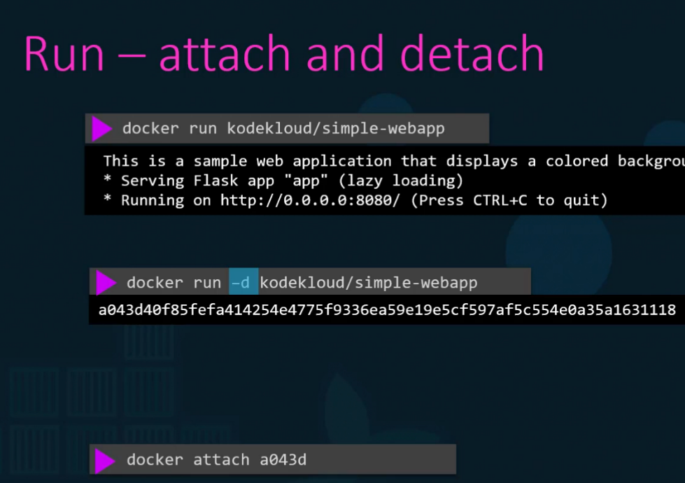
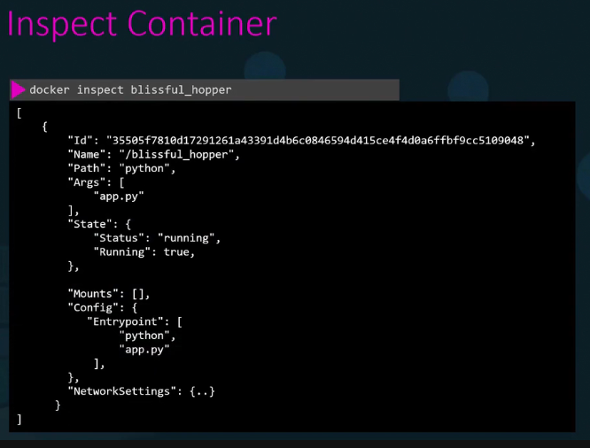
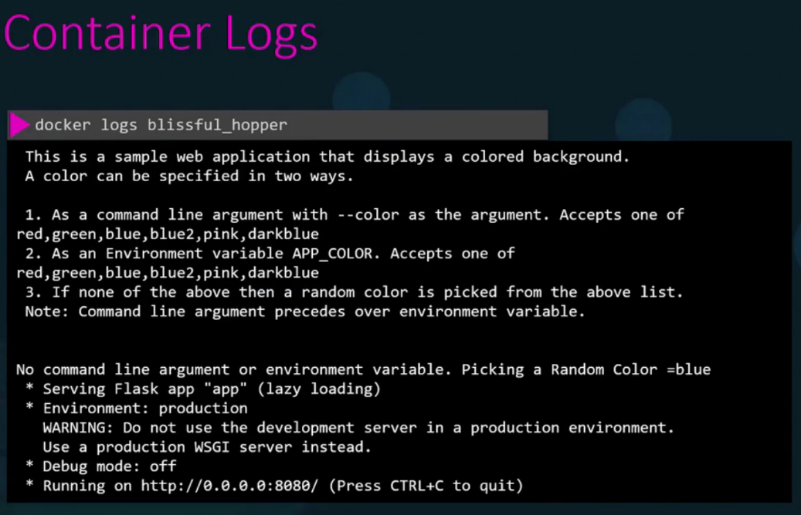

# 🏃‍♂️ Mastering the docker run Command

## 📋 Basic Syntax

```bash
docker run [OPTIONS] IMAGE_NAME[:TAG] [COMMAND] [ARG...]
```

> If the tag version is not specified, Docker defaults to `latest`.

## ⚙️ Common Options

| Option | Description |
|--------|-------------|
| `--name` | Assigns a custom name to the container |
| `-e` or `--env` | Sets environment variables inside the container |
| `-d` or `--detach` | Runs the container in detached mode (background) |
| `-p` or `--publish` | Maps container port to host port (host_port:container_port) |

## 🛠️ Practical Examples

### Executing Commands in a Container
```bash
docker run ubuntu sleep 5
```
- Starts the container →
- Runs sleep for 5 seconds →
- Stops the container

**Verify the execution:**
```bash
docker ps -a
```

### 📂 Accessing Files in a Running Container
```bash
docker exec [containerID] cat /etc/hosts
```
Prints the content of the hosts file.

### 🔗 Attach, Detach, and Reattach
```bash
docker run -d ubuntu
```



### 🖥️ Interactive Mode
```bash
docker run -it centos bash
```
- `-i`: Interactive input
- `-t`: Attach to the terminal
- Opens the Bash shell inside the container

### 🌐 Port Mapping
```bash
docker run -p 80:5000 kodekloud/webapp
```
- `80`: Host port
- `5000`: Container port

### 📂 Volume Mapping (Persistent Data)
```bash
docker run -v /opt/datadir:/var/lib/mysql mysql
```
Maps the external folder `/opt/datadir` to the MySQL container's data directory.

### 🔎 Inspect Container Details
```bash
docker inspect [containerName]
```



### 📝 Viewing Container Logs
```bash
docker logs [containerName]
```



### 🌈 Setting Environment Variables
```bash
docker run -e APP_COLOR=blue simple-webapp
```

**Verify the environment variable:**
```bash
docker inspect [containerName]
```

