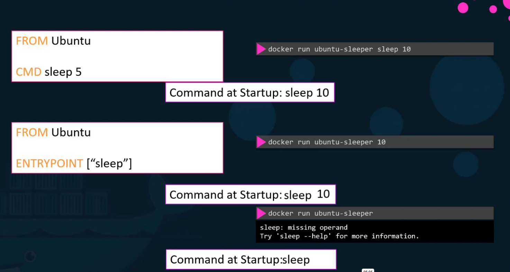
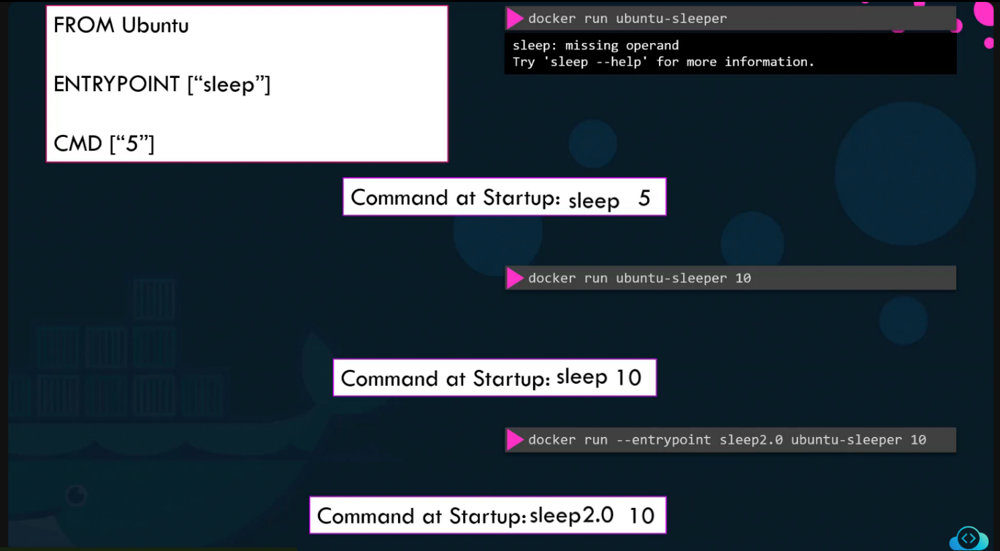

# 🚦 CMD vs ENTRYPOINT

## 📋 Overview

Both CMD and ENTRYPOINT define commands that run when a Docker container starts, but they behave differently when additional arguments are provided.

## 🔵 CMD (Command Directive)

**Purpose:**
- Provides default command to run when the container starts
- Can be overwritten at runtime

**Syntax:**
```dockerfile
CMD ["command", "param1"]
# or
CMD command param1
```

### Example with CMD

```dockerfile
FROM ubuntu 
CMD ["sleep", "5"]
```

**Behavior:**
- Container will terminate after 5 seconds
- **Overriding CMD:**
  ```bash
  docker run ubuntu-sleeper sleep 10
  ```
  The entire CMD instruction gets replaced with `sleep 10`

## 🟢 ENTRYPOINT (Entrypoint Directive)

**Purpose:**
- Sets the executable, making the container behave like a standalone application
- Arguments passed during `docker run` are appended to the entrypoint

**Syntax:**
```dockerfile
ENTRYPOINT ["command"]
```

### Example with ENTRYPOINT

```dockerfile
FROM ubuntu 
ENTRYPOINT ["sleep"]
```

**Behavior:**
- Running the container with an argument:
  ```bash
  docker run ubuntu-sleeper 10
  ```
  `10` gets appended to entrypoint command, resulting in `sleep 10`

## 🔄 Key Differences

| Aspect | CMD | ENTRYPOINT |
|--------|-----|------------|
| **Override Behavior** | Completely replaced by docker run arguments | Arguments are appended to the entrypoint |
| **Use Case** | Default commands that can be changed | Fixed executable with flexible arguments |
| **Flexibility** | High - entire command can be changed | Medium - only arguments can be modified |

## 🤝 Using CMD and ENTRYPOINT Together



You can use both instructions together for maximum flexibility:

```dockerfile
FROM ubuntu
ENTRYPOINT ["sleep"]
CMD ["5"]
```

**Behavior:**
- **Default run:** `docker run ubuntu-sleeper` → executes `sleep 5`
- **With argument:** `docker run ubuntu-sleeper 10` → executes `sleep 10`
- CMD provides default argument, ENTRYPOINT provides the base command



## 💡 Best Practices

- **Use CMD when:** You want to provide a default command that can be easily overridden
- **Use ENTRYPOINT when:** You want to create a container that always runs a specific executable
- **Use both when:** You want a fixed command with flexible default arguments
- **Prefer exec form:** Use array syntax `["cmd", "arg"]` instead of shell form `cmd arg` for better signal handling