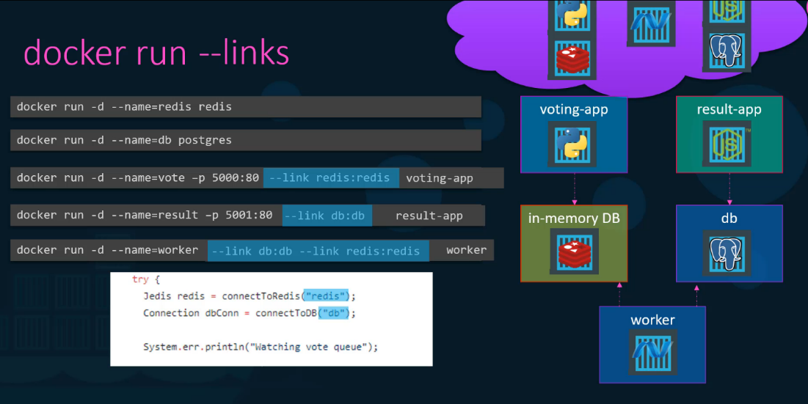
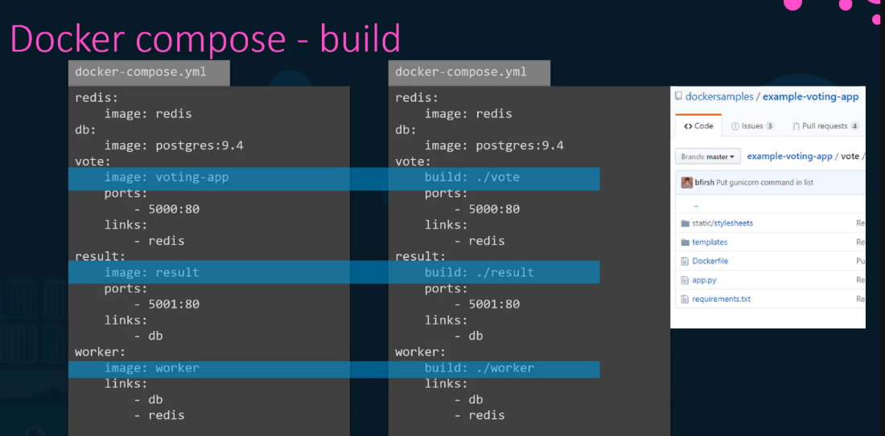

# 🔗 Docker Compose

## 🌟 What is Docker Compose?

- A tool for defining and managing multi-container Docker applications
- Allows starting multiple containers in one go using a single YAML file (`docker-compose.yml`)

## 🤔 Why Use Docker Compose?



Instead of running multiple `docker run` commands manually, Docker Compose lets you define all services in a single configuration file and manage them together.

## 🛠️ Basic Structure of docker-compose.yml

```yaml
version: '3.8'  # Docker Compose version
services: 
  app_service:  # Name of the service (container)
    image: my_app_image  # or ./vote # location to Dockerfile
    ports:
      - "8080:80"  # Port mapping (host:container)
    links:
      - db_service  # Deprecated: Was used to Linking to another service
    networks:
      - app_network  # Custom network
    depends_on:
      - db_service  # Ensure the database starts first
    environment:
      - APP_ENV=production
      
  db_service:
    image: mysql:5.7
    environment:
      MYSQL_ROOT_PASSWORD: example
    volumes:
      - db_data:/var/lib/mysql
      
networks:
  app_network:
  
volumes:
  db_data:
```

## 🛠️ Key Docker Compose Components

| Component | Description |
|-----------|-------------|
| **Services** | Defines individual containers (like app and database) |
| **Ports Mapping (ports)** | Maps ports between host and container |
| **Links (links)** *(Deprecated in v3+)* | Adds entries to the /etc/hosts file to allow container communication |
| **Depends On (depends_on)** | Ensures one service starts after another |
| **Networks (networks)** | Creates isolated networks for secure communication |
| **Volumes (volumes)** | Persistent data storage between container restarts |
| **Build Context (build)** | When a Dockerfile is available, specify the build directory<br/>`build: ./app_directory` |

## 🚀 Essential Docker Compose Commands

| Command | Description |
|---------|-------------|
| `docker-compose up -d` | Start containers in the background |
| `docker-compose down` | Stop running containers |
| `docker-compose logs` | View logs |
| `docker-compose up --scale app_service=3` | Scale services |

## 🔗 Container Communication

### Legacy Links (Deprecated)
```bash
--link redis:redis
```
- `containerName:NameOfHostAppLookingFor`
- Adds entry to the host file of the target container


### Modern Networking Approach


Instead of using deprecated links, use custom networks:

```yaml
services:
  voting-app:
    networks:
      - front-tier
      - back-tier
  
  redis:
    networks:
      - back-tier
      
networks:
  front-tier:
  back-tier:
```



## 🌐 Network Management


- Docker Compose automatically creates a default network for your application
- Services can communicate using service names as hostnames
- Custom networks provide better isolation and security

## 💡 Best Practices

- Use specific image tags instead of `latest`
- Define health checks for critical services
- Use environment files (`.env`) for sensitive data
- Leverage volumes for persistent data
- Use depends_on to define service startup order
- Always use networks instead of deprecated links