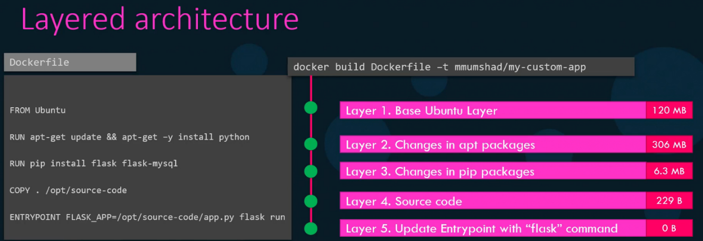
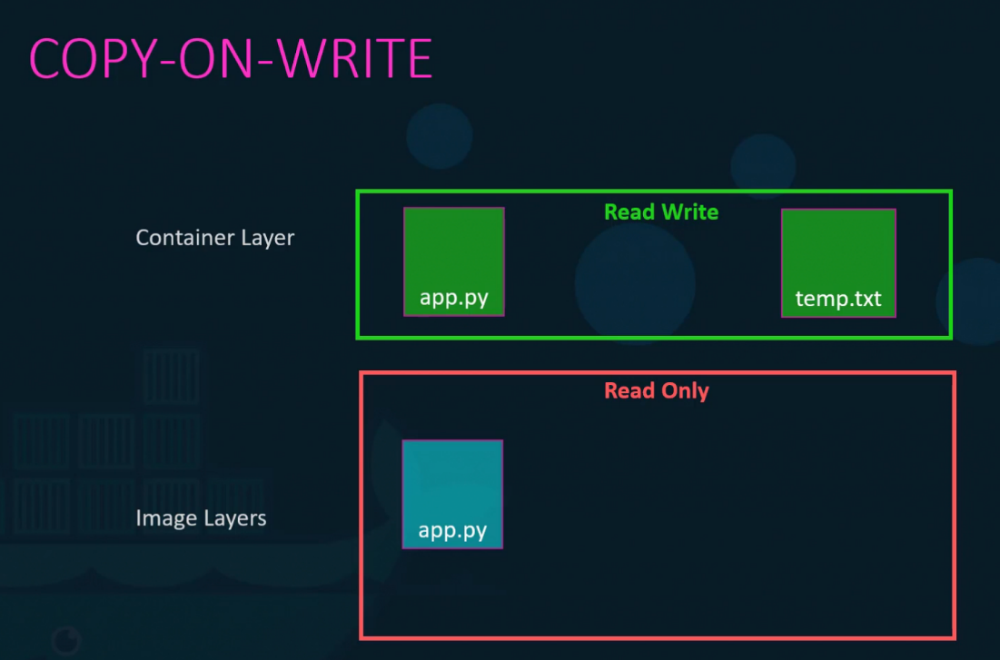
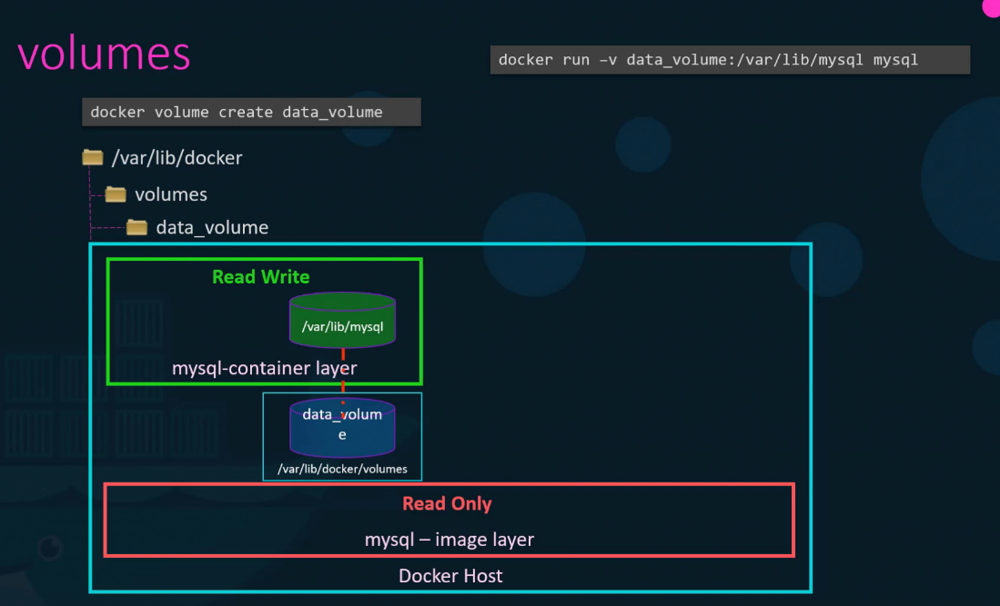

# 🛠️ Docker Architecture

## ⚙️ Docker Engine

Docker Engine is responsible for building, running, and managing containers.

**It consists of:**
- **Docker Daemon (dockerd)** – Runs in the background and listens for API requests
- **Docker CLI (docker)** – Used to interact with the daemon
- **REST API** – Allows communication between the Docker CLI and daemon

## 🔌 Default Docker Ports

| Port | Purpose |
|------|---------|
| **2376** | Secure (TLS/SSL) communication between Docker hosts and clients |
| **2375** | Insecure, non-TLS communication |

## 🌐 Remote Docker Engine

Used to execute Docker commands on a remote machine.

**Example:** Running an Nginx container on a remote Docker host:
```bash
docker -H=<Remote_IP>:2375 run nginx
```

> Use 2376 for secure communication with TLS encryption.

## 📂 Docker's Layered Architecture

- Docker uses a layered file system, where each layer is immutable
- If a build fails at a certain layer, Docker can cache previous layers and restart from the failed layer



## 🛑 Key Benefits of Layered Architecture

✅ Improved build efficiency with caching  
✅ Reduces storage requirements  
✅ Enables portability across different environments  
✅ If two Dockerfiles have the same set of instructions as start except for the source code, Docker reuses the cache existing layers from the first build, reducing redundancy and speeding up the build process

## 🛠️ Container Layer (Writable Layer)

- When a container runs from an image, Docker adds a thin writable layer on top of the image's layers
- This writable layer allows modifications like file creation or configuration changes
- Once the container is stopped, the writable layer is deleted unless explicitly saved

```
+--------------------+
| Writable Layer OR  |
| Container Layer    |
+--------------------+
|  Layer 3 (RUN)     |
+--------------------+
|  Layer 2 (COPY)    |
+--------------------+
|  Layer 1 (FROM)    |
+--------------------+
|  Base Image (OS)   |
+--------------------+
```

## 🔄 Copy-on-Write (CoW) Mechanism

- Docker images are immutable, meaning they cannot be modified once created
- When a container is started from an image, a read-write layer (container layer) is added on top of the existing read-only image layers
- If a file inside the container needs modification, Docker copies it from the image layer to the writable container layer before making changes
- This approach ensures that the original image remains unchanged, allowing multiple containers to share the same image efficiently



## ⚠️ Data Persistence in Containers

- The writable container layer is temporary—any changes made inside the container are lost once the container is stopped or deleted
- To persist data, use volumes, which store data outside the container's ephemeral storage

### 💾 Creating and Using Docker Volumes

1️⃣ **Create a volume:**
```bash
docker volume create data_volume
```

2️⃣ **Mount the volume to a container:**
```bash
docker run -v data_volume:/app/data my_container
```

This ensures that data remains intact even if the container is stopped or removed.

