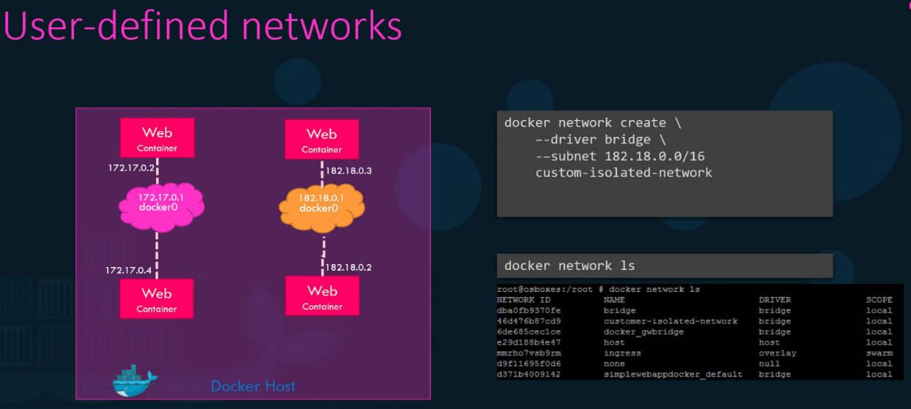
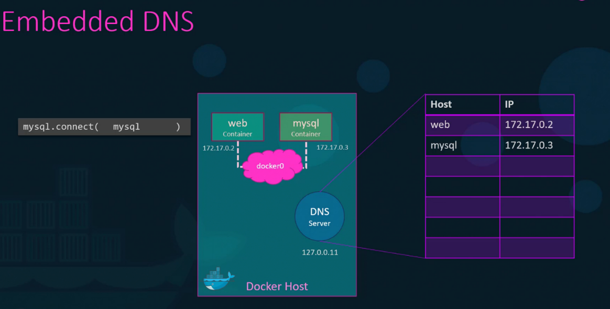

# 🌐 Networking (Container Communication)

Docker provides multiple networking options:
- **Bridge (default network)** → Containers on the same host can talk to each other
- **Host** → Uses the host network directly (no isolation)
- **Overlay** → Enables communication across multiple hosts
- **None** → No network access

**Example:** Running a container with port mapping for Bridge Network
```bash
docker run -p 8080:80 nginx
```
Maps port 80 of the container to port 8080 of the host.

## 🔍 Viewing Networks

| Command | Description |
|---------|-------------|
| `docker network ls` | List all available Docker networks |
| `docker network inspect <network_id_or_name>` | Get detailed information about a specific network |

## 🌐 Creating & Removing Networks

| Command | Description |
|---------|-------------|
| `docker network create <network_id>` | Create a new custom network |
| `docker network rm <network_name>` | Remove a specific network |

## 🔗 Connecting & Disconnecting Containers

| Command | Description |
|---------|-------------|
| `docker network connect <network_name> <container_name>` | Connect a running container to a network |
| `docker network disconnect <network_name> <container_name>` | Disconnect a container from a network |

## 🚀 Running Containers with Network Options

| Command | Description |
|---------|-------------|
| `docker run --network <network_name> <image>` | Start a container in a specific network |
| `docker run --network host <image>` | Use the host network (no isolation) |
| `docker run --network none <image>` | Start a container with no network access |

## 🔄 Port Mapping & Communication

| Command | Description |
|---------|-------------|
| `docker run -p <host_port>:<container_port> <image>` | Map container ports to host ports (default bridge network) |
| `docker exec -it <container_id> ping <another_container>` | Check communication between containers in the same network |

## 🌐 Docker Networking Examples

**Bridge is default:**





Docker has built-in DNS server that help container to resolve each other with the name of the container.



## 🛠️ Practical Example: Creating Custom Network

```bash
# Create network
docker network create --driver=bridge --gateway=182.18.0.1 --subnet=182.18.0.0/24 wp-mysql-network 

# Create MySQL DB in network
docker run -d --name=mysql-db -e MYSQL_ROOT_PASSWORD=db_pass123 --network=wp-mysql-network mysql:5.6

# Create application in network with link to mysql-db
docker run -d --name=webapp -p 38080:8080 -e DB_Host=mysql-db -e DB_Password=db_pass123 --network=wp-mysql-network --link mysql-db:mysql-db kodekloud/simple-webapp-mysql
```