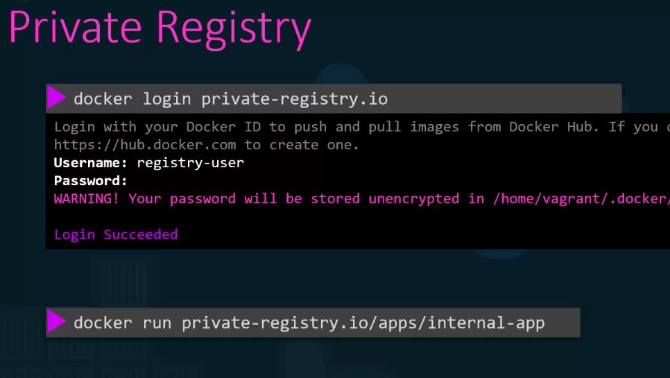

# 🌍 Docker Hub

## 📋 Docker Image Formats and Registry Usage

| Format | Example | Meaning |
|--------|---------|---------|
| **Official Image** | `docker pull ubuntu` | Pulls from Docker's official repo |
| **Username/Image** | `docker pull ommapari/app` | Pulls from a specific Docker Hub user |
| **Private Registry** | `docker pull 123456789012.dkr.ecr.us-east-1.amazonaws.com/my-app` | Pulls from a private registry |
| **With Tag** | `docker pull nginx:1.23.4` | Pulls a specific version |
| **With Digest** | `docker pull nginx@sha256:xyz` | Pulls a fixed image version<br/>**Why use digests?** Guarantees that the pulled image **never changes**, unlike latest. |

> **Note:** Always login before pulling

## 🚀 Deploy Private Registry and Pull Images

### Setting up a Private Registry

```bash
docker run -d --name=my-registry -p 5000:5000 --restart always registry:2
```

### Pull and Tag Images

```bash
docker pull nginx:latest httpd:latest

docker image tag nginx localhost:5000/nginx:latest
```

### View Tagged Images

```bash
docker images                  
```
```
REPOSITORY           TAG    IMAGE ID    CREATED     SIZE
localhost:5000/nginx      latest  53a18edff809  6 weeks ago   192MB
nginx              latest  53a18edff809  6 weeks ago   192MB
```

### Push to Private Registry

```bash
docker image tag nginx localhost:5000/nginx:latest
```

### Query Registry Catalog

```bash
curl -X GET localhost:5000/v2/_catalog
```
```json
{"repositories":["httpd","nginx"]}
```

### Pull from Private Registry

```bash
docker pull localhost:5000/nginx
```

## 🖼️ Docker Hub Examples




## 💡 Best Practices

- Always use specific tags instead of `latest` in production
- Use digests for guaranteed immutable deployments
- Set up private registries for proprietary applications
- Regularly scan images for security vulnerabilities
- Keep images lightweight by using minimal base images
- Use multi-stage builds to reduce final image size