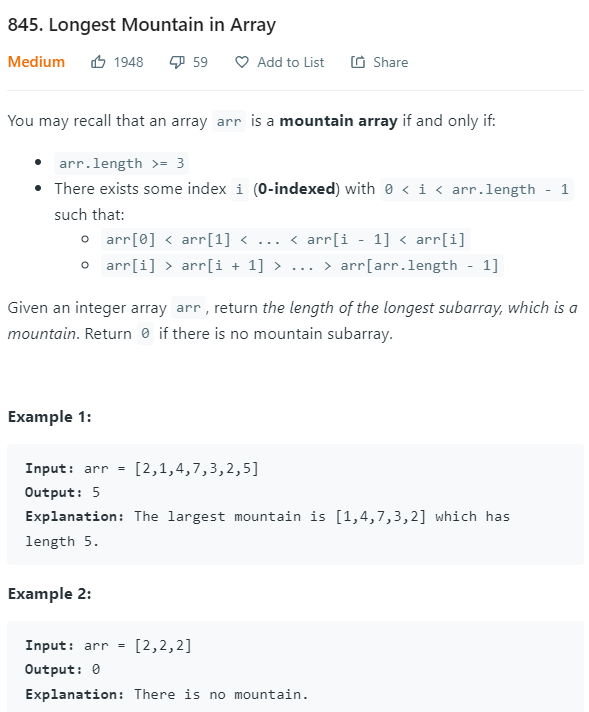
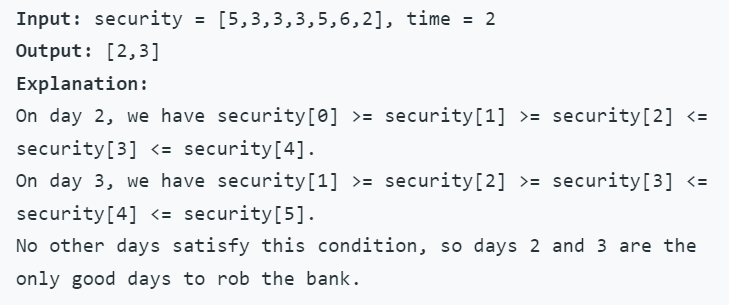
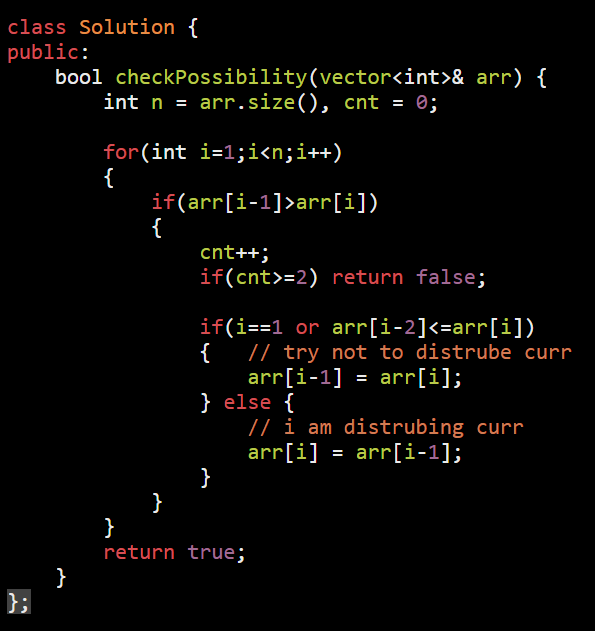

<table>
<colgroup>
<col style="width: 41%" />
<col style="width: 58%" />
</colgroup>
<thead>
<tr class="header">
<th>
<strong>Incresing decresing array pattern</strong>

<a href="https://leetcode.com/problems/maximum-ascending-subarray-sum/">1800. Maximum Ascending Subarray Sum</a>

incresing only

<strong>Input:</strong> nums = [10,20,30,5,10,50] 
<strong>Output:</strong> 65 
<strong>Explanation:</strong> [5,10,50] is the ascending subarray with the maximum sum of 65.

Always check for wrong case in if

</th>
<th>

</th>
</tr>
</thead>
<tbody>
<tr class="odd">
<td>
<strong>Intuition</strong>: <a href="https://leetcode.com/problems/longest-mountain-in-array/discuss/135593/C%2B%2BJavaPython-1-pass-and-O(1)-space">Link</a>

We have already many 2-pass or 3-pass problems, like 821. Shortest Distance to a Character.

They have almost the same idea.

One forward pass and one backward pass.

Maybe another pass to get the final result, or you can merge it in one previous pass.

<strong>Explanation</strong>:

In this problem, we take one forward pass to count up hill length (to every point).

We take another backward pass to count down hill length (from every point).

Finally a pass to find max(up[i] + down[i] + 1) where up[i] and down[i] should be positives.

</td>
<td>

Updated list of problems that involved 1 or 2 passes from left to right/right to left:

53 Maximum Subarray

121 Best Time to Buy and Sell Stock

152 Maximum Product Subarray

238 Product of Array Except Self

739 Daily Temperatures

769 Max Chunks to Make Sorted

770 Max Chunks to Make Sorted II

821 Shortest Distance to a Character

845 Longest Mountain in Array

581. Shortest Unsorted Continuous Subarray
</td>
</tr>
<tr class="even">
<td>
<a href="https://leetcode.com/problems/longest-mountain-in-array/">845. Longest Mountain in Array</a>

<ol type="1">
<li>
inc + top + dec needed
</li>
</ol>
<blockquote>

</blockquote>

corner case

[0,1,2,3,4,5,6,7,8,9] ans int_min

[0] if(n&lt;=2) return 0

</td>
<td>

// approch with space sufix and prefix

with O(1) space

</td>
</tr>
<tr class="odd">
<td>
<a href="https://leetcode.com/problems/find-good-days-to-rob-the-bank/">2100. Find Good Days to Rob the Bank</a>

Prefix &amp; Suffix

find i index such that

2 ele to left should gre &amp;

2 ele to right should greater

</td>
<td>

</td>
</tr>
<tr class="even">
<td>
Hard :

<a href="https://leetcode.com/problems/non-decreasing-array/">665. Non-decreasing Array</a>

Given an arraynumswithnintegers, your task is to check if it could become non-decreasing by modifying<strong>at most one element</strong>.

We define an array is non-decreasing ifnums[i] &lt;= nums[i + 1]holds for everyi(<strong>0-based</strong>) such that (0 &lt;= i &lt;= n - 2).

<strong>Example 1:</strong>

<strong>Input:</strong> nums = [4,2,3] 
<strong>Output:</strong> true 
<strong>Explanation:</strong> You could modify the first 4 to 1 to get a non-decreasing array.

<strong>Example 2:</strong>

<strong>Input:</strong> nums = [4,2,1] 
<strong>Output:</strong> false 
<strong>Explanation:</strong> You can't get a non-decreasing array by modify at most one element.

// [3,4,2,3]

</td>
<td>

</td>
</tr>
<tr class="odd">
<td>
when arr[i-1] &gt; arr[i]

then problem occer

.arr[i-1]

. arr[i]

2 ways to solve the problem

make arr[i-1] = arr[i]

or make arr[i] = arr[i-1]

Best thing we can do here is
</td>
<td></td>
</tr>
</tbody>
</table>

