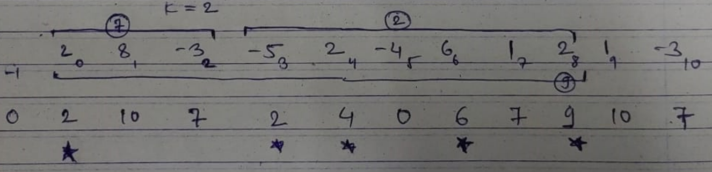
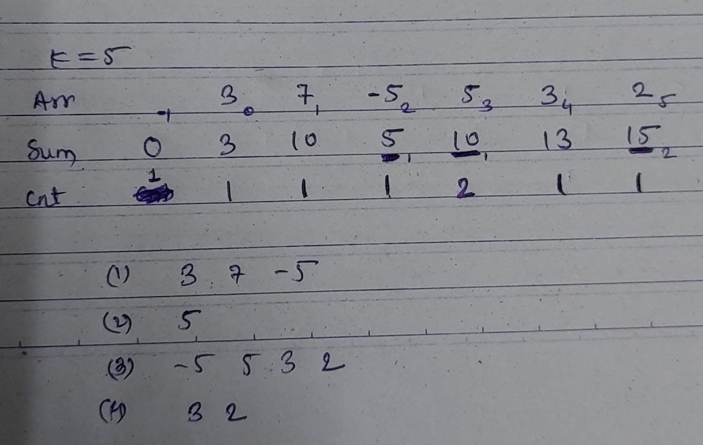
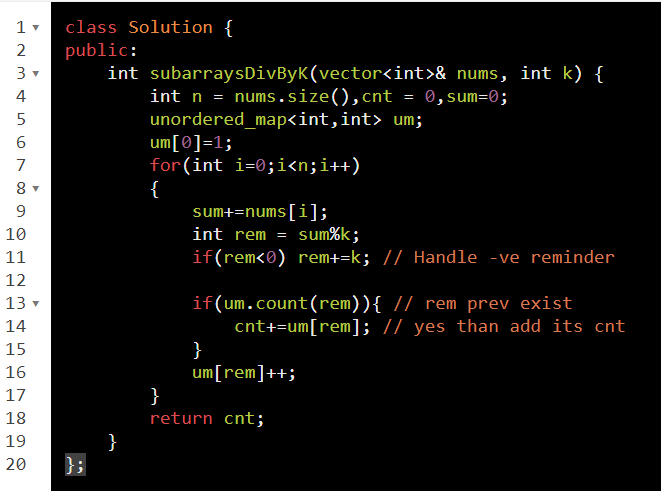
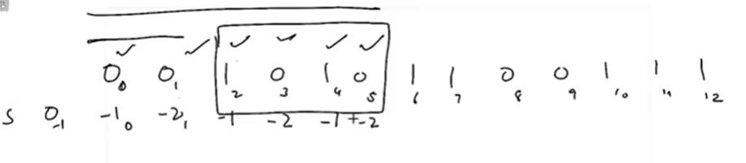

Keyword : subarray, sum

BF : Generate all subarray

OS : Prefix Sum

sum\[0,j\] = sum\[0,i\] + sum\[i+1,j\]

property\[0,j\] = property\[0,i\] + property\[i+1,j\]
& we have to find property\[i+1,j\]

======================================== Questions on This Concept ================================================================

<table>
<colgroup>
<col style="width: 53%" />
<col style="width: 46%" />
</colgroup>
<thead>
<tr class="header">
<th><ol type="1">
<li>
Largest SubArray with sum = 0
</li>
</ol>
<blockquote>

Largest SubArray with sum = k

Smallest check how to do ?

Sum = 0

Ans :

0 3 || -1 5 || 2 7 || 1 9 || 2 10 || maxLen 8

Sum = 2

Ans :

-1 0 || -1 3 || 0 4 || 4 6 || 2 8 || maxLen 6

</blockquote></th>
<th>
<em>#include</em> &lt;iostream&gt;

using namespace std;

<em>#include</em> &lt;bits/stdc++.h&gt;

void sumEquals0(vector&lt;int&gt; &amp;A)

{

  int n = A.size(), sum = 0, maxLen = 0;

  unordered_map&lt;int, int&gt; um;

  um[0] = -1; <em>// {sum,index} default</em>

  <em>for</em> (int i = 0; i &lt; n; i++)

  {

    sum += A[i];

    <em>if</em> (um.count(sum)) {

      cout &lt;&lt; um[sum] &lt;&lt; " " &lt;&lt; i &lt;&lt; " || ";

      maxLen = max(maxLen, i - um[sum]);

    } <em>else</em> {

      um.insert({sum, i});

    }

  }

  cout &lt;&lt; "maxLen " &lt;&lt; maxLen &lt;&lt; endl;

}

void sumEqualsK(vector&lt;int&gt; &amp;A, int k)

{

  int n = A.size(), sum = 0, maxLen = 0;

  unordered_map&lt;int, int&gt; um;

  um[0] = -1; <em>// {sum,index} default</em>

  <em>for</em> (int i = 0; i &lt; n; i++)

  {

    sum += A[i];

    <em>if</em> (um.count(sum - k))

    {

      cout &lt;&lt; um[sum - k] &lt;&lt; " " &lt;&lt; i &lt;&lt; " || ";

      maxLen = max(maxLen, i - um[sum - k]);

    }

    <em>if</em> (!um.count(sum)) um[sum] = i;

  }

  cout &lt;&lt; "maxLen " &lt;&lt; maxLen &lt;&lt; endl;

}

int main()

{

  vector&lt;int&gt; A = {2, 8, -3, -5, 2, -4, 6, 1, 2, 1, -3};

  sumEquals0(A);

  sumEqualsK(A, 2);

  <em>return</em> 0;

}
</th>
</tr>
</thead>
<tbody>
<tr class="odd">
<td>

<ol start="2" type="1">
<li>
Count No SubArray Whose Sum = k
</li>
</ol>

There can be multiple (sum - k) therefore count track

</td>
<td>
<em>#include</em> &lt;iostream&gt;

using namespace std;

<em>#include</em> &lt;bits/stdc++.h&gt;

void CountsumEqualsK(vector&lt;int&gt; &amp;A, int k)

{

  int n = A.size(), sum = 0, cnt = 0;

  unordered_map&lt;int, int&gt; um;

  um[0] = 1; <em>// {sum,cnt} default</em>

  <em>for</em> (int i = 0; i &lt; n; i++)

  {

    sum += A[i];

    <em>if</em> (um.count(sum - k))

    {

      cout &lt;&lt; i &lt;&lt; " " &lt;&lt; sum - k &lt;&lt; " " &lt;&lt; um[sum - k] &lt;&lt; endl;

      cnt += um[sum - k];

    }

    um[sum]++;

  }

  cout &lt;&lt; "cnt " &lt;&lt; cnt &lt;&lt; endl;

}

int main()

{

  vector&lt;int&gt; A = {3, 7, -5, 5, 3, 2};

  CountsumEqualsK(A, 5);

  <em>return</em> 0;

}
</td>
</tr>
<tr class="even">
<td>

<ol start="3" type="1">
<li>
<a href="https://leetcode.com/problems/subarray-sums-divisible-by-k/">Count No. of subArray Divisible by k</a>
</li>
</ol>

div = div*qu + rem

sum = k.m + r;

S1 = k.n + r;

S2 = sum - S1;

sum - S1 = k(m-n) + 0 ;

therefore S2 % k = 0;

<table>
<colgroup>
<col style="width: 46%" />
<col style="width: 53%" />
</colgroup>
<thead>
<tr class="header">
<th>

</th>
<th></th>
</tr>
</thead>
<tbody>
</tbody>
</table>

dont' forget um[0] = 1

for rem = 0 cnt = 1

</td>
<td>

</td>
</tr>
<tr class="odd">
<td><ol start="4" type="1">
<li>
<a href="https://leetcode.com/problems/continuous-subarray-sum/">Largest SubArray with sum divisible by k</a>
</li>
</ol></td>
<td>
class Solution {

public:

  bool checkSubarraySum(vector&lt;int&gt;&amp; nums, int k) {

    unordered_map&lt;int,int&gt; um;

    int sum = 0;

    um[0]=-1;

    <em>for</em>(int i=0;i&lt;nums.size();i++)

    {

      sum+=nums[i];

      int rem = (sum%k);

     

      <em>if</em>(rem&lt;0) rem+=k;

      <em>if</em>(um.count(rem))

        <em>if</em>(i-um[rem]&gt;1) <em>// imp</em>

          <em>return</em> true;

      <em>else</em> um[rem]=i;

    }

    <em>return</em> false;

  }

};
</td>
</tr>
<tr class="even">
<td><ol start="5" type="1">
<li>
<a href="https://leetcode.com/problems/contiguous-array/">Largest SubArray with Equal 0's and 1's</a>
</li>
</ol>
<blockquote>

i/p = 0 0 1 0 1 0 1 1 0 0 1 1 1

</blockquote></td>
<td>
class Solution {

public:

  int findMaxLength(vector&lt;int&gt;&amp; nums) {

    unordered_map&lt;int,int&gt; um;

    int sum = 0,maxLen=0;

    um[0]=-1;

    <em>for</em>(int i=0;i&lt;nums.size();i++)

    {

      sum+=(nums[i]==0? -1 : 1);

      <em>if</em>(um.count(sum))

        maxLen = max(maxLen,i-um[sum]);

      <em>else</em> um[sum]=i;

    }

    <em>return</em> maxLen;

  }

};
</td>
</tr>
<tr class="odd">
<td><ol start="6" type="1">
<li>
<a href="https://practice.geeksforgeeks.org/problems/count-subarrays-with-equal-number-of-1s-and-0s-1587115620/1/">Count Subarrays with equal 1s and 0s</a>
</li>
</ol>
<blockquote>

class Solution{

 public:

  long long int countSubarrWithEqualZeroAndOne(int nums[], int n)

  {

    unordered_map&lt;int,int&gt; um;

    int sum = 0,cnt=0;

    um[0]=1;

    <em>for</em>(int i=0;i&lt;n;i++)

    {

      sum+=(nums[i]==0? -1 : 1);

      <em>if</em>(um.count(sum))

        cnt+=um[sum];

      um[sum]++;

    }

    <em>return</em> cnt;

  }

};

follow up : Largest subArray with Equal 0, 1 and 2

</blockquote></td>
<td></td>
</tr>
<tr class="even">
<td><ol start="7" type="1">
<li>
<a href="https://practice.geeksforgeeks.org/problems/equal-0-1-and-23208/1/">Count SubArray with Equal 0, 1 and 2</a>
</li>
</ol>
<blockquote>

</blockquote></td>
<td>
// Prefix key

class Solution {

 public:

  long long getSubstringWithEqual012(string str) {

    int z=0,o=0,t=0; <em>// 0's 1's 2's count</em>

    int cnt = 0;

    unordered_map&lt;string,int&gt; um;

    string key = to_string(z-o)+"#"+to_string(o-t);

    um[key]=1;

    <em>for</em>(int i=0;i&lt;str.size();i++)

    {

      int ch = str[i];

      <em>if</em>(ch=='0') z++;

      <em>else if</em>(ch=='1') o++;

      <em>else</em> t++;

      key = to_string(z-o)+"#"+to_string(o-t);

      <em>if</em>(um.count(key))

        cnt+=um[key];

      um[key]++;

    }

    <em>return</em> cnt;

  }

};
</td>
</tr>
</tbody>
</table>
