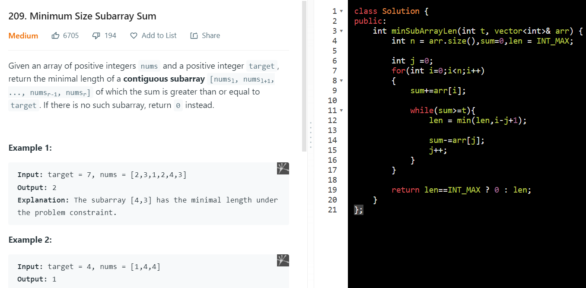
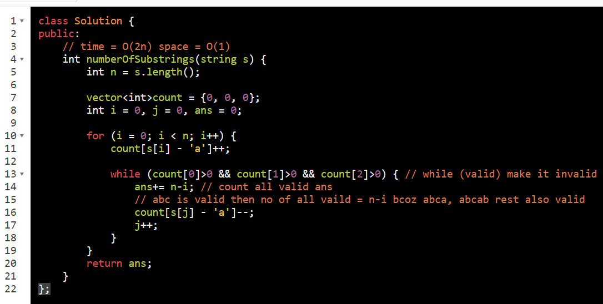

<table>
<colgroup>
<col style="width: 42%" />
<col style="width: 57%" />
</colgroup>
<thead>
<tr class="header">
<th>
<a href="https://leetcode.com/problems/minimum-size-subarray-sum/">209. Minimum Size Subarray Sum</a>

<strong>While reducing window there is possiblity of answer</strong>

While(Valid) // make it invalid

{

<blockquote>

update ans;

decrease window;

</blockquote>

}

// dosen't works for -ve integer <a href="onenote:#Type%20II%20%20b%20Invalid&amp;section-id={0561D0A3-CBFE-49B1-A9DD-DE8B099423FA}&amp;page-id={89A235C9-683A-4A97-BA88-E5B749C59FD0}&amp;object-id={688FFE5F-AB03-45AD-925C-C75E58563479}&amp;3E&amp;base-path=https://d.docs.live.net/488d82fe7a9fef0f/Documents/PLACEMENT-DSA/ARRAY%202.one">Link</a>

// coz while(sum&gt;=t) when j-- then there is possiblity

// [84,-37,32,40,95] t = 167
</th>
<th>

</th>
</tr>
</thead>
<tbody>
<tr class="odd">
<td>
<a href="https://leetcode.com/problems/number-of-substrings-containing-all-three-characters/">1358. Number of Substrings Containing All Three Characters</a>

<ol type="1">
<li>
always aquire value
</li>
<li>
release untill become invalid
</li>
</ol>
<blockquote>

: while(valid) count ans : untill = invalid

</blockquote>

char = abc find no of substr contain all three

</td>
<td>

</td>
</tr>
<tr class="even">
<td>
<a href="https://leetcode.com/problems/minimum-window-substring/">76. Minimum Window Substring</a>

Hard to make it in O(m+n)

aim = find min substr such that all char in t must be in s including dublicate

<strong>Example 1:</strong>

<strong>Input:</strong> s = "ADOBECODEBANC", t = "ABC" 
<strong>Output:</strong> "BANC" 
<strong>Explanation:</strong> The minimum window substring "BANC" includes 'A', 'B', and 'C' from string t.

<strong>Example 2:</strong>

<strong>Input:</strong> s = "a", t = "a" 
<strong>Output:</strong> "a" 
<strong>Explanation:</strong> The entire string s is the minimum window.

<strong>Example 3:</strong>

<strong>Input:</strong> s = "a", t = "aa" 
<strong>Output:</strong> "" 
<strong>Explanation:</strong> Both 'a's from t must be included in the window. 
Since the largest window of s only has one 'a', return empty string.

<table>
<colgroup>
<col style="width: 39%" />
<col style="width: 60%" />
</colgroup>
<thead>
<tr class="header">
<th>win increase</th>
<th>win decrease</th>
</tr>
</thead>
<tbody>
<tr class="odd">
<td>ADOBEC valid</td>
<td>
ADOBEC ans = min(6,INT_MAX)

DOBEC invalid
</td>
</tr>
<tr class="even">
<td>DOBECODEBA valid</td>
<td>
DOBECODEBA ans = min(6,10)

OBECODEBA ans = 6

BECODEBA --

ECODEBA --

CODEBA ans = 6

ODEBA invalid
</td>
</tr>
<tr class="odd">
<td>ODEBANC</td>
<td>
ODEBANC ans = 6

DEBANC --

EBANC ans = 5

BANC ans = 4

ANC invalid
</td>
</tr>
</tbody>
</table>

</td>
<td></td>
</tr>
<tr class="odd">
<td>
<a href="https://leetcode.com/problems/shortest-subarray-with-sum-at-least-k/">862. Shortest Subarray with Sum at Least K</a>

"What makes this problem hard is that we have negative values.

If you haven't already done the problem with positive integers only,

I highly recommend solving it first"

<a href="onenote:#Type%20II%20%20b&amp;section-id={0561D0A3-CBFE-49B1-A9DD-DE8B099423FA}&amp;page-id={89A235C9-683A-4A97-BA88-E5B749C59FD0}&amp;object-id={688FFE5F-AB03-45AD-925C-C75E58563479}&amp;19&amp;base-path=https://d.docs.live.net/488d82fe7a9fef0f/Documents/PLACEMENT-DSA/ARRAY%202.one">Minimum Size Subarray Sum</a>

</td>
<td></td>
</tr>
</tbody>
</table>

