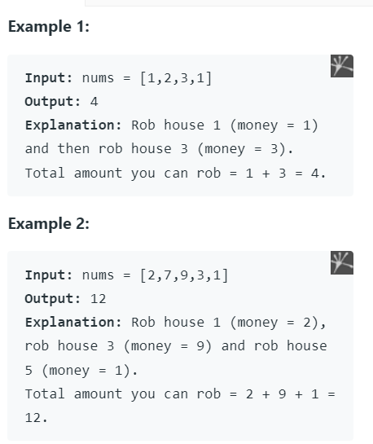
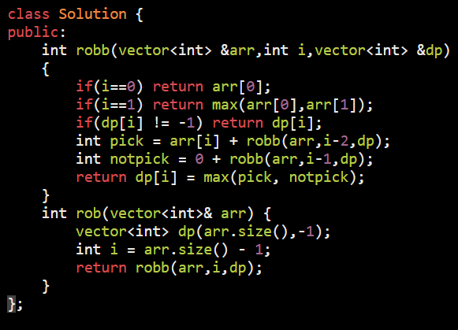
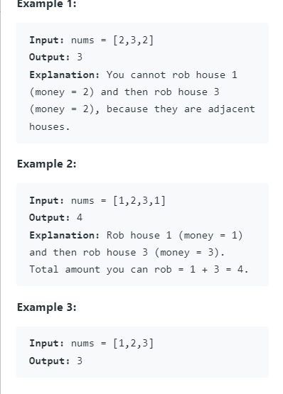
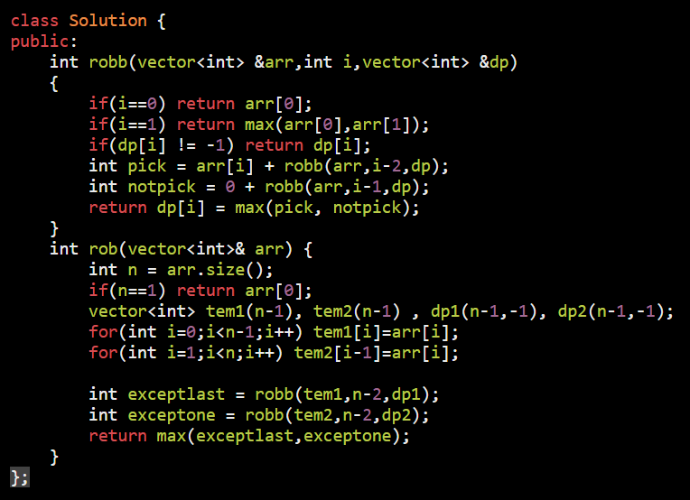
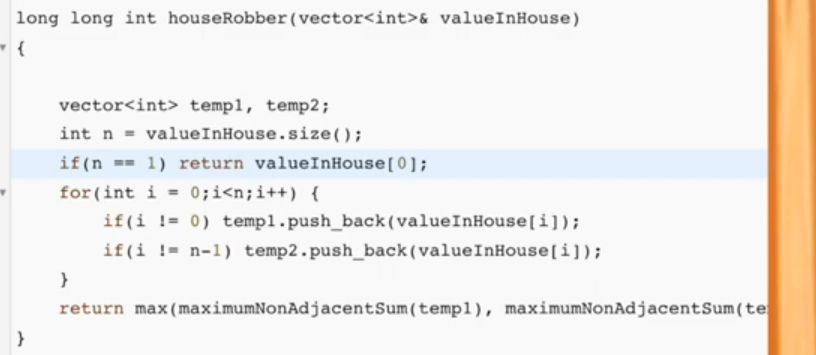

// Maximum sum of non adjecent element

<table>
<colgroup>
<col style="width: 37%" />
<col style="width: 62%" />
</colgroup>
<thead>
<tr class="header">
<th>
<a href="https://leetcode.com/problems/house-robber/submissions/">198. House Robber</a>

</th>
<th>

</th>
</tr>
</thead>
<tbody>
<tr class="odd">
<td>
<a href="https://leetcode.com/problems/house-robber-ii/">213. House Robber II</a>

</td>
<td>

</td>
</tr>
</tbody>
</table>

*\#include* \<iostream\>
using namespace std;
*\#include* \<bits/stdc++.h\>
*// time = O(2^n) --\> O(n)*
*// space = O(n) --\> (1);*
int fun(vector\<int\> &arr, int i, vector\<int\> &dp)
{ 
*  // dp = -1 2 4 6*
  *if* (i == 0) *return* arr\[0\];
  *if* (i \< 0) *return* 0;
  *if* (dp\[i\] != -1) *return* dp\[i\];
  int pick = arr\[i\] + fun(arr, i - 2, dp);
  int notpict = 0 + fun(arr, i - 1, dp);
  *return* dp\[i\] = max(pick, notpict);
}
void tabulation(vector\<int\> &arr)
{
*  // dp = 1 2 4 6*
  int dp\[arr.size() + 1\];
  dp\[0\] = arr\[0\];
  int neg = 0;
  *for* (int i = 1; i \< arr.size(); i++)
  {
    int pick = arr\[i\] + ((i \>= 2) ? dp\[i - 2\] : 0);
    int notpict = 0 + dp\[i - 1\];
    dp\[i\] = max(pick, notpict);
  }
  cout \<\< dp\[arr.size() - 1\] \<\< endl;
}
void space_optimized(vector\<int\> &arr)
{
  int a = arr\[0\];
  int b = max(arr\[0\], arr\[1\]), c = -1;
  *for* (int i = 2; i \< arr.size(); i++)
  {
    int pick = arr\[i\] + a;
    int notpick = 0 + b;
    c = max(pick, notpick);
    a = b;
    b = c;
  }
*  // a b c*
*  //  a b c*
  cout \<\< c \<\< endl;
}

int main()
{
  vector\<int\> arr = {1, 2, 3, 4};
  int n = arr.size();
*  //\* sol 1*
  vector\<int\> dp(n, -1);
  cout \<\< fun(arr, arr.size() - 1, dp)\<\<endl;
  *for* (auto i : dp) cout \<\< i \<\< " "; cout\<\<endl;
*  //\* sol 2*
  tabulation(arr);
*  //\* sol 3*
  space_optimized(arr);

  *return* 0;
}

If Array is circular : first and last are adjecent

Leave last apply prev logic
Leave first apply prev logic

as both cant be present

max(ans1,ans2)

