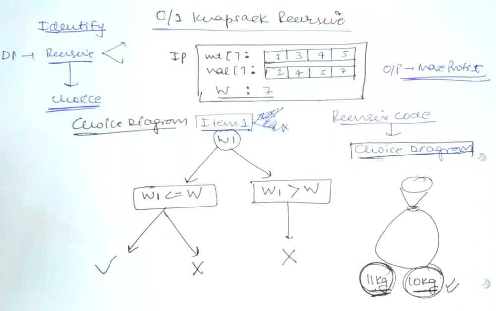

AM

1.  Choice
2.  Optimal

int wt \[ \] = Wt array
int val \[ \] = Value array
int W = Wt of knapsack
int n = Size of Array

We have to fill Knapsack so that profit is Maximum

Recursion ---\> Memoization

