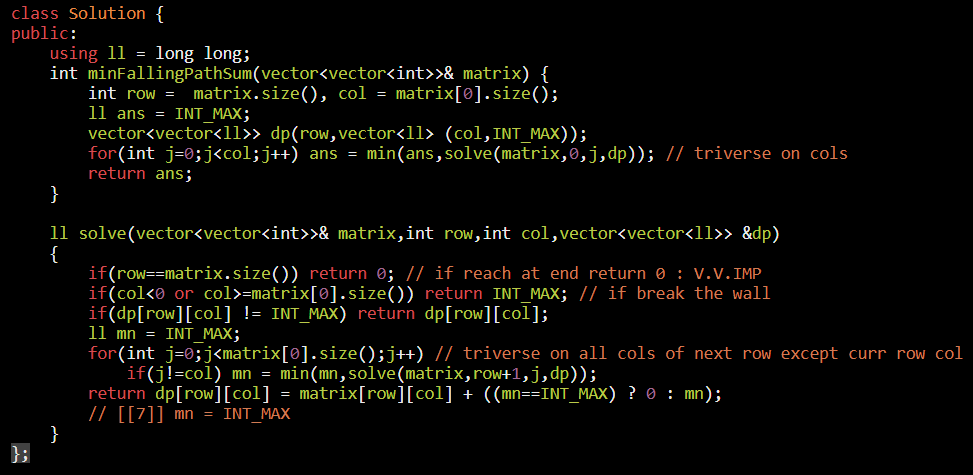
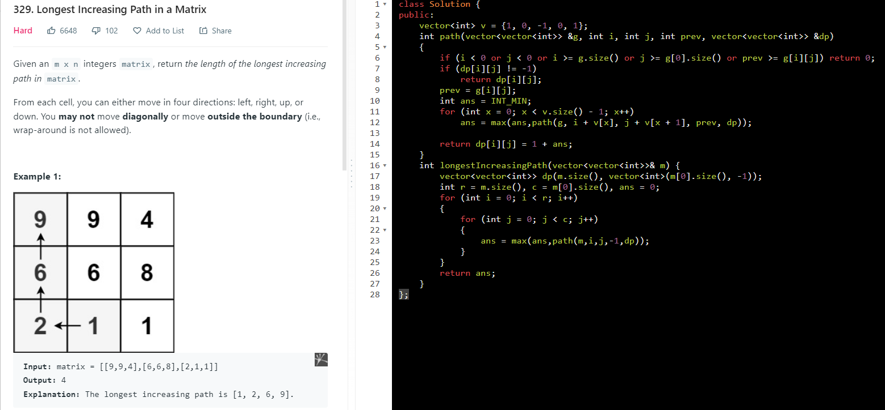

<table>
<colgroup>
<col style="width: 35%" />
<col style="width: 64%" />
</colgroup>
<thead>
<tr class="header">
<th>
<a href="https://leetcode.com/problems/minimum-falling-path-sum/">931. Minimum Falling Path Sum</a>

</th>
<th>

</th>
</tr>
</thead>
<tbody>
<tr class="odd">
<td>
<a href="https://leetcode.com/problems/minimum-falling-path-sum-ii/">1289. Minimum Falling Path Sum II</a>

</td>
<td>

</td>
</tr>
<tr class="even">
<td><a href="https://leetcode.com/problems/longest-increasing-path-in-a-matrix/">329. Longest Increasing Path in a Matrix</a></td>
<td>

</td>
</tr>
<tr class="odd">
<td><a href="https://leetcode.com/problems/number-of-increasing-paths-in-a-grid/">2328. Number of Increasing Paths in a Grid</a></td>
<td>

</td>
</tr>
</tbody>
</table>

