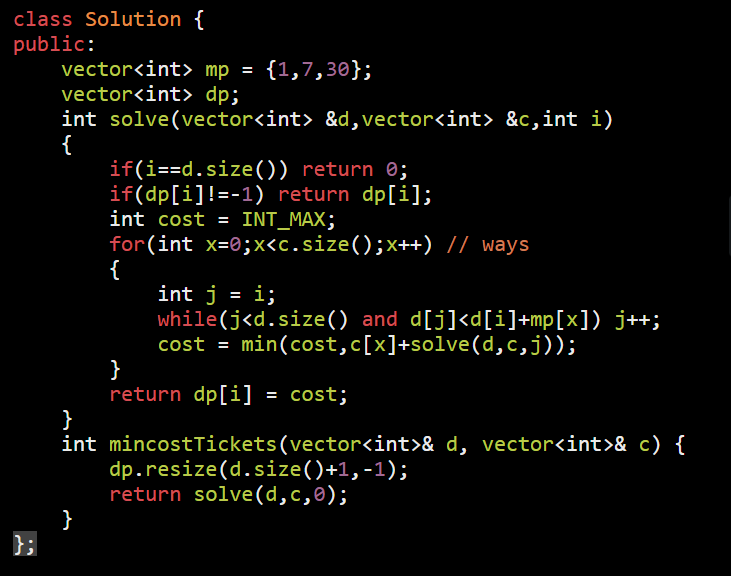

AM

1.  find max min
2.  find count
3.  find all

<table>
<colgroup>
<col style="width: 48%" />
<col style="width: 51%" />
</colgroup>
<thead>
<tr class="header">
<th>Ways</th>
<th>sum up all the way</th>
</tr>
</thead>
<tbody>
<tr class="odd">
<td>
<a href="https://leetcode.com/problems/decode-ways/">91. Decode Ways</a> : ways

</td>
<td>

</td>
</tr>
<tr class="even">
<td>
<a href="https://leetcode.com/problems/minimum-cost-for-tickets/">983. Minimum Cost For Tickets</a>

Min : take minimum of all cases

</td>
<td>

</td>
</tr>
<tr class="odd">
<td>path return 1 + recursion()</td>
<td></td>
</tr>
</tbody>
</table>
