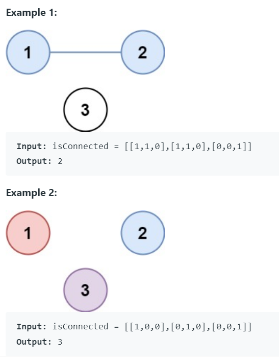
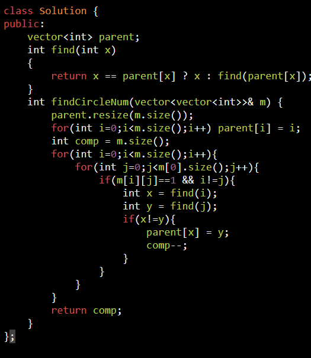

Time complexity:
1.  For regular union and find, each operation takes O(logn) in average, and O(n) in worst case.
2.  For union by rank, it takes at most O(logn) time since the height of tree-like structure is restricted in O(logn).
3.  For path compression, the time complexity is reduced to O(1) in average and worst case, since the structure is flattened.
So the total time complexity can be reduced from O(n^2)(worst case), O(nlogn)(average case) to O(n) in both cases.

<table>
<colgroup>
<col style="width: 42%" />
<col style="width: 57%" />
</colgroup>
<thead>
<tr class="header">
<th>
if two node belongs to same component ?

this ds will give ans

</th>
<th>
Union By Rank and Path Compression

<ol type="1">
<li>
Normal
</li>
<li>
Union by Rank
</li>
<li>
Path Compression
</li>
</ol></th>
</tr>
</thead>
<tbody>
<tr class="odd">
<td>
There is tree and one edge just added. find that last edge added

</td>
<td>

</td>
</tr>
<tr class="even">
<td>
ON Matrix : find no of component

</td>
<td>

</td>
</tr>
<tr class="odd">
<td></td>
<td>

</td>
</tr>
</tbody>
</table>

