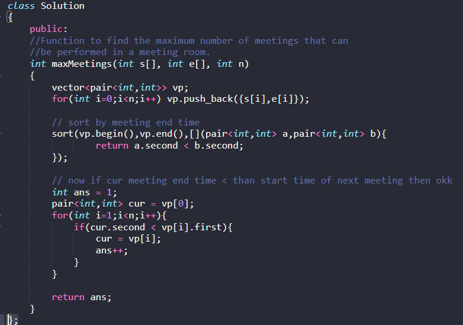
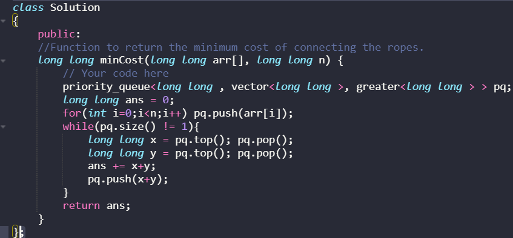

<table>
<colgroup>
<col style="width: 21%" />
<col style="width: 78%" />
</colgroup>
<thead>
<tr class="header">
<th><ol type="1">
<li>
<a href="https://practice.geeksforgeeks.org/problems/n-meetings-in-one-room-1587115620/1">N meetings in one room</a>
</li>
</ol>
<blockquote>

Approch

sort by meeting end time

now if cur meeting end time &lt; than start time of next meeting then okk

</blockquote></th>
<th>

</th>
</tr>
</thead>
<tbody>
<tr class="odd">
<td><ol type="1">
<li>
<a href="https://practice.geeksforgeeks.org/problems/minimum-cost-of-ropes-1587115620/1">Minimum Cost of ropes</a>
</li>
</ol></td>
<td>

</td>
</tr>
<tr class="even">
<td></td>
<td></td>
</tr>
</tbody>
</table>
