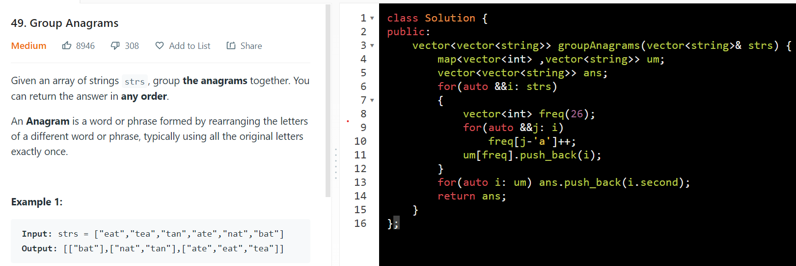

<table>
<colgroup>
<col style="width: 19%" />
<col style="width: 80%" />
</colgroup>
<thead>
<tr class="header">
<th>
<a href="https://leetcode.com/problems/permutation-in-string/">567. Permutation in String</a>

<strong>Input:</strong> s1 = "ab", s2 = "eid<u>ba</u>ooo" 
<strong>Output:</strong> true

<strong>Input:</strong> s1 = "ab", s2 = "eidboaoo" 
<strong>Output:</strong> false

"abc" "bbbca" true

SC = len(s1) only
</th>
<th>

Optimization VV I.M.P

class Solution

{

public:

<em>  // TC = O(n) SC = (len(s1))</em>

  bool checkInclusion(string s1, string s2)

  {

    <em>if</em> (s1.size() &gt; s2.size())

      <em>return</em> false;

    vector&lt;int&gt; s1Count(26, 0), s2Count(26, 0);

    int k = s1.size(); <em>// WinSize</em>

    int n = s2.size(); <em>// s2 size</em>

    <em>for</em> (int i = 0; i &lt; k; i++) <em>// Add first Window</em>

    {

      s1Count[s1[i] - 'a']++;

      s2Count[s2[i] - 'a']++;

    }

    int match = 0;

    <em>for</em> (int i = 0; i &lt; 26; i++)

      match += (s1Count[i] == s2Count[i] ? 1 : 0);

<em>    // matches count = Equal values in both Vector</em>

    <em>if</em> (match == 26)

      <em>return</em> true;

    <em>for</em> (int i = k; i &lt; n; i++)

    {

<em>      // ADD CHAR</em>

      int index = s2[i] - 'a';

      s2Count[index]++;

      <em>if</em> (s1Count[index] == s2Count[index]) <em>// we created new match which was originally mismatch</em>

        match += 1;

      <em>else if</em> (s1Count[index] == s2Count[index] - 1) <em>// we created new mismatch which was from originally match</em>

        match -= 1;

<em>      // REMOVE CHAR</em>

      index = s2[i - k] - 'a';

      s2Count[index]--;

      <em>if</em> (s1Count[index] == s2Count[index]) <em>// we created new match which was originally mismatch</em>

        match += 1;

      <em>else if</em> (s1Count[index] == s2Count[index] + 1) <em>// we created new mismatch which was originally match</em>

        match -= 1;

      <em>if</em> (match == 26)

        <em>return</em> true;

    }

    <em>return</em> false;

  }

};

</th>
</tr>
</thead>
<tbody>
<tr class="odd">
<td></td>
<td></td>
</tr>
<tr class="even">
<td></td>
<td></td>
</tr>
</tbody>
</table>

