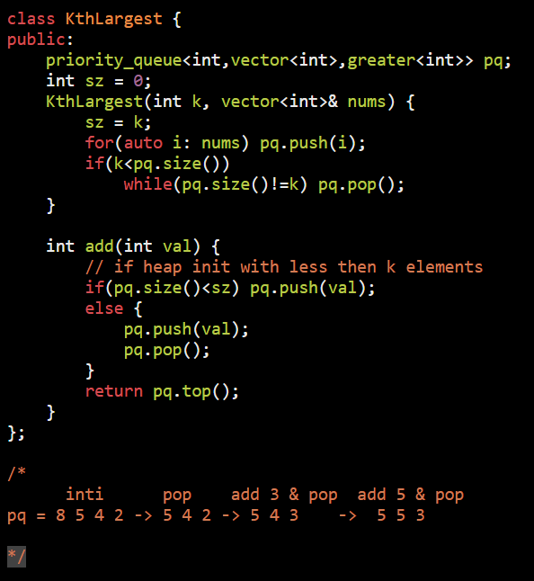

AM

[703. Kth Largest Element in a Stream](https://leetcode.com/problems/kth-largest-element-in-a-stream/https:/leetcode.com/problems/kth-largest-element-in-a-stream/)

**Example 1:**
**Input**  
\["KthLargest", "add", "add", "add", "add", "add"\]  
\[\[3, \[4, 5, 8, 2\]\], \[3\], \[5\], \[10\], \[9\], \[4\]\]  
**Output**  
\[null, 4, 5, 5, 8, 8\]
**Explanation**  
KthLargest kthLargest = new KthLargest(3, \[4, 5, 8, 2\]);  
kthLargest.add(3); // return 4  
kthLargest.add(5); // return 5  
kthLargest.add(10); // return 5  
kthLargest.add(9); // return 8  
kthLargest.add(4); // return 8

