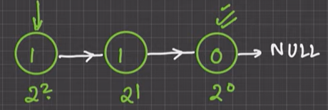
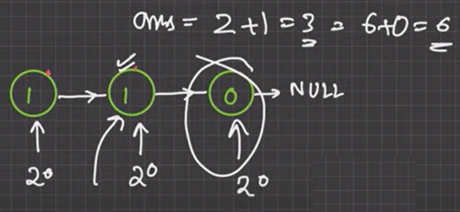

AM

Soluation :

<table>
<colgroup>
<col style="width: 50%" />
<col style="width: 49%" />
</colgroup>
<thead>
<tr class="header">
<th><ol type="1">
<li>
Reverse the ll
</li>
</ol></th>
<th></th>
</tr>
</thead>
<tbody>
<tr class="odd">
<td><ol start="2" type="1">
<li>
Find Length of ll
</li>
</ol>
<blockquote>

first node = val * (2&lt;&lt;(len-1))

</blockquote></td>
<td>

</td>
</tr>
<tr class="even">
<td><ol start="3" type="1">
<li>
consider first node head as the last node As last node
</li>
</ol>
<blockquote>

value = 2^0 * val

So when we move next we see that our assumtion was wrong

So we multiply prev one by 2 as it becomes 2nd last and consider curr as last node so add 2^0 * val and add both of them

</blockquote></td>
<td>

</td>
</tr>
</tbody>
</table>

