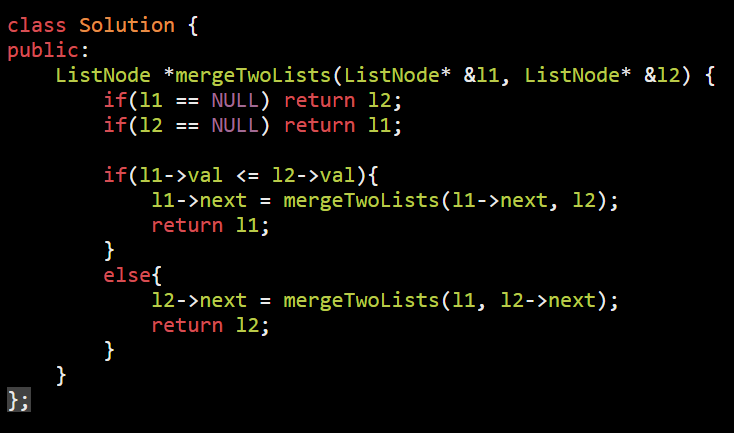
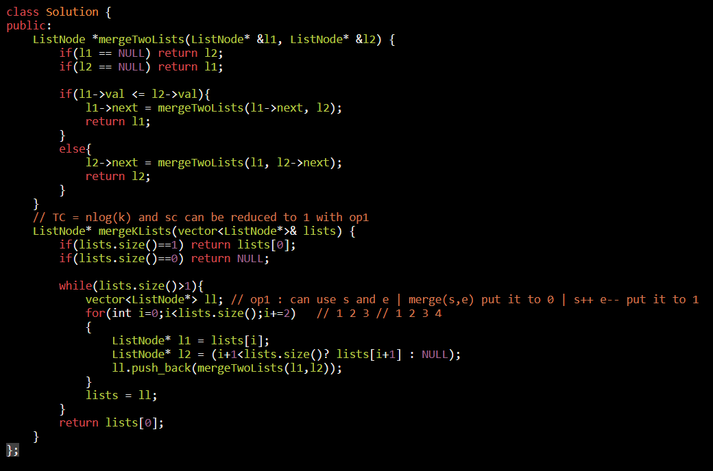

//Merge2sortedarrayswithoutusingExtraspace.Solution

TimeComplexity SpaceComplexity
1.  Sort NewA -O(n+m)log(n+m) O(n+m) or O(1)
2.  Merge Alog NewA -O(n+m)O(n+m)or O(1) (space given)
3.  NoIdea -O(n+m)log(n+m) O(1)(GapMethodorShellShortIntuition)

<table>
<colgroup>
<col style="width: 45%" />
<col style="width: 54%" />
</colgroup>
<thead>
<tr class="header">
<th>
<a href="https://leetcode.com/problems/merge-sorted-array/">88. Merge Sorted Array</a>

nums1 = [1,2,3,0,0,0]

nums2 = [2,5,6]

nums1 = [1,2,2,3,5,6] =&gt; result
</th>
<th>

</th>
</tr>
</thead>
<tbody>
<tr class="odd">
<td>

<strong>Input:</strong> list1 = [1,2,4], list2 = [1,3,4] 
<strong>Output:</strong> [1,1,2,3,4,4]
</td>
<td></td>
</tr>
<tr class="even">
<td>
follow up

<a href="https://leetcode.com/problems/merge-k-sorted-lists/">23. Merge k Sorted Lists</a>
</td>
<td>

</td>
</tr>
<tr class="odd">
<td></td>
<td></td>
</tr>
</tbody>
</table>

