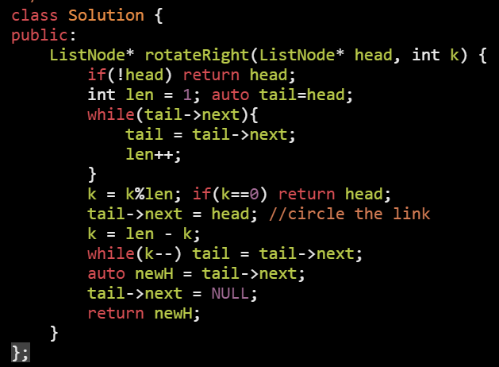
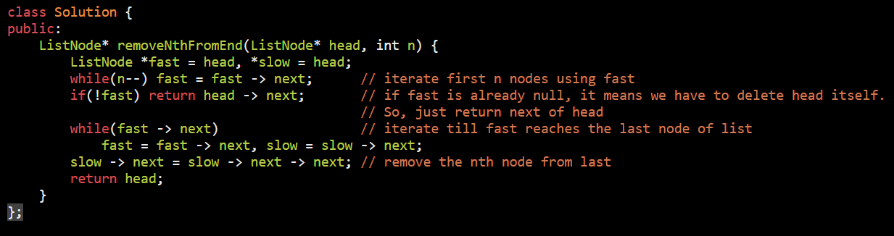

<table>
<colgroup>
<col style="width: 26%" />
<col style="width: 73%" />
</colgroup>
<thead>
<tr class="header">
<th><ol type="1">
<li>
Finding middle element in a linked list
</li>
</ol>
<blockquote>

while(f &amp;&amp; f-&gt;next)

even list

odd list

</blockquote></th>
<th></th>
</tr>
</thead>
<tbody>
<tr class="odd">
<td><ol start="2" type="1">
<li>
Reverse a linked list
</li>
</ol>
<blockquote>

check when nex get NULL

</blockquote></td>
<td></td>
</tr>
<tr class="even">
<td><ol start="3" type="1">
<li>
Rotate a linked list
</li>
</ol>
<blockquote>

len = 1 as we point at head initally

</blockquote></td>
<td></td>
</tr>
<tr class="odd">
<td>delete n’th node from end of linked list</td>
<td>

</td>
</tr>
<tr class="even">
<td>Detect Loop in linked list</td>
<td></td>
</tr>
<tr class="odd">
<td>Remove loop in Linked List</td>
<td></td>
</tr>
<tr class="even">
<td>Intersection point in Y shaped linked lists</td>
<td></td>
</tr>
<tr class="odd">
<td>Intersection point of two Linked Lists</td>
<td></td>
</tr>
<tr class="even">
<td>Pairwise swap of a linked list</td>
<td></td>
</tr>
<tr class="odd">
<td>Add two numbers represented by linked lists</td>
<td></td>
</tr>
<tr class="even">
<td>Check if Linked List is Palindrome</td>
<td></td>
</tr>
<tr class="odd">
<td>Merge two sorted linked lists</td>
<td></td>
</tr>
<tr class="even">
<td>Given a linked list of 0s, 1s and 2s, sort it</td>
<td>

</td>
</tr>
<tr class="odd">
<td>Reverse a Linked List in groups of given size</td>
<td></td>
</tr>
<tr class="even">
<td>Flattening a Linked List</td>
<td></td>
</tr>
<tr class="odd">
<td>Implement Queue using Linked List</td>
<td></td>
</tr>
<tr class="even">
<td>Implement Stack using Linked List</td>
<td></td>
</tr>
<tr class="odd">
<td>Delete without head pointer</td>
<td></td>
</tr>
</tbody>
</table>

