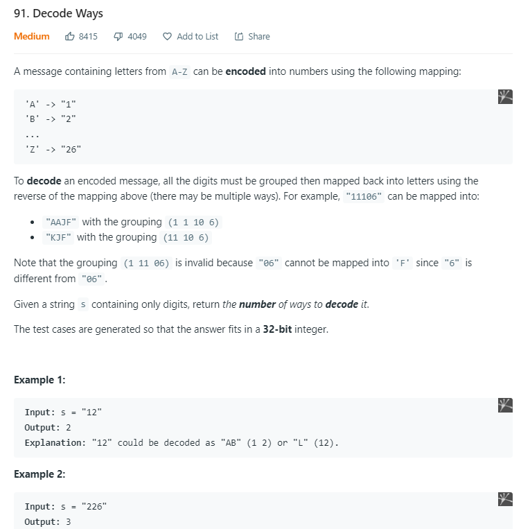

<table>
<colgroup>
<col style="width: 67%" />
<col style="width: 32%" />
</colgroup>
<thead>
<tr class="header">
<th>
<a href="https://leetcode.com/problems/decode-ways/https:/leetcode.com/problems/decode-ways/">91. Decode Ways</a>

</th>
<th>

class Solution {

public:

  vector&lt;int&gt; dp;

  int solve(string &amp;s,int i)

  {

    <em>if</em>(i &gt;= s.size()) <em>return</em> 1;

    <em>if</em>(s[i] == '0') <em>return</em> 0;

    <em>if</em>(dp[i] != -1) <em>return</em> dp[i];

    int l = 0, r = 0;

   

    l = solve(s,i+1);

   

    <em>if</em>(i+2 &lt;= s.size() &amp;&amp; stoi(s.substr(i,2)) &lt;= 26)

<blockquote>

r = solve(s,i+2);

</blockquote>

   

    <em>return</em> dp[i] = l + r;

   

  }

  int numDecodings(string s) {

    dp.resize(s.size() + 1, -1);

    <em>return</em> solve(s,0);

  }

};
</th>
</tr>
</thead>
<tbody>
</tbody>
</table>

