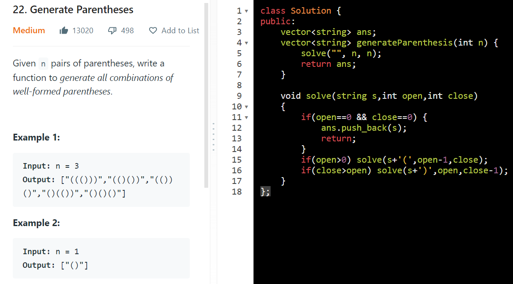

AM

class Solution {
public:
  vector\<string\> ans;
  void solve(int o, int c,string tem)
  {
    if(o==0 && c==0){
      ans.push_back(tem);
      return;
    }
    if(o \> 0) solve(o-1, c, tem + '(');
    if(o \< c && c \> 0){
      solve(o, c-1, tem + ')');
    }
  }
  vector\<string\> generateParenthesis(int n) {
    solve(n,n,"");
    return ans;
  }
};

