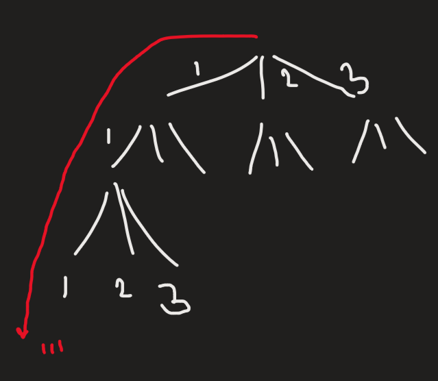

choices = 1 or 2 or 3 jump on every step

1111
112
121
13
211
22
31

*\#include* \<iostream\>
using namespace std;
*\#include* \<bits/stdc++.h\>
void fun(int n, string psf)
{
  *if* (n == 0) cout \<\< psf \<\< endl;
  *if* (n \< 0) *return*;
  fun(n - 1, psf + "1");
  fun(n - 2, psf + "2");
  fun(n - 3, psf + "3");
}
int main()
{
  fun(4, "");
  *return* 0;
}
