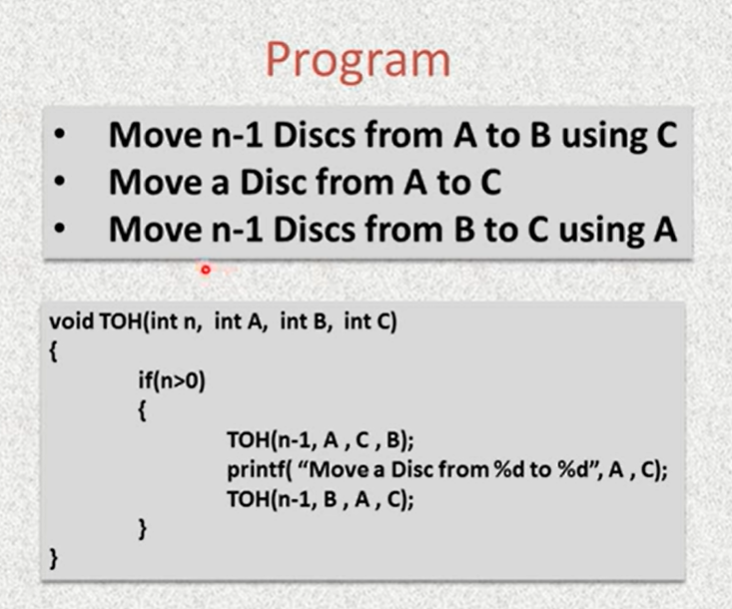

void tower_of_Hanoi(int n, char s, char mid, char d)
{
if (n == 0) return ;
tower_of_Hanoi(n - 1, s, d, mid);
cout \<\< "move from " \<\< s \<\< " to " \<\< d \<\< " " \<\< endl;
tower_of_Hanoi(n - 1, mid, s, d);
}
int main()
{
tower_of_Hanoi(3, 'A', 'B', 'C');
return 0;
}

move from A to C
move from A to B
move from C to B
move from A to C
move from B to A
move from B to C
move from A to C

